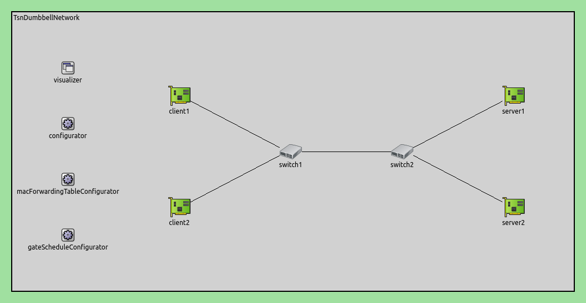
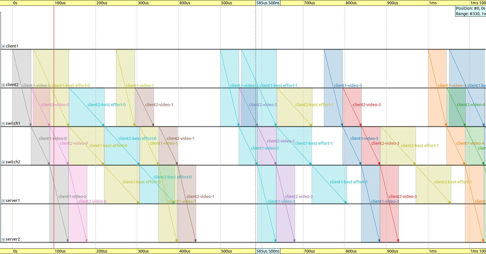
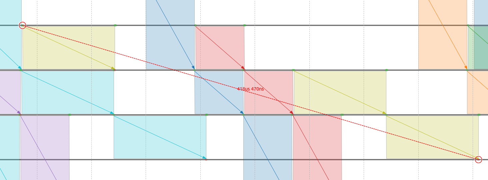
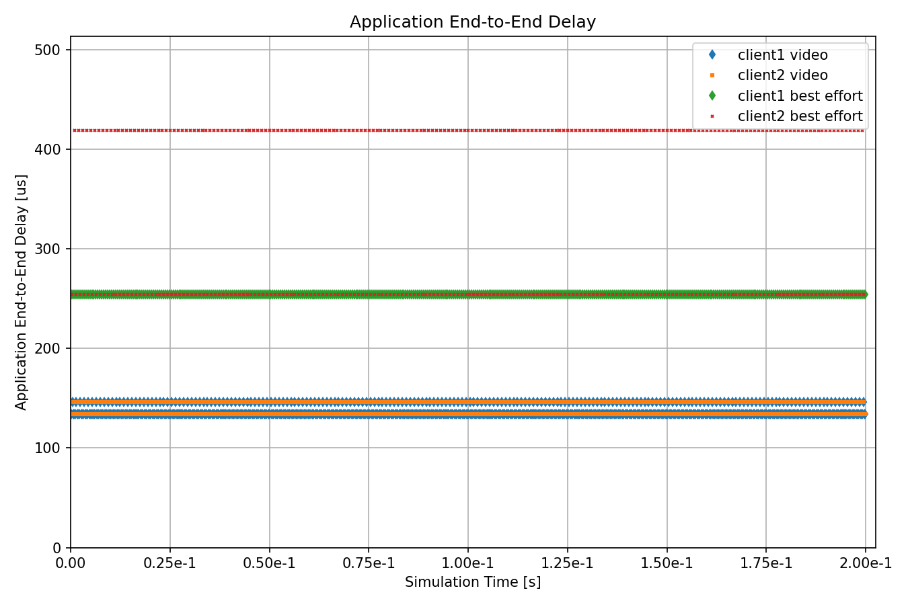

快速自动门控配置
==============================================

| `原文链接 <https://inet.omnetpp.org/docs/showcases/tsn/gatescheduling/eager/doc/index.html>`__ 
| `讲解视频 <https://space.bilibili.com/35942145>`__

目标
------
这个示例演示了 EagerGateScheduleConfigurator 如何在简单网络中设置调度。

INET version: ``4.4``

Source files location: `inet/showcases/tsn/gatescheduling/eager <https://github.com/inet-framework/inet/tree/master/showcases/tsn/gatescheduling/eager>`_

模型
------

仿真网络结构如下：

配置如下：

.. code:: ini

    [Eager]
    network = inet.networks.tsn.TsnDumbbellNetwork
    description = "Eager gate scheduling"
    sim-time-limit = 0.2s
    #record-eventlog = true

    # 配置交换机类型
    *.switch1.typename = "TsnSwitch1"
    *.switch2.typename = "TsnSwitch2"

    # 客户端应用配置
    *.client*.numApps = 2
    *.client*.app[*].typename = "UdpSourceApp"
    *.client*.app[0].display-name = "best effort"
    *.client*.app[1].display-name = "video"
    *.client*.app[0].io.destAddress = "server1"
    *.client*.app[1].io.destAddress = "server2"
    *.client1.app[0].io.destPort = 1000
    *.client1.app[1].io.destPort = 1002
    *.client2.app[0].io.destPort = 1001
    *.client2.app[1].io.destPort = 1003
    *.client*.app[*].source.packetNameFormat = "%M-%m-%c"
    *.client*.app[0].source.packetLength = 1000B
    *.client*.app[1].source.packetLength = 500B
    *.client*.app[0].source.productionInterval = 500us # ~16Mbps
    *.client*.app[1].source.productionInterval = 250us # ~16Mbps

    # 服务器应用配置
    *.server*.numApps = 4
    *.server*.app[*].typename = "UdpSinkApp"
    *.server*.app[0..1].display-name = "best effort"
    *.server*.app[2..3].display-name = "video"
    *.server*.app[0].io.localPort = 1000
    *.server*.app[1].io.localPort = 1001
    *.server*.app[2].io.localPort = 1002
    *.server*.app[3].io.localPort = 1003

    # 启用出站流
    *.client*.hasOutgoingStreams = true

    # 客户端流识别
    *.client*.bridging.streamIdentifier.identifier.mapping = [
        {stream: "best effort", packetFilter: expr(udp.destPort == 1000)},
        {stream: "video", packetFilter: expr(udp.destPort == 1002)},
        {stream: "best effort", packetFilter: expr(udp.destPort == 1001)},
        {stream: "video", packetFilter: expr(udp.destPort == 1003)}
    ]

    # 客户端流编码
    *.client*.bridging.streamCoder.encoder.mapping = [
        {stream: "best effort", pcp: 0},
        {stream: "video", pcp: 4}
    ]

    # 启用流
    *.switch*.hasIncomingStreams = true
    *.switch*.hasOutgoingStreams = true

    *.switch*.bridging.streamCoder.decoder.mapping = [
        {pcp: 0, stream: "best effort"},
        {pcp: 4, stream: "video"}
    ]

    *.switch*.bridging.streamCoder.encoder.mapping = [
        {stream: "best effort", pcp: 0},
        {stream: "video", pcp: 4}
    ]

    # 启用入站流
    *.server*.hasIncomingStreams = true

    # 启用出口流量整形
    *.switch*.hasEgressTrafficShaping = true

    # 带有2个队列的时域感知流量整形
    *.switch*.eth[*].macLayer.queue.numTrafficClasses = 2
    *.switch*.eth[*].macLayer.queue.queue[0].display-name = "best effort"
    *.switch*.eth[*].macLayer.queue.queue[1].display-name = "video"

    # 自动门控调度
    *.gateScheduleConfigurator.typename = "EagerGateScheduleConfigurator"
    *.gateScheduleConfigurator.gateCycleDuration = 1ms
    # 58B = 8B (UDP) + 20B (IP) + 4B (802.1 Q-TAG) + 14B (ETH MAC) + 4B (ETH FCS) + 8B (ETH PHY)
    *.gateScheduleConfigurator.configuration = [
        {pcp: 0, gateIndex: 0, application: "app[0]", source: "client1", destination: "server1", packetLength: 1000B + 58B, packetInterval: 500us, maxLatency: 500us},
        {pcp: 4, gateIndex: 1, application: "app[1]", source: "client1", destination: "server2", packetLength: 500B + 58B, packetInterval: 250us, maxLatency: 500us},
        {pcp: 0, gateIndex: 0, application: "app[0]", source: "client2", destination: "server1", packetLength: 1000B + 58B, packetInterval: 500us, maxLatency: 500us},
        {pcp: 4, gateIndex: 1, application: "app[1]", source: "client2", destination: "server2", packetLength: 500B + 58B, packetInterval: 250us, maxLatency: 500us}
    ]

    # 门控调度可视化
    *.visualizer.gateScheduleVisualizer.displayGateSchedules = true
    *.visualizer.gateScheduleVisualizer.displayDuration = 100us
    *.visualizer.gateScheduleVisualizer.gateFilter = "*.switch1.eth[2].** or *.switch2.eth[0].**.transmissionGate[0] or *.switch2.eth[1].**.transmissionGate[1]"
    *.visualizer.gateScheduleVisualizer.height = 16

仿真结果
------
在以下序列图中显示了1毫秒的门周期持续时间。注意从源到接收器的包流的时间效率是如何的：

以下是BE类流量中client2的第二个分组从分组源到分组sink的延迟。请注意，此流是上述图表中的异常值。虽然延迟仍在500us要求范围内，但已经非常接近：

不同流量类别的报文延迟情况如下图所示：

所有延迟都在指定的约束范围内。

.. 注意::

    视频流和client2 尽力而为流都存在两个聚类点。这是因为每个门周期内这些流量类别都有多个数据包。由于不同流之间的相互作用，一些分组的延迟会增加。（图中看似是平行线，但实际是锯齿状折线）

讨论
------
如果您对这个示例有任何疑问或讨论，请在 `此页面 <https://github.com/inet-framework/inet/discussions/791>`__ 分享您的想法。
