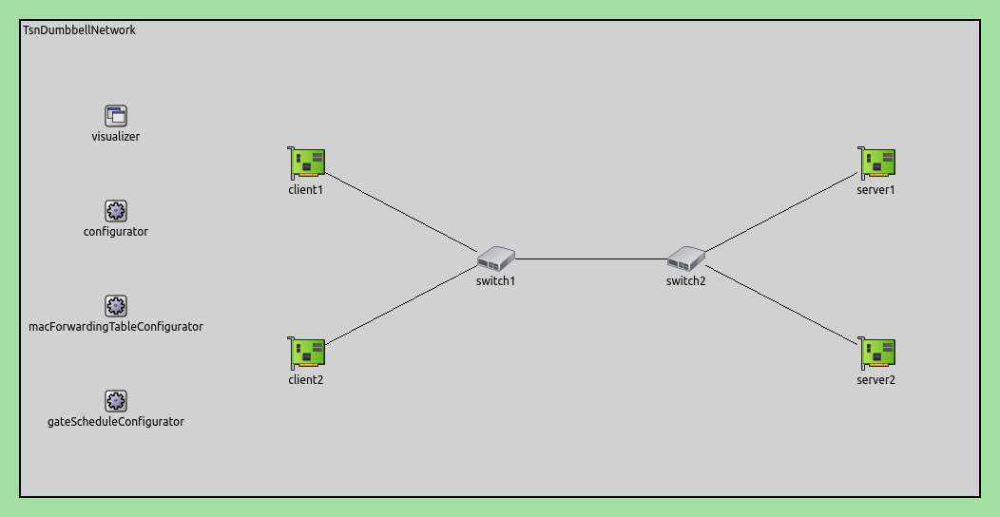

基于SAT求解器的自动门控配置
====================================================================

目标
------

这个示例演示了一个门调度配置器，使用多元线性不等式系统解决自动配置问题，直接从变量生成门控制列表。

INET version: 4.5

Source files location: `inet/showcases/tsn/gatescheduling/sat <https://github.com/inet-framework/inet/tree/master/showcases/tsn/gatescheduling/sat>`_

模型
------

基于SAT求解器的门调度配置器需要启用Z3门调度配置器INET特性，并安装libz3-dev或Z3-devel包。

仿真网络结构如下：

配置如下：

.. code-block:: plain

    # 创建一个TSN双哑铃网络
    network = inet.networks.tsn.TsnDumbbellNetwork
    description = "Z3 SAT based gate scheduling"
    sim-time-limit = 0.2s

    # 定义交换机类型
    *.switch1.typename = "TsnSwitch1"
    *.switch2.typename = "TsnSwitch2"

    # 客户端应用程序配置
    *.client*.numApps = 2
    *.client*.app[*].typename = "UdpSourceApp"
    *.client*.app[0].display-name = "best effort"
    *.client*.app[1].display-name = "video"
    *.client*.app[0].io.destAddress = "server1"
    *.client*.app[1].io.destAddress = "server2"
    *.client1.app[0].io.destPort = 1000
    *.client1.app[1].io.destPort = 1002
    *.client2.app[0].io.destPort = 1001
    *.client2.app[1].io.destPort = 1003
    *.client*.app[*].source.packetNameFormat = "%M-%m-%c"
    *.client*.app[0].source.packetLength = 1000B
    *.client*.app[1].source.packetLength = 500B
    *.client*.app[0].source.productionInterval = 500us # ~16Mbps
    *.client*.app[1].source.productionInterval = 250us # ~16Mbps

    # 服务器应用程序配置
    *.server*.numApps = 4
    *.server*.app[*].typename = "UdpSinkApp"
    *.server*.app[0..1].display-name = "best effort"
    *.server*.app[2..3].display-name = "video"
    *.server*.app[0].io.localPort = 1000
    *.server*.app[1].io.localPort = 1001
    *.server*.app[2].io.localPort = 1002
    *.server*.app[3].io.localPort = 1003

    # 启用客户端的出站流
    *.client*.hasOutgoingStreams = true

    # 客户端流标识
    *.client*.bridging.streamIdentifier.identifier.mapping = [{stream: "best effort", packetFilter: expr(udp.destPort == 1000)},
                                                                  {stream: "video", packetFilter: expr(udp.destPort == 1002)},
                                                                  {stream: "best effort", packetFilter: expr(udp.destPort == 1001)},
                                                                  {stream: "video", packetFilter: expr(udp.destPort == 1003)}]

    # 客户端流编码
    *.client*.bridging.streamCoder.encoder.mapping = [{stream: "best effort", pcp: 0},
                                                      {stream: "video", pcp: 4}]

    # 启用交换机的入站和出站流
    *.switch*.hasIncomingStreams = true
    *.switch*.hasOutgoingStreams = true

    *.switch*.bridging.streamCoder.decoder.mapping = [{pcp: 0, stream: "best effort"},
                                                      {pcp: 4, stream: "video"}]

    *.switch*.bridging.streamCoder.encoder.mapping = [{stream: "best effort", pcp: 0},
                                                      {stream: "video", pcp: 4}]

    # 启用服务器的入站流
    *.server*.hasIncomingStreams = true

    # 启用出口流量整形
    *.switch*.hasEgressTrafficShaping = true

    # 使用两个队列进行时间感知流量整形
    *.switch*.eth[*].macLayer.queue.numTrafficClasses = 2
    *.switch*.eth[*].macLayer.queue.queue[0].display-name = "best effort"
    *.switch*.eth[*].macLayer.queue.queue[1].display-name = "video"

    # 自动门调度配置
    *.gateScheduleConfigurator.typename = "Z3GateScheduleConfigurator"
    *.gateScheduleConfigurator.gateCycleDuration = 1ms
    # 58B = 8B (UDP) + 20B (IP) + 4B (802.1 Q-TAG) + 14B (ETH MAC) + 4B (ETH FCS) + 8B (ETH PHY)
    *.gateScheduleConfigurator.configuration =
       [{pcp: 0, gateIndex: 0, application: "app[0]", source: "client1", destination: "server1", packetLength: 1000B + 58B, packetInterval: 500us, maxLatency: 500us},
        {pcp: 4, gateIndex: 1, application: "app[1]", source: "client1", destination: "server2", packetLength: 500B + 58B, packetInterval: 250us, maxLatency: 500us},
        {pcp: 0, gateIndex: 0, application: "app[0]", source: "client2", destination: "server1", packetLength: 1000B + 58B, packetInterval: 500us, maxLatency: 500us},
        {pcp: 4, gateIndex: 1, application: "app[1]", source: "client2", destination: "server2", packetLength: 500B + 58B, packetInterval: 250us, maxLatency: 500us}]

    # 门调度可视化配置
    *.visualizer.gateScheduleVisualizer.displayGateSchedules = true
    *.visualizer.gateScheduleVisualizer.displayDuration = 100us
    *.visualizer.gateScheduleVisualizer.gateFilter = "*.switch1.eth[2].** or *.switch2.eth[0].**.transmissionGate[0] or *.switch2.eth[1].**.transmissionGate[1]"
    *.visualizer.gateScheduleVisualizer.height = 16

仿真结果
------
下面的序列图展示了一个持续1毫秒的门循环。请注意，相较于Eager情况，该调度门具有更高的时间效率：

不同流量类别下的应用端到端时延如下图所示:

每个分组的延迟是恒定且不超过500微秒。需要注意的是，流量延迟在不同源和目标组合中是对称的（与紧急情况相反）。下面这个序列图摘录展示了数据包从数据包源传输到数据包目标的过程，并显示了时延：

要计算数据包的延迟，可以使用公式：

.. math::

    D = (传播时间 + 传输时间) * 3     （排队时间为0）

给定每条链路的传输时间为84.64微秒，传播时间为0.05微秒，我们可以将这些值代入公式中计算尽力而为流量类别的延迟。

.. math::

    D =(84.64 us + 0.05 us) * 3 = 84.69 us * 3 = 254.07 us

因此，尽力而为流量类别的延迟为254.07微秒。

下图比较了基于SAT和Eager门调度配置器在应用程序端到端延迟方面的差异：

不同之处在于，在基于SAT的门调度配置器中，给定流量类别中的所有流都具有相同的恒定延迟；而在Eager配置器中，某些流的延迟比其他流更大。

**Sources:** `omnetpp.ini <https://inet.omnetpp.org/docs/_downloads/b07d203c6a98b6856b7c6e9a750edadf/omnetpp.ini>`_

讨论
----------
如果您对这个示例有任何疑问或讨论，请在 `此页面 <https://github.com/inet-framework/inet/discussions/792>`__ 分享您的想法。
