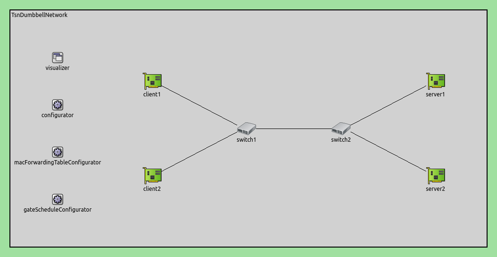
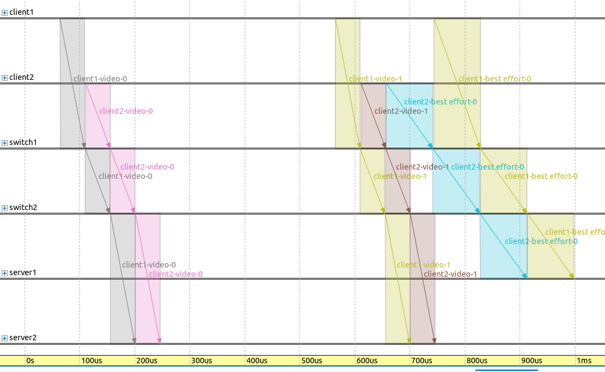
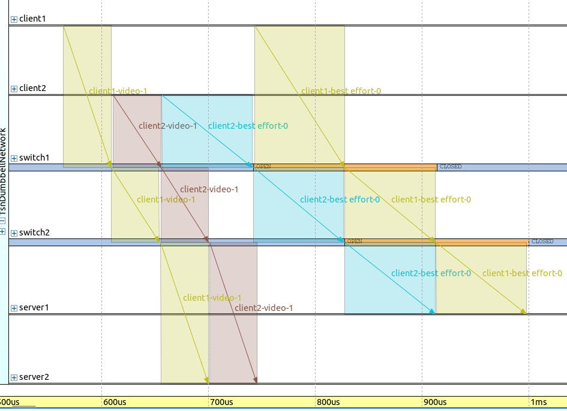
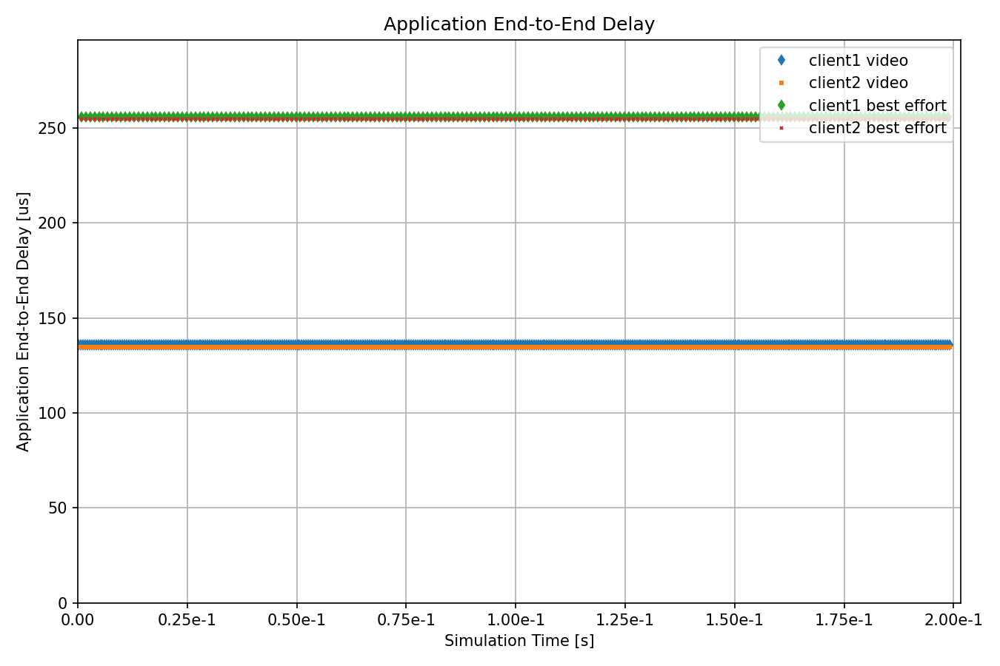

基于TSNsched的自动门控配置
======================================================
| `原文链接 <https://inet.omnetpp.org/docs/showcases/tsn/gatescheduling/tsnsched/doc/index.html>`__ 
| `讲解视频 <https://space.bilibili.com/35942145>`__
目标
------
这个示例演示了 TSNsched gate 调度配置器，它通过外部 SAT 求解工具解决了自动配置问题。

INET version: ``4.4``

Source files location: `inet/showcases/tsn/gatescheduling/tsnsched <https://github.com/inet-framework/inet/tree/master/showcases/tsn/gatescheduling/tsnsched>`_

模型
------

TSNschedGateScheduleConfigurator 模块提供了一个自动门控配置器，它使用了可在 `https://github.com/ACassimiro/TSNsched <https://github.com/ACassimiro/TSNsched>`_ 上获得的 TSNsched 工具（有关安装说明，请查看 NED 文档）。该模块与其他门调度配置器具有相同的参数。

模拟使用了与 Eager 和 SAT 配置器相同的网络:

配置如下：

.. code:: ini

    [General]
    network = inet.networks.tsn.TsnDumbbellNetwork
    description = "TSN sched based gate scheduling"
    sim-time-limit = 0.2s
    #record-eventlog = true
    #emulation = true

    # 配置交换机类型
    *.switch1.typename = "TsnSwitch1"
    *.switch2.typename = "TsnSwitch2"

    # 客户端应用配置
    *.client*.numApps = 2
    *.client*.app[*].typename = "UdpSourceApp"
    *.client*.app[0].display-name = "best effort"
    *.client*.app[1].display-name = "video"
    *.client*.app[0].io.destAddress = "server1"
    *.client*.app[1].io.destAddress = "server2"
    *.client1.app[0].io.destPort = 1000
    *.client1.app[1].io.destPort = 1002
    *.client2.app[0].io.destPort = 1001
    *.client2.app[1].io.destPort = 1003
    *.client*.app[*].source.packetNameFormat = "%M-%m-%c"
    *.client*.app[0].source.packetLength = 1000B
    *.client*.app[1].source.packetLength = 500B
    *.client*.app[0].source.productionInterval = 1000us # ~8Mbps
    *.client*.app[1].source.productionInterval = 500us # ~8Mbps

    # 服务器应用配置
    *.server*.numApps = 4
    *.server*.app[*].typename = "UdpSinkApp"
    *.server*.app[0..1].display-name = "best effort"
    *.server*.app[2..3].display-name = "video"
    *.server*.app[0].io.localPort = 1000
    *.server*.app[1].io.localPort = 1001
    *.server*.app[2].io.localPort = 1002
    *.server*.app[3].io.localPort = 1003

    # 启用出站流
    *.client*.hasOutgoingStreams = true

    # 客户端流识别
    *.client*.bridging.streamIdentifier.identifier.mapping = [
        {stream: "best effort", packetFilter: expr(udp.destPort == 1000)},
        {stream: "video", packetFilter: expr(udp.destPort == 1002)},
        {stream: "best effort", packetFilter: expr(udp.destPort == 1001)},
        {stream: "video", packetFilter: expr(udp.destPort == 1003)}
    ]

    # 客户端流编码
    *.client*.bridging.streamCoder.encoder.mapping = [
        {stream: "best effort", pcp: 0},
        {stream: "video", pcp: 4}
    ]

    # 启用流
    *.switch*.hasIncomingStreams = true
    *.switch*.hasOutgoingStreams = true

    *.switch*.bridging.streamCoder.decoder.mapping = [
        {pcp: 0, stream: "best effort"},
        {pcp: 4, stream: "video"}
    ]

    *.switch*.bridging.streamCoder.encoder.mapping = [
        {stream: "best effort", pcp: 0},
        {stream: "video", pcp: 4}
    ]

    # 启用入站流
    *.server*.hasIncomingStreams = true

    # 启用出口流量整形
    *.switch*.hasEgressTrafficShaping = true

    # 带有2个队列的时域感知流量整形
    *.switch*.eth[*].macLayer.queue.numTrafficClasses = 2
    *.switch*.eth[*].macLayer.queue.queue[0].display-name = "best effort"
    *.switch*.eth[*].macLayer.queue.queue[1].display-name = "video"

    # 自动门控调度
    *.gateScheduleConfigurator.typename = "TSNschedGateScheduleConfigurator"
    *.gateScheduleConfigurator.gateCycleDuration = 1ms
    # 58B = 8B (UDP) + 20B (IP) + 4B (802.1 Q-TAG) + 14B (ETH MAC) + 4B (ETH FCS) + 8B (ETH PHY)
    *.gateScheduleConfigurator.configuration = [
        {pcp: 0, gateIndex: 0, application: "app[0]", source: "client1", destination: "server1", packetLength: 1000B + 58B + 12B, packetInterval: 1000us, maxLatency: 500us},
        {pcp: 4, gateIndex: 1, application: "app[1]", source: "client1", destination: "server2", packetLength: 500B + 58B + 12B, packetInterval: 500us, maxLatency: 500us},
        {pcp: 0, gateIndex: 0, application: "app[0]", source: "client2", destination: "server1", packetLength: 1000B + 58B + 12B, packetInterval: 1000us, maxLatency: 500us},
        {pcp: 4, gateIndex: 1, application: "app[1]", source: "client2", destination: "server2", packetLength: 500B + 58B + 12B, packetInterval: 500us, maxLatency: 500us}
    ]

    # 门控调度可视化
    *.visualizer.gateScheduleVisualizer.displayGateSchedules = true
    *.visualizer.gateScheduleVisualizer.displayDuration = 100us
    *.visualizer.gateScheduleVisualizer.gateFilter = "*.switch1.eth[2].** or *.switch2.eth[0].**.transmissionGate[0] or *.switch2.eth[1].**.transmissionGate[1]"
    *.visualizer.gateScheduleVisualizer.height = 16

.. 注意::

    由于SAT求解器工具的限制，与Eager和SAT配置器示例相比，此配置中有两个变化：

    1. 流量密度是Eager和SAT配置器展示的一半。目前，该工具只能在所有传输在门控周期内完成的情况下找到自动配置问题的解决方案（尽管单个帧传输应该可以重叠）。
    2. 需要在XML配置中的包大小上增加12个字节，以考虑帧间间隙（针对此问题，可以关注一下TSNSched工具的README）。

仿真结果
------
下面的序列图显示了一个门循环周期(1ms):

请注意，帧是立即由交换机转发的（即无等待）。

下面的序列图显示了帧传输，在两个交换机的轴上显示了BE流的门状态：

注意，门是打开的，因此可以传输两个帧，并且帧传输和发送窗口在时间上紧密对齐。

下图展示了这4个流的应用端到端延迟：

所有流的延迟都尽可能小，因为它们是立即转发的。

Sources: `omnetpp.ini <https://inet.omnetpp.org/docs/_downloads/fdbec43094d14e516a7cb573c82e2ef7/omnetpp.ini>`_

讨论
----------
如果您对这个示例有任何疑问或讨论，请在 `此页面 <https://github.com/inet-framework/inet/discussions/793>`__ 分享您的想法。
