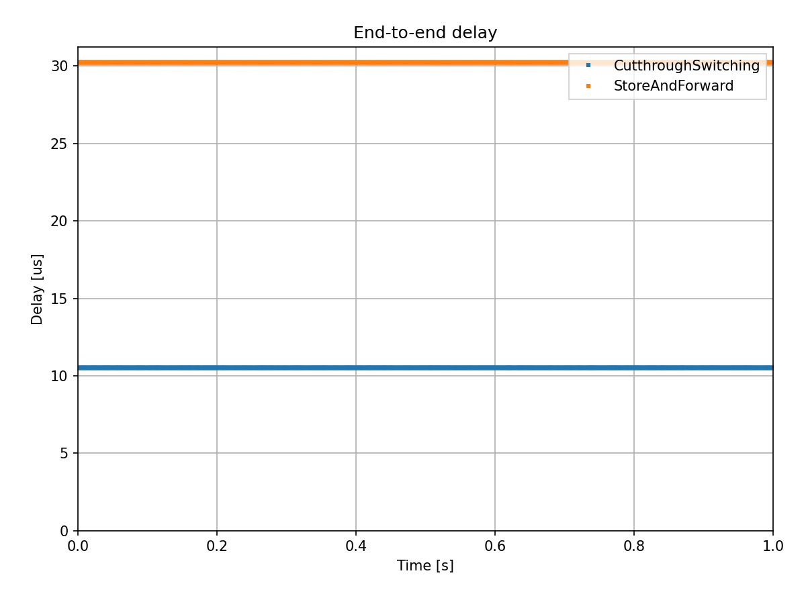

直通交换
==============================

相关视频
----------

目标
-----

直通交换（Cut-through Switching）是一种在分组交换系统中广泛应用的方法，特别是在以太网交换机中，用于快速转发帧或数据包。 \
其基本原理是在整个帧完全接收之前即可开始转发，通常是在确认目地地址和出端口后立即执行。与存储-转发交换相比，存储-转发交换会等待 \
整个帧完全接收后才进行转发。直通交换的主要优势是能够降低以太网数据帧在交换机处所消耗的时间，因为交换机可以在获取足够信息后立即开始转发帧。 \
然而，直通交换也存在一些潜在的缺点，例如相较于存储-转发交换可能具有更高的错误率，因为在转发之前它不会对整个帧进行错误检查。 \
在本示例中，我们将展示直通交换的工作原理，并在延迟方面与存储-转发交换进行对比。

| INET 版本: ``4.3``
| 源文件位置: `inet/showcases/tsn/cutthroughswitching <https://github.com/inet-framework/inet/tree/master/showcases/tsn/cutthroughswitching>`__

模型
-----

直通交换可以减少数据帧在交换机处消耗的时间，但会跳过交换机中的FCS检查。（因为FCS位于以太网数据帧末尾，如果进行FCS检查，则数据帧几乎完全传输了，无法达到直通交换的意义）。 \
如果数据包经过多跳，直通交换可以显著减少延迟。

INET框架中的直通交换利用"节点内数据包流" 的机制，以便在帧被完全接收之前就能够开始处理和转发。这种方法有助于降低切换延迟，使交换机能够更迅速地处理和转发网络数据。

.. note:: 在 `StandardHost <https://doc.omnetpp.org/inet/api-current/neddoc/inet.node.inet.StandardHost.html>`__ 等主机中，默认为存储-转发行为。

示例仿真中包含了两个 `TsnSwitch <https://doc.omnetpp.org/inet/api-current/neddoc/inet.node.tsn.TsnDevice.html>`__ 和两个 `TsnDevice <https://doc.omnetpp.org/inet/api-current/neddoc/inet.node.tsn.TsnDevice.html>`__ \
,所有连接速率均为1Gbps

在仿真中， ``device1`` 向 ``device2`` 发送1000B的UDP数据包，平均到达时间为100ms，具有X毫秒的抖动。在omnetpp.ini文件中有两个配置，分别为 ``StoreAndForward`` 和 ``CutthroughSwitching`` ，他们仅在交换方上有所不同。

在以太网交换机中，网口模块默认采用 `EthernetInterface <https://doc.omnetpp.org/inet/api-current/neddoc/inet.linklayer.ethernet.EthernetInterface.html>`__ ,该模块不支持直通交换功能。为了使用直通交换，我们需要将 \
以太网交换机的网口模块替换为 `EthernetCutthroughInterface <https://doc.omnetpp.org/inet/api-current/neddoc/inet.linklayer.ethernet.modular.EthernetCutthroughInterface.html>`__ 。这个模块默认不启用直通交换功能，\
因此需要通过将 ``enableCutthrough``参数设置为``true``来启用它。

此外，在交换机中的所有模块必须都支持数据包流。交换机中的 EthernetCutthroughInterface 模块默认支持数据包流；需要将主机中的PHY层模块替换为 `EthernetStreamingPhyLayer <https://doc.omnetpp.org/inet/api-current/neddoc/inet.physicallayer.wired.ethernet.EthernetStreamingPhyLayer.html>`__ \
模块以支持数据包流。

结果
-----

以下视频显示了 Qtenv 中的存储-转发行为：

.. raw:: html

   <video controls width="600">
       <source src="Pic/storeandforward.mp4" type="video/mp4">
       Your browser does not support the video tag.
   </video>

接下来的视频显示了 cut-through 行为：

.. figure:: Pic/storeandforward.mp4

测试

.. raw:: html

   <iframe src="Pic/storeandforward.mp4"> </iframe>

以下序列图摘录显示了从 ``device1`` 发送到 ``device2`` 的包经过交换机的情况。

存储-转发交换

直通交换

我们比较了存储-转发交换和直通交换中UDP包的端到端延迟：

我们可以通过分析来验证结果。在存储-转发的情况下，端到端延迟为 ``3 *（传输时间 + 传播时间）``，约为 25.296ms。在直通交换的情况下，持续时间为 ``1 * 传输时间 + 3 传播时间 + 2 * 直通交换延迟``，约为 8.432ms。

| 源代码：
|  `omnetpp.ini <https://inet.omnetpp.org/docs/_downloads/43f185873bdc27fdc40564724e4a64fa/omnetpp.ini>`__ 
|  `CutthroughSwitchingShowcase.ned <https://inet.omnetpp.org/docs/_downloads/8add5c151ff6e797bdd54f614b47cc19/CutthroughSwitchingShowcase.ned>`__

讨论
----------
如果您对这个示例有任何疑问或讨论，请在 `此页面 <https://github.com/inet-framework/inet/discussions/685>`__ 分享您的想法。