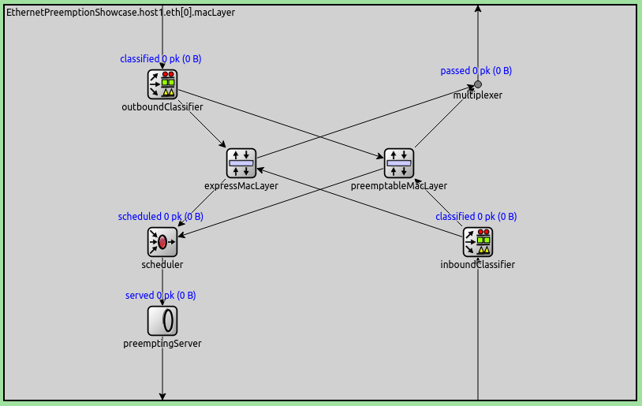
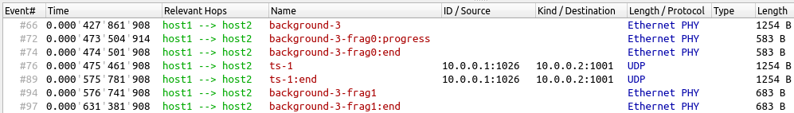
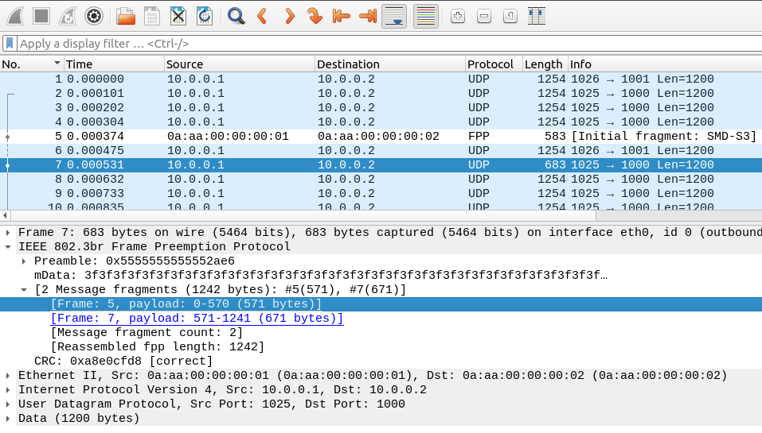
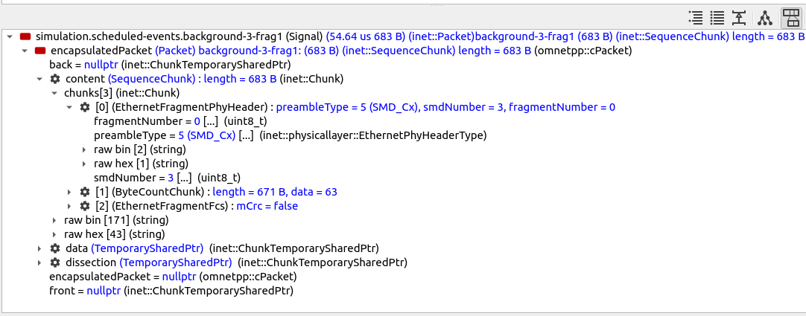
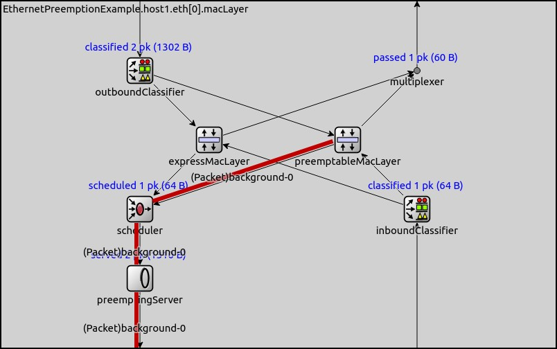
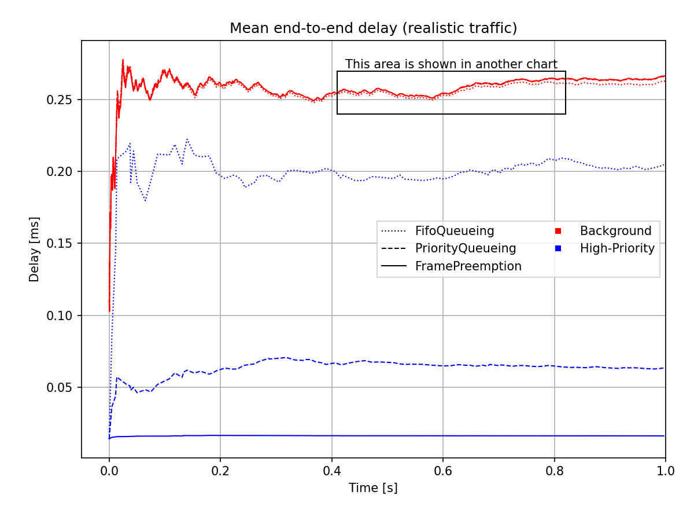

帧抢占
========

| `原文链接 <https://inet.omnetpp.org/docs/showcases/tsn/framepreemption/doc/index.html>`__ 
| `讲解视频 <https://space.bilibili.com/35942145>`__

目标
----

以太网帧抢占是802.1Qbu标准中规定的一项功能，允许在以太网网络的媒体访问控制（MAC）层中，高优先级的帧可以中断低优先级帧的传输。这对于需要为高优先级帧提供低延迟的时间敏感型应用非常有用。例如，在时敏网络（TSN）应用中，高优先级帧可能包含必须以最小延迟传递的时间关键数据。帧抢占可以帮助确保这些高优先级帧优先于低优先级帧，从而减少其传输延迟。

在本示例中，我们将演示以太网帧抢占，并对比展示其可以提供的延迟减少效果。在本示例中，您将了解帧抢占的工作原理以及其如何在以太网中提高时间敏感型应用的性能。

| INET 版本：``4.3``
| 源文件位置：`inet/showcases/tsn/framepreemption <https://github.com/inet-framework/inet/tree/master/showcases/tsn/framepreemption>`__

模型
----

概述
~~~~~~

在时间敏感的应用中，以太网帧抢占可以显著减少延迟。当在传输低优先级帧期间高优先级帧可供传输时，以太网 MAC 可以中断低优先级帧的传输，并立即开始发送高优先级帧。当高优先级帧传输完成后，MAC可以从中断处继续发送低优先级帧，最终将低优先级帧分成两个（或更多）片段发送。

帧抢占是INET中可组合以太网模型的一个功能。它使用INET的数据包流API，使得数据包传输表示为一个可中断的流。帧抢占需要 `LayeredEthernetInterface`，其包含一个MAC层和一个PHY层，如下所示：

.. figure::Pic/LayeredEthernetInterface2.png
   :align: center

要启用帧抢占，需要将默认子模块 `EthernetMacLayer`和 `EthernetPhyLayer`替换为 `EthernetPreemptingMacLayer`和 `EthernetPreemptingPhyLayer`。

 `EthernetPreemptingMacLayer`包含两个子模块，它们本身表示以太网MAC层，一个是可抢占的（ `EthernetFragmentingMacLayer`）和一个是快速MAC层（ `EthernetStreamingMacLayer`），每个都有自己的帧队列：

 `EthernetPreemptingMacLayer`使用节点内的数据包流。离散的数据包从上层进入MAC模块，但以数据包流的形式离开子MAC层（快速和可抢占的）。数据包以流的形式从MAC层退出，并通过PHY层和链路表示为流。

在抢占的情况下，数据包最初从可抢占的子MAC层流出。当高优先级帧在快速MAC层到达时， `scheduler`会通知 `preemptingServer`。 `preemptingServer`停止可抢占的流，完整发送快速流，然后最终恢复可抢占的流。

PHY层会插入帧间间隔。

 `EthernetPreemptingPhyLayer`同时支持数据包流和分片（将数据包分成多个片段发送）。

配置
~~~~~~

仿真采用以下网络拓扑：

.. figure:: Pic/network.png
   :align: center

其包含两个连接在100Mbps以太网上的 `StandardHost`和一个 `PcapRecorder`用于记录PCAP跟踪； `host1`定期为 `host2`发送数据包。

主要我们要比较端到端延迟，因此我们在omnetpp.ini中以相同的数据包长度为低优先级和高优先级流量运行以下三种配置的仿真：

- ``FifoQueueing``：基础配置；不使用优先级队列或抢占。
- ``PriorityQueueing``：在以太网MAC中使用优先级队列，以降低高优先级帧的延迟。
- ``FramePreemption``：使用抢占来确保高优先级帧具有非常低的延迟，并有一个保证的上限。

此外，我们还演示了在更真实的流量下使用优先级队列和抢占：较长且更频繁的低优先级帧和较短且不太频繁的高优先级帧。这些模拟是上述三种配置的扩展，并在ini文件中定义为带有 `Realistic`前缀的配置。

我们还希望记录PCAP文件，以便在Wireshark中检查流量。我们启用PCAP记录，并将PCAP记录器设置为转储以太网PHY帧，因为抢占在PHY头中是可见的：

.. code:: ini
    **.recordPcap = true
    **.dumpProtocols = "ethernetphy"

    **.crcMode = "computed"
    **.fcsMode = "computed"

以下是 `host1`中流量生成的配置：

.. code:: ini
    *.host1.numApps = 2
    *.host1.app[*].typename = "UdpSourceApp"
    *.host1.app[0].source.packetNameFormat = "background-%c"
    *.host1.app[1].source.packetNameFormat = "ts-%c"
    *.host1.app[*].tagger.typename = "PacketTagger"
    *.host1.app[0].tagger.vlanId = 1
    *.host1.app[1].tagger.vlanId = 0
    *.host1.app[*].io.destAddress = "host2"
    *.host1.app[0].io.destPort = 1000
    *.host1.app[1].io.destPort = 1001

`host1`中有两个 `UdpApp`，一个生成背景流量（低优先级），另一个生成高优先级流量。UDP应用在数据包上添加VLAN标签，以太网MAC使用标签中的VLAN ID将流量分类为高优先级和低优先级。

我们设置低优先级的背景流量带宽为96Mbps，高优先级的流量为9.6Mbps，两者的数据包大小均为1200B。它们的总和高于100 Mbps链路容量（我们希望队列不为空）；多余的数据包将被丢弃。

.. code:: ini
    *.host1.app[0].source.packetLength = 1200B
    *.host1.app[0].source.productionInterval = truncnormal(100us,50us)
    *.host1.app[0].source.initialProductionOffset = 5us

    # high-ts ~9.6Mbps
    *.host1.app[1].source.packetLength = 1200B
    *.host1.app[1].source.productionInterval = truncnormal(1ms,500us)

`FifoQueueing`配置不使用抢占或优先级队列。该配置仅将 `EthernetMac`的队列长度限制为4。

在所有三种情况下，队列需要较短，以减少队列时间对测量延迟的影响。然而，如果队列过短，它们可能会过于频繁地为空，这将使优先级队列失效（例如，如果队列中只有一个数据包，它无法进行优先级排序）。队列长度为4是一个任意选择。队列类型设置为 `DropTailQueue`，以便在队列满时可以丢弃数据包。

.. code:: ini
    [Config FifoQueueing]
    description = "High and low priority frames are transmitted in first-in first-out order"

    **.macLayer.queue.packetCapacity = 4
    **.macLayer.queue.typename = "DropTailQueue"

在 `PriorityQueueing`配置中，我们将MAC层中的队列类型从默认的 `PacketQueue`更改为 `PriorityQueue`：

.. code:: ini
    [Config PriorityQueueing]
    description = "High priority frames are transmitted before low priority frames"

    **.macLayer.queue.typename = "PriorityQueue"
    **.macLayer.queue.numQueues = 2
    **.macLayer.queue.queue[*].packetCapacity = 4

    **.macLayer.queue.queue*.typename = "DropTailQueue"
    **.macLayer.queue.classifier.classifierClass = "inet::PacketVlanReqClassifier"

优先级队列利用两个内部队列来处理两类流量。为了限制队列时间对测量端到端延迟的影响，我们还将内部队列的长度限制为4。我们还禁用了共享缓冲区，并将队列类型设置为 `DropTailQueue`。我们使用优先级队列的分类器将数据包放入两类流量中。

在 `FramePreemption`配置中，我们将 `LayeredEthernetInterface`中的默认 `EthernetMacLayer`和 `EthernetPhyLayer`模块替换为支持抢占的 `EthernetPreemptingMacLayer`和 `EthernetPreemptingPhyLayer`。

.. code:: ini
    [Config FramePreemption]
    description = "Transmission of low priority frames are preempted by high priority frames"

    *.host*.eth[0].macLayer.typename = "EthernetPreemptingMacLayer"
    *.host*.eth[0].phyLayer.typename = "EthernetPreemptingPhyLayer"

    **.macLayer.*.queue.packetCapacity = 4
    **.macLayer.*.queue.typename = "DropTailQueue"

在此配置中没有优先级队列。两个MAC子模块都有自己的队列。我们还将队列长度限制为4，并将队列类型配置为 `DropTailQueue`。

.. note:: 我们也可以在EthernetPreemptableMac模块中仅使用一个共享优先级队列，但这里不涉及。

我们在 `RealisticFifoQueueing`、 `RealisticPriorityQueueing`和 `RealisticFramePreemption`配置中使用以下流量：

.. code:: ini
    #abstract-config = true (requires omnet 7)

    # background
    *.host1.app[0].source.packetLength = 1200B
    *.host1.app[0].source.productionInterval = truncnormal(100us,50us)

    # time-sensitive
    *.host1.app[1].source.packetLength = 120B
    *.host1.app[1].source.productionInterval = truncnormal(10ms,5ms)

在此流量配置中，高优先级数据包的频率是低优先级数据包的100倍，且其大小是低优先级数据包的1/10。

链路上的传输
~~~~~~~~~~~~~

为了理解帧抢占在OMNeT++ GUI中的表示方式（在Qtenv的动画和数据包日志中以及IDE中的序列图），需要了解数据包传输在OMNeT++中的建模方式。

传统上，在链路上发送帧在OMNeT++中表示为发送一个“数据包”。“数据包”是一个C++对象（即数据结构），属于或是OMNeT++类 `cPacket`的子类。发送时间对应于传输的开始。数据包数据结构包含以字节为单位的帧长度以及（或多或少抽象的）帧内容。传输结束是隐含的：它被计算为 ``开始时间`` + ``持续时间``，其中持续时间是显式的或基于帧大小和链路比特率推导出来的。这种原始形式的方法当然不适用于以太网帧抢占，因为事先不知道帧传输是否会被抢占以及在何时被抢占。

相反，在OMNeT++ 6.0中，上述方法被修改以适应新的用例。在新方法中，原始的数据包发送仍然存在，但其解释略有变化。它现在代表一个 `预测`：“除非我们另有说明，否则这是一个将传输通过的帧”。也就是说，在传输进行过程中，可以发送 ``传输更新``，这些更新会修改对剩余传输部分的预测。 ``传输更新``数据包本质上表示“忽略我之前关于总帧大小/内容和传输时间的说明，根据当前情况，剩余传输将花费的时间，以及更新后的帧长度/内容”。

传输更新可能会截断、缩短或扩展传输（及帧）。出于技术原因，传输更新数据包携带完整的帧大小和内容（而不仅仅是剩余部分），但必须由发送方以与已传输部分一致的方式制作（不能改变过去）。例如，截断是通过指示剩余时间为零并将帧内容设置为已传输到该点的内容来完成的。后续的传输更新可以进一步修改更新后的传输。传输的结束仍然是隐含的（根据最后的传输更新完成），但也可以通过在传输原本结束时间点发送一个剩余时间为零的传输更新来明确结束。传输结束时间过后，自然不能再发送任何传输更新（因为无法修改过去）。

鉴于上述情况，很容易看出为什么被抢占的以太网帧会多次出现在 Qtenv 的数据包日志中：原始传输和后续传输更新都是数据包。

- 第一个是原始数据包，包含完整的帧大小/内容，并携带传输将不被中断的预测。
- 第二个数据包是在节点内部决定帧将被抢占时发送的。此时，节点会计算截断的帧和剩余的传输时间，同时考虑到至少需要传输当前八位字节和 FCS，并且还有最小帧大小要求。数据包表示截断帧的大小/内容，包括 FCS。
- 在当前实现中，以太网模型还发送了一个具有零剩余传输持续时间和与前一个相同的帧大小/内容的显式结束传输更新。这在严格意义上不是必要的，并且可能在未来的INET版本中有所更改。

上述数据包通过名称后缀进行区分： ``:progress``和 ``:end``分别添加到原始数据包名称后，用于传输更新和显式的结束传输。此外，数据包本身也通过在其名称后添加 ``-frag0``、 ``-frag1``等名称，使帧片段彼此可区分。例如，一个名为 `background3`的帧可能会被 `background3-frag0:progress`和 `background3-frag0:end`跟随。在中间的快速帧也完成传输后，将跟随 `background3-frag1`（请参见下一节的视频）。

结果
----

帧抢占行为
~~~~~~~~~~~~~~

以下是帧抢占行为的视频：

.. figure:: Pic/preemption3.mp4

 `host1`中的以太网MAC开始传输 `background-3`。在传输过程中，一个高优先级帧（ `ts-1`）到达MAC。MAC中断 `background-3`的传输；在动画中， `background-3`最初以完整帧显示，然后在高优先级帧可用时更改为 `background-3-frag0:progress`。在传输高优先级帧后，传输剩余部分的 `background-3-frag1`被传输。

帧序列在Qtenv的数据包日志中显示：

如前一节所述，被抢占的帧在数据包日志中会多次出现，因为对帧的更新被记录。最初， `background-3`被记录为一个不间断的帧。当高优先级帧可用时，帧名称更改为 `background-3-frag0`，并分别记录。实际上，在 `ts-1`之前只发送了一个名为 `background-3-frag0`的帧，但有三个单独的数据包更新。

相同的帧序列显示在以下图像的序列图中，每个图像中选择并高亮显示不同的帧（红色）。请注意，时间轴是非线性的：

.. figure:: Pic/seqchart4.png
   :align: center
   :width: 100%

正如在数据包日志中一样，序列图包含最初预期的、不间断的 `background-3`帧，因为它是在开始传输时记录的。

.. note:: 您可以认为序列图上实际上存在两个时间维度：事件和消息在当前时刻发生，以及模块“认为”的未来，即传输将需要多长时间。实际上，传输可能会被中断，因此原始的（ background-3）和“更新后的”（background-3-frag0）都存在于图表中。

以下是线性时间轴上的帧序列， `background-3-frag0`帧被高亮显示：

.. figure:: Pic/linear.png
   :align: center
   :width: 100%

请注意， `background-3-frag0:progress`非常短（基本上只包含一个带有FCS的更新数据包，作为第一个片段的剩余数据部分）。 `ts-1`的传输在一个短的帧间间隔后开始。

以下是Wireshark中显示的相同帧序列：

帧在PCAP文件中记录在每个帧或片段传输结束时，因此原始意图的1243B `background-3`帧不在其中，只有两个片段。

在Wireshark日志中， `frame 5`和 `frame 7`是 `background-3`的两个片段。请注意，FPP指的是 `帧抢占协议`； `frame 6`是 `ts-1`，在两个片段之间发送。

以下是在Qtenv的数据包检查器中显示的 `background-3-frag1`：

此片段不包含MAC头，因为它是原始以太网帧的第二部分。

高优先级和低优先级（快速和可抢占）数据包在 `EthernetPreemptingMacLayer`中走的路径如下红线所示：

.. figure:: Pic/express2.png
   :align: center

分析端到端延迟
~~~~~~~~~~~~~~~

模拟结果
+++++++++

为了分析相同数据包长度配置的结果，我们在以下图表中绘制了三种情况下UDP数据包在[0,t]上的平均端到端延迟。请注意，通过不同的线型区分配置，流量类别通过颜色区分：

.. figure:: Pic/delay.png
   :align: center
   :width: 80%

图表显示，在默认配置下，两类流量的延迟大致相同。使用优先级队列显著减少了高优先级帧的延迟，并略微增加了与基础配置相比的背景流的延迟。帧抢占在降低高优先级帧延迟方面效果更好，但以略微增加背景流的延迟为代价。

估算端到端延迟
++++++++++++++++

在下一节中，我们将通过一些简易计算来检验这些结果的可信度。

FifoQueueing 配置
******************

对于 `FifoQueueing`配置，MAC在同一个FIFO队列中存储后台和高优先级数据包。因此，两类流量的延迟大致相同。由于高流量，队列总是包含数据包。队列限制为4个数据包，因此队列时间有一个上限：大约4帧传输时间。查看队列长度统计（参见anf文件），我们可以看到平均队列长度约为2.6，因此数据包承受的平均队列延迟为2.6帧传输时间。

端到端延迟大致为帧传输持续时间 + 队列延迟 + 帧间间隔。100Mbps以太网上1200B帧的传输持续时间约为0.1ms。平均来说，队列中有两个帧，因此帧在队列中等待两个帧传输持续时间。100Mbps以太网的帧间间隔为0.96μs，因此我们认为可以忽略：

``delay ~= txDuration + 2.6 * txDuration + IFG = 3.6 * txDuration = 0.36ms``

PriorityQueueing 配置
************************

对于 `PriorityQueueing`配置，高优先级帧在MAC的PriorityQueue模块中有自己的子队列。当高优先级帧到达队列时，MAC会完成正在进行的低优先级传输（如果有的话）后再开始传输高优先级帧。因此，高优先级帧可能会被延迟，因为需要先完成当前帧的传输。尽管如此，使用优先级队列仍然减少了高优先级帧的延迟，并增加了与仅使用一个队列的基线默认配置相比的后台帧的延迟。

由于高流量背景流量，后台队列中总是有帧存在。高优先级帧需要等待当前后台帧传输完成；平均来说，剩余传输时间是后台帧传输时间的一半：

``delay ~= txDuration + 0.5 * txDuration + IFG = 1.5 * txDuration = 0.15ms``

FramePreemption 配置
*****************************

对于 `FramePreemption`配置，高优先级帧在MAC中有自己的队列。当高优先级帧变为可用时，当前背景流传输几乎立即停止。

延迟大致为FCS的持续时间 + 传输持续时间 + 帧间间隔。FCS的持续时间约为1μs，因此在计算中可以忽略（如前所述，帧间间隔也被忽略）：

``delay = txDuration + fcsDuration + IFG ~= txDuration = 0.1ms``

上述计算值大致与模拟结果相匹配。

现实流量
++++++++++++

现实流量情况下的平均端到端延迟在以下图表中绘制：

图表上方矩形指示的范围在下方的图表中进行了放大，以便更清晰地显示：

.. figure:: Pic/realisticdelay_zoomed.png
   :align: center
   :width: 80%

如上所述，使用抢占时高优先级帧的端到端延迟与背景帧的长度无关。延迟大约为高优先级帧的传输持续时间（在现实流量和可比长度流量结果中均明显可见）。

在现实流量情况下，背景流的延迟不受优先级队列或抢占的影响。高优先级帧的延迟显著降低，因为流量不同（最初背景流数据包和高优先级数据包具有相同的长度，因此可以进行更好的比较）。

| 源代码：
|  `omnetpp.ini <https://inet.omnetpp.org/docs/_downloads/a1850c83e020b0fc2ecc63d1346c1def/omnetpp.ini>`__ 
|  `FramePreemptionShowcase.ned <https://inet.omnetpp.org/docs/_downloads/69a3067b0fd6c79663ae50551da7d4c6/FramePreemptionShowcase.ned>`__

讨论
----------
如果您对这个示例有任何疑问或讨论，请在 `此页面 <https://github.com/inet-framework/inet/discussions/676>`__ 分享您的想法。

