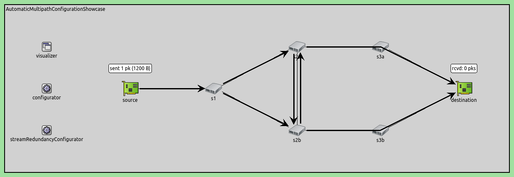
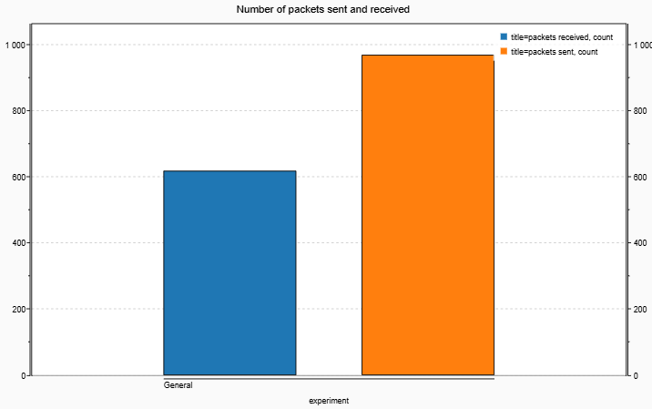
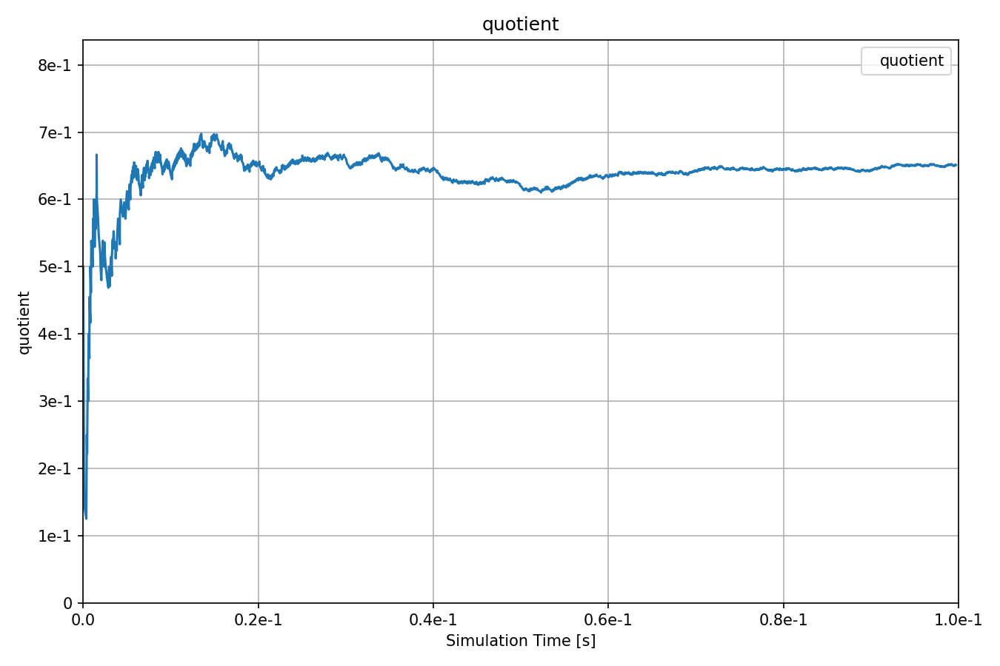

自动多路径流配置
=========================================================

| `原文链接 <https://inet.omnetpp.org/docs/showcases/tsn/framereplication/automaticmultipathconfiguration/doc/index.html>`__ 
| `讲解视频 <https://space.bilibili.com/35942145>`__

目标
-----
在此示例中，我们演示了基于从源到目的地的多条路径的自动流冗余配置。

INET version: ``4.4``

Source files location:
`inet/showcases/tsn/framereplication/automaticmultipathconfiguration <https://github.com/inet-framework/inet/tree/master/showcases/tsn/framereplication/automaticmultipathconfiguration>`__

模型
------
在这种情况下，我们使用自动流冗余配置器，它将每个冗余流的不同路径作为参数。自动配置器设置所有网络节点的所有流识别、流合并、流分割、字符串编码和流解码组件的参数。

网络如下：

配置如下：

.. code:: ini

    [General]
    network = AutomaticMultipathConfigurationShowcase
    sim-time-limit = 0.1s
    description = "Automatic multipath stataic stream redundancy configuration"

    # disable automatic MAC forwarding table configuration
    *.macForwardingTableConfigurator.typename = ""

    # all Ethernet interfaces have 100 Mbps speed
    *.*.eth[*].bitrate = 100Mbps

    # packet error rate of all links is 20%
    **.channel.per = 0.2

    # enable frame replication and elimination
    *.*.hasStreamRedundancy = true

    # source application
    *.source.numApps = 1
    *.source.app[0].typename = "UdpSourceApp"
    *.source.app[0].io.destAddress = "destination"
    *.source.app[0].io.destPort = 1000
    *.source.app[0].source.displayStringTextFormat = "sent %p pk (%l)"
    *.source.app[0].source.packetLength = 1200B
    *.source.app[0].source.productionInterval = truncnormal(100us,50us)

    # destination application
    *.destination.numApps = 1
    *.destination.app[0].typename = "UdpSinkApp"
    *.destination.app[0].io.localPort = 1000

    # all interfaces must have the same address to accept packets from all streams
    *.destination.eth[*].address = "0A-AA-12-34-56-78"

    # visualizer
    *.visualizer.infoVisualizer.modules = "*.source.app[0].source or *.destination.app[0].sink"

    # enable stream policing in layer 2
    *.*.bridging.streamRelay.typename = "StreamRelayLayer"
    *.*.bridging.streamCoder.typename = "StreamCoderLayer"

    # enable automatic stream redundancy configurator
    # 启用自动流冗余配置器
    *.streamRedundancyConfigurator.typename = "StreamRedundancyConfigurator"

    # seamless stream redundancy configuration
    *.streamRedundancyConfigurator.configuration = [{name: "S1", packetFilter: "*", source: "source", destination: "destination",
                                                    trees: [[["source", "s1", "s2a", "s3a", "destination"]],
                                                            [["source", "s1", "s2b", "s3b", "destination"]],
                                                            [["source", "s1", "s2a", "s2b", "s3b", "destination"]],
                                                            [["source", "s1", "s2b", "s2a", "s3a", "destination"]]]}]

    # visualizer
    *.visualizer.streamRedundancyConfigurationVisualizer.displayTrees = true
    *.visualizer.streamRedundancyConfigurationVisualizer.lineColor = "black"

结果
------
以下是接收和发送的数据包数量：

以下是接收和发送数据包的比例：

通过python脚本验证了预期成功接收数据包数与发送数据包数之比，预期结果约为0.657。

| 源代码：
|  `omnetpp.ini <https://inet.omnetpp.org/docs/_downloads/d96e9a206573765884850148f471a89a/omnetpp.ini>`__ 
|  `AutomaticMultipathConfigurationShowcase.ned <https://inet.omnetpp.org/docs/_downloads/cfcc70de3c15565fad3231ec36e8872b/AutomaticMultipathConfigurationShowcase.ned>`__

讨论
----------
如果您对这个示例有任何疑问或讨论，请在 `此页面 <https://github.com/inet-framework/inet/discussions/788>`__ 分享您的想法。