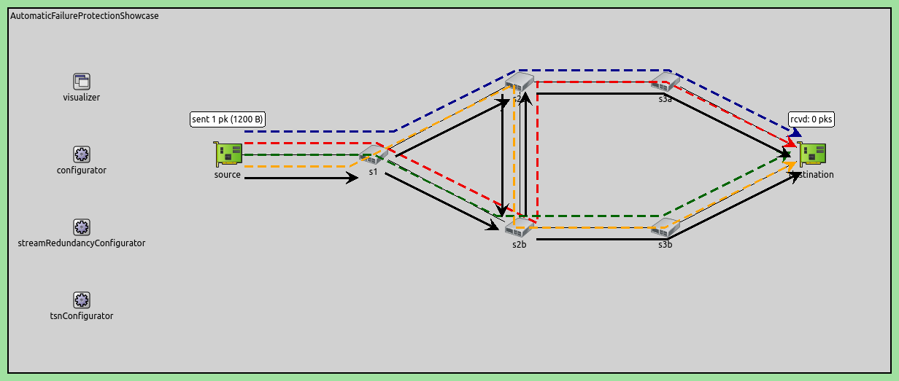
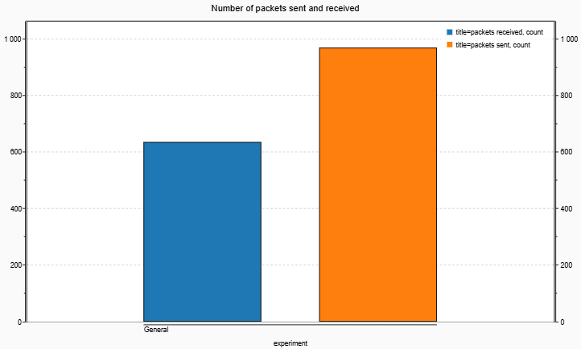
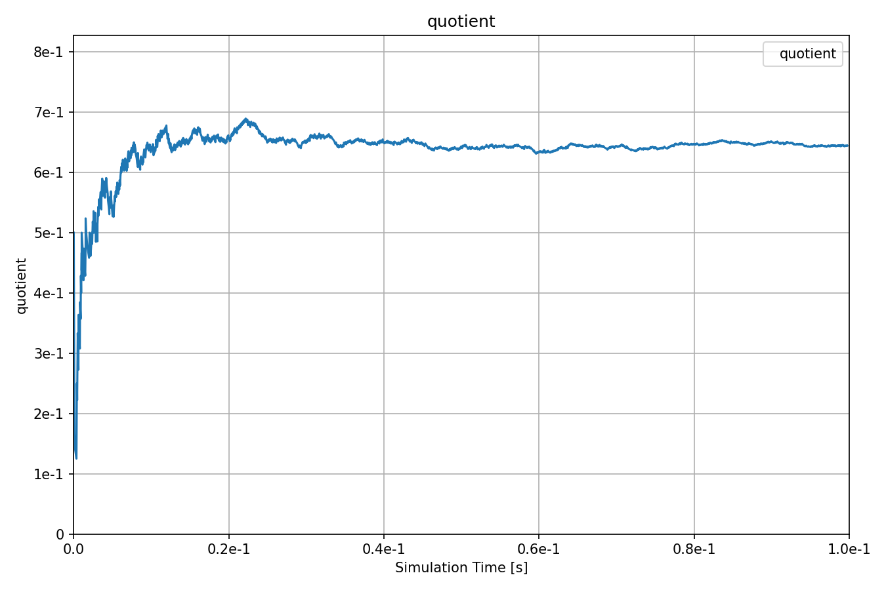

具有故障保护功能的自动流配置
=================================================================================

| `原文链接 <https://inet.omnetpp.org/docs/showcases/tsn/framereplication/automaticfailureprotection/doc/index.html>`__ 
| `讲解视频 <https://space.bilibili.com/35942145>`__

目标
-----
在此示例中，我们演示了基于链路和节点故障保护要求的自动流冗余配置。

INET version: ``4.4``

Source files location:
`inet/showcases/tsn/framereplication/automaticfailureprotection <https://github.com/inet-framework/inet/tree/master/showcases/tsn/framereplication/automaticfailureprotection>`__

模型
------
在此配置中，我们使用一种不同的自动流冗余配置器，该配置器将每个冗余流的链路和节点故障保护要求作为参数。自动配置器根据故障保护要求配置每个流所经过的不同路径，以便在发生故障的情况下，至少保留一条可用的路径。

网络如下：

配置如下：

.. code:: ini

    [General]
    network = AutomaticFailureProtectionShowcase
    sim-time-limit = 0.1s
    description = "Automatic static stream redundancy configuration with failure protection"

    # disable automatic MAC forwarding table configuration
    *.macForwardingTableConfigurator.typename = ""

    # all Ethernet interfaces have 100 Mbps speed
    *.*.eth[*].bitrate = 100Mbps

    # packet error rate of all links is 20%
    **.channel.per = 0.2

    # enable frame replication and elimination
    *.*.hasStreamRedundancy = true

    # source application
    *.source.numApps = 1
    *.source.app[0].typename = "UdpSourceApp"
    *.source.app[0].io.destAddress = "destination"
    *.source.app[0].io.destPort = 1000
    *.source.app[0].source.displayStringTextFormat = "sent %p pk (%l)"
    *.source.app[0].source.packetLength = 1200B
    *.source.app[0].source.productionInterval = truncnormal(100us,50us)

    # destination application
    *.destination.numApps = 1
    *.destination.app[0].typename = "UdpSinkApp"
    *.destination.app[0].io.localPort = 1000

    # all interfaces must have the same address to accept packets from all streams
    *.destination.eth[*].address = "0A-AA-12-34-56-78"

    # visualizer
    *.visualizer.infoVisualizer.modules = "*.source.app[0].source or *.destination.app[0].sink"

    # enable all automatic configurators
    *.streamRedundancyConfigurator.typename = "StreamRedundancyConfigurator"
    *.failureProtectionConfigurator.typename = "FailureProtectionConfigurator"

    # TSN configuration
    *.failureProtectionConfigurator.gateScheduleConfiguratorModule = ""
    # 64B = 8B (UDP) + 20B (IP) + 4B (802.1R) + 6B (802.1Q) + 14B + 4B (ETH MAC) + 8B (ETH PHY)
    *.failureProtectionConfigurator.configuration = [{name: "S1", application: "app[0]", source: "source", destination: "destination",
                                                    pcp: 0, packetFilter: "*",
                                                    packetLength: 100B + 64B, packetInterval: 5ms, maxLatency: 100us,
                                                    nodeFailureProtection: [{any: 1, of: "s2a or s2b or s3a or s3b"}],
                                                    # this link failure protection is somewhat redundant for demonstration purposes
                                                    linkFailureProtection: [{any: 1, of: "*->* and not source->s1"},
                                                                            {any: 2, of: "s1->s2a or s2a->s2b or s2b->s3b"},
                                                                            {any: 2, of: "s1->s2b or s2b->s2a or s2a->s3a"}]}]

    # visualizer
    *.visualizer.failureProtectionConfigurationVisualizer.displayTrees = true
    *.visualizer.failureProtectionConfigurationVisualizer.lineStyle = "dashed"
    *.visualizer.streamRedundancyConfigurationVisualizer.displayTrees = true
    *.visualizer.streamRedundancyConfigurationVisualizer.lineColor = "black"

结果
------
以下是接收和发送的数据包数量：

以下是接收和发送数据包的比例：

通过python脚本验证了预期成功接收数据包数与发送数据包数之比，预期结果约为0.657。
| 源代码：
|  `omnetpp.ini <https://inet.omnetpp.org/docs/_downloads/52100d503a7a324ef4538280927ab223/omnetpp.ini>`__ 
|  `AutomaticFailureProtectionShowcase.ned <https://inet.omnetpp.org/docs/_downloads/3dbef2dbf1e351fc2ac4dd2f0338bde0/AutomaticFailureProtectionShowcase.ned>`__

讨论
----------
如果您对这个示例有任何疑问或讨论，请在 `此页面 <https://github.com/inet-framework/inet/discussions/787>`__ 分享您的想法。