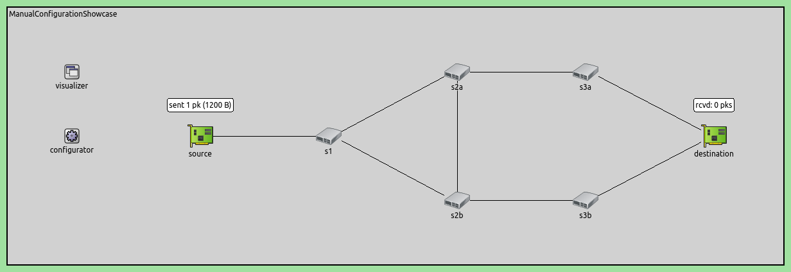
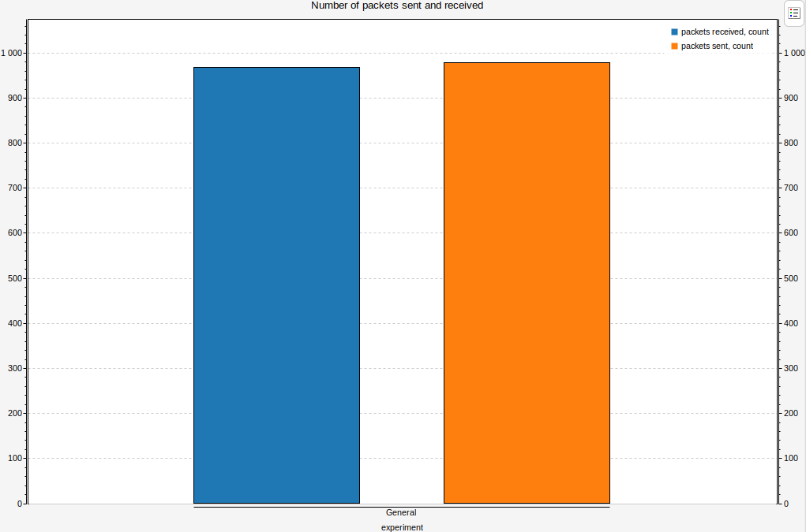
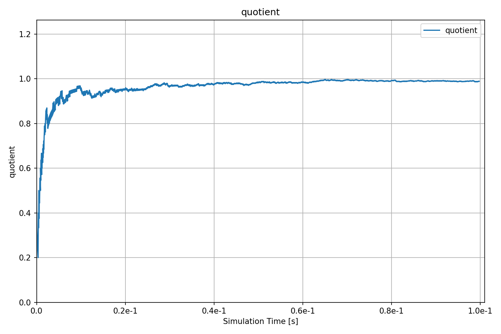

手动流配置
======================================

| `原文链接 <https://inet.omnetpp.org/docs/showcases/tsn/framereplication/manualconfiguration/doc/index.html>`__ 
| `讲解视频 <https://space.bilibili.com/35942145>`__

目标
-----
在此示例中，我们演示了流识别、流分割、流合并、流编码和流解码的手动配置，以实现所需的流冗余。

INET version: ``4.4``

Source files location:
`inet/showcases/tsn/framereplication/manualconfiguration <https://github.com/inet-framework/inet/tree/master/showcases/tsn/framereplication/manualconfiguration>`__

模型
------
在此配置中，我们采用了IEEE 802.1CB修正案中提到的网络拓扑。网络包含一个源节点和目标节点，其中源节点通过五个交换机发送冗余数据流。该流在三个交换机中复制，并在两个交换机中合并。

网络如下：

配置如下：

.. code:: ini

   [General]
   network = ManualConfigurationShowcase
   sim-time-limit = 0.1s
   description = "Manual static stream redundancy configuration"

   # disable automatic MAC forwarding table configuration
   *.macForwardingTableConfigurator.typename = ""

   # all Ethernet interfaces have 100 Mbps speed
   *.*.eth[*].bitrate = 100Mbps

   # decrease throughput measurement interval
   **.throughput.interval = 10ms

   # link breaks between switches
   # 设置链路故障
   *.scenarioManager.script = xml("<scenario> \
                                   <at t='0.1'> \
                                      <disconnect src-module='s1' dest-module='s2a'/> \
                                   </at> \
                                   <at t='0.2'> \
                                      <disconnect src-module='s2b' dest-module='s3b'/> \
                                   </at> \
                                   </scenario>")

   # enable frame replication and elimination
   *.*.hasStreamRedundancy = true
   # source application
   *.source.numApps = 1
   *.source.app[0].typename = "UdpSourceApp"
   *.source.app[0].io.destAddress = "destination"
   *.source.app[0].io.destPort = 1000
   *.source.app[0].source.displayStringTextFormat = "sent %p pk (%l)"
   *.source.app[0].source.packetLength = 1200B
   *.source.app[0].source.productionInterval = truncnormal(100us,50us)
   # destination application
   *.destination.numApps = 1
   *.destination.app[0].typename = "UdpSinkApp"
   *.destination.app[0].io.localPort = 1000
   # all interfaces must have the same address to accept packets from all streams
   # 接收端有两个网卡，需要将两个网卡设置为相同的MAC地址
   *.destination.eth[*].address = "0A-AA-12-34-56-78"
   # visualizer
   *.visualizer.infoVisualizer.modules = "*.source.app[0].source or *.destination.app[0].sink"
   # configure all egress traffic as part of stream s1, start sequence numbering
   # CB是基于报文序列编号进行复制与消除的
   *.source.bridging.streamIdentifier.identifier.mapping = [{packetFilter: "*", stream: "s1", sequenceNumbering: true}]
   # encode egress stream s1 to VLAN 1
   *.source.bridging.streamCoder.encoder.mapping = [{stream: "s1", vlan: 1}]
   # map destination MAC address and VLAN pairs to network interfaces
   *.s1.macTable.forwardingTable = [{address: "destination", vlan: 1, interface: "eth0"},
                                   {address: "destination", vlan: 2, interface: "eth1"}]
   # allow ingress traffic from VLAN 1
   *.s1.ieee8021q.qTagHeaderChecker.vlanIdFilter = [1]
   # enable stream policing in layer 2 bridging
   *.s1.bridging.streamRelay.typename = "StreamRelayLayer"
   *.s1.bridging.streamCoder.typename = "StreamCoderLayer"
   # map eth2 VLAN 1 to stream s1
   *.s1.bridging.streamCoder.decoder.mapping = [{interface: "eth2", vlan: 1, stream: "s1"}]
   # eliminate duplicates from stream s1
   *.s1.bridging.streamRelay.merger.mapping = {s1: "s1"}
   # split stream s1 into s2a and s2b
   *.s1.bridging.streamRelay.splitter.mapping = {s1: ["s2a", "s2b"]}
   # map stream s2a to VLAN 1 and s2b to VLAN 2
   *.s1.bridging.streamCoder.encoder.mapping = [{stream: "s2a", vlan: 1},
                                               {stream: "s2b", vlan: 2}]
   # map destination MAC address and VLAN pairs to network interfaces
   *.s2a.macTable.forwardingTable = [{address: "destination", vlan: 1, interface: "eth0"},
                                   {address: "destination", vlan: 2, interface: "eth1"}]
   # allow ingress traffic from VLAN 1 and 2
   *.s2a.ieee8021q.qTagHeaderChecker.vlanIdFilter = [1, 2]
   # enable stream policing in layer 2 bridging
   *.s2a.bridging.streamRelay.typename = "StreamRelayLayer"
   *.s2a.bridging.streamCoder.typename = "StreamCoderLayer"
   # map eth2 VLAN 1 to stream s2a and eth1 VLAN 2 to stream s2b-s2a
   *.s2a.bridging.streamCoder.decoder.mapping = [{interface: "eth2", vlan: 1, stream: "s2a"},
                                               {interface: "eth1", vlan: 2, stream: "s2b-s2a"}]
   # merge streams s2a and s2b-s2a in into s3a
   *.s2a.bridging.streamRelay.merger.mapping = {s2a: "s3a", "s2b-s2a": "s3a"}
   # split stream s2a into s3a and s2b
   *.s2a.bridging.streamRelay.splitter.mapping = {s3a: ["s3a", "s2b"]}
   # map stream s3a to VLAN 1 and s2b to VLAN 2
   *.s2a.bridging.streamCoder.encoder.mapping = [{stream: "s3a", vlan: 1},
                                               {stream: "s2b", vlan: 2}]
   # map destination MAC address and VLAN pairs to network interfaces
   *.s2b.macTable.forwardingTable = [{address: "destination", vlan: 1, interface: "eth0"},
                                   {address: "destination", vlan: 2, interface: "eth1"}]
   # allow ingress traffic from VLAN 1 and 2
   *.s2b.ieee8021q.qTagHeaderChecker.vlanIdFilter = [1, 2]
   # enable stream policing in layer 2 bridging
   *.s2b.bridging.streamRelay.typename = "StreamRelayLayer"
   *.s2b.bridging.streamCoder.typename = "StreamCoderLayer"
   # map eth2 VLAN 2 to stream s2b and eth1 VLAN 1 to stream s2a-s2b
   *.s2b.bridging.streamCoder.decoder.mapping = [{interface: "eth2", vlan: 2, stream: "s2b"},
                                               {interface: "eth1", vlan: 2, stream: "s2a-s2b"}]
   # merge streams s2b and s2a-s2b in into s3b
   *.s2b.bridging.streamRelay.merger.mapping = {s2b: "s3b", "s2a-s2b": "s3b"}
   # split stream s2b into s3b and s2a
   *.s2b.bridging.streamRelay.splitter.mapping = {s3b: ["s3b", "s2a"]}
   # stream s3a maps to VLAN 1 and s2a to VLAN 2
   *.s2b.bridging.streamCoder.encoder.mapping = [{stream: "s3b", vlan: 1},
                                               {stream: "s2a", vlan: 2}]
   # map destination MAC address and VLAN pairs to network interfaces
   *.s3a.macTable.forwardingTable = [{address: "destination", vlan: 1, interface: "eth0"}]
   # map eth1 VLAN 1 to stream s3a
   *.s3a.bridging.streamCoder.decoder.mapping = [{interface: "eth1", vlan: 1, stream: "s3a"}]
   # stream s3a maps to VLAN 1
   *.s3a.bridging.streamCoder.encoder.mapping = [{stream: "s3a", vlan: 1}]
   # allow ingress traffic from VLAN 1
   *.s3a.ieee8021q.qTagHeaderChecker.vlanIdFilter = [1]
   # map destination MAC address and VLAN pairs to network interfaces
   *.s3b.macTable.forwardingTable = [{address: "destination", vlan: 1, interface: "eth0"}]
   # map eth1 VLAN 1 to stream s3b
   *.s3b.bridging.streamCoder.decoder.mapping = [{interface: "eth1", vlan: 1, stream: "s3b"}]
   # stream s3b maps to VLAN 1
   *.s3b.bridging.streamCoder.encoder.mapping = [{stream: "s3b", vlan: 1}]
   # allow ingress traffic from VLAN 1
   *.s3b.ieee8021q.qTagHeaderChecker.vlanIdFilter = [1]
   # allow ingress traffic from VLAN 1
   *.destination.ieee8021q.qTagHeaderChecker.vlanIdFilter = [1]
   # map eth0 VLAN 1 to stream s3a and eth1 VLAN 1 to stream s3b
   *.destination.bridging.streamCoder.decoder.mapping = [{interface: "eth0", vlan: 1, stream: "s3a"},
                                                       {interface: "eth1", vlan: 1, stream: "s3b"}]
   # merge streams s3a and s3b into null stream
   *.destination.bridging.streamRelay.merger.mapping = {s3a: "", s3b: ""}

结果
------
以下是接收和发送的数据包数量：

以下是接收和发送数据包的比例：

通过python脚本验证了预期成功接收数据包数与发送数据包数之比，预期结果约为0.657。

| 源代码：
|  `omnetpp.ini <https://inet.omnetpp.org/docs/_downloads/fcf5fb9ee44c86d0cd7a123274fed73d/omnetpp.ini>`__ 
|  `ManualConfigurationShowcase.ned <https://inet.omnetpp.org/docs/_downloads/a2b127160c4dd310e0f667c91af6efdb/ManualConfigurationShowcase.ned>`__

讨论
----------
如果您对这个示例有任何疑问或讨论，请在 `此页面 <https://github.com/inet-framework/inet/discussions/789>`__ 分享您的想法。
