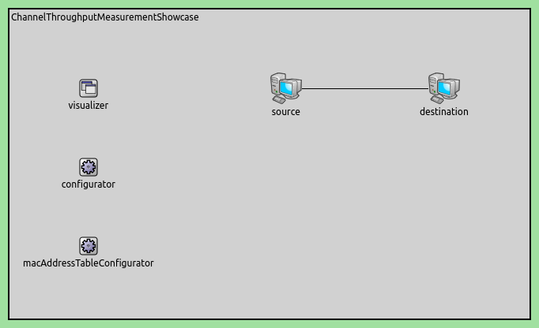
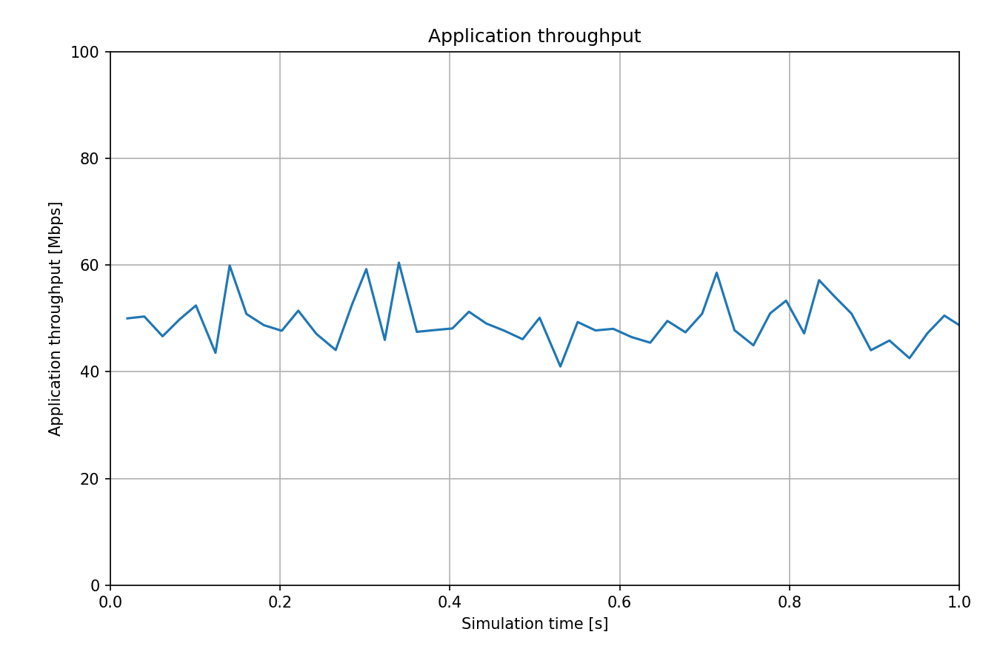

测量通道吞吐量
===================

| `原文链接 <https://inet.omnetpp.org/docs/showcases/measurement/throughput/doc/index.html>`__ 

目标
~~~~~

在这个示例中，我们探索了有线和无线传输介质的通道吞吐量统计信息。

INET 版本: ``4.4``

源地址链接:
`inet/showcases/measurement/throughput <https://github.com/inet-framework/inet/tree/master/showcases/measurement/throughput>`__

模型
~~~~~~~~~~
通道吞吐量是通过观察在一段时间内通过传输介质传输的数据包来测量的。对于有线和无线通道，吞吐量是针对任何一对通信网络接口分别进行测量的，按两个方向分别计算。

通道吞吐量是发射器模块的统计信息，例如以太网物理层中的 ``PacketTransmitter``。吞吐量是通过滑动窗口来测量的。默认情况下，窗口为 0.1 秒或 100 个数据包，先到为准。窗口的参数，例如窗口间隔，可以通过 ini 文件进行配置，配置项为 ``module.statistic.parameter``。例如：

.. code:: ini
   *.host.eth[0].phyLayer.transmitter.throughput.interval = 0.2s

以下是网络配置：

以下是配置：

.. code:: ini
   [General]
   network = ChannelThroughputMeasurementShowcase
   description = "测量源和目标之间的吞吐量"
   sim-time-limit = 1s

   # 源应用，吞吐量大约为 ~48Mbps
   *.source.numApps = 1
   *.source.app[0].typename = "UdpSourceApp"
   *.source.app[0].source.packetLength = 1200B
   *.source.app[0].source.productionInterval = exponential(200us)
   *.source.app[0].io.destAddress = "destination"
   *.source.app[0].io.destPort = 1000

   # 目标应用
   *.destination.numApps = 1
   *.destination.app[0].typename = "UdpSinkApp"
   *.destination.app[0].io.localPort = 1000

   # 启用模块化以太网模型
   *.*.ethernet.typename = "EthernetLayer"
   *.*.eth[*].typename = "LayeredEthernetInterface"

   # 所有网络接口的数据速率
   *.*.eth[*].bitrate = 100Mbps

结果
~~~~~~~~~~
以下是结果：

数据点的频率比 0.1 秒更密集，因此统计信息会更频繁地发出，每 100 个数据包后发出一次。

| 源代码：
|  `omnetpp.ini <https://inet.omnetpp.org/docs/_downloads/f30657204540975e04e5aa4b5c08b76a/omnetpp.ini>`__ 
|  `ChannelThroughputMeasurementShowcase.ned <https://inet.omnetpp.org/docs/_downloads/ed87815ae269d61b9472db3d22328c85/ChannelThroughputMeasurementShowcase.ned>`__ 

讨论
----------
如果您对这个示例有任何疑问或讨论，请在 `此页面 <https://github.com/inet-framework/inet/discussions/TODO>`__ 分享您的想法。
