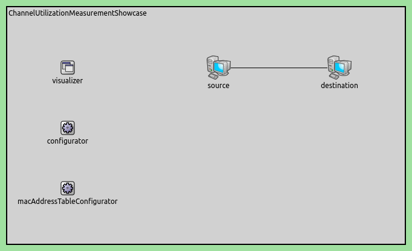
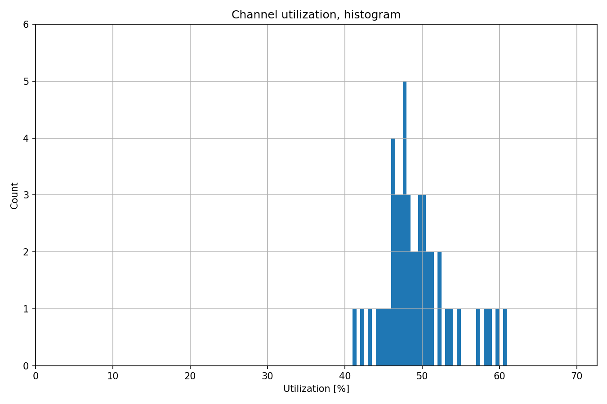
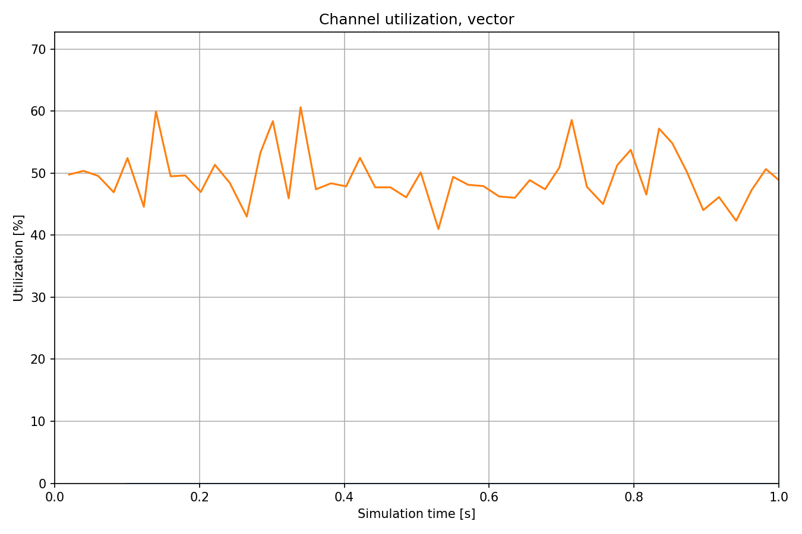

测量通道利用率
===================

目标
~~~~~

在这个示例中，我们探索了有线和无线传输介质的通道利用率统计信息。

INET 版本: ``4.4``

源地址链接:
`inet/showcases/measurement/utilization <https://github.com/inet-framework/inet/tree/master/showcases/measurement/utilization>`__

模型
~~~~~~~~~~
通道利用率统计是通过观察在一段时间内通过传输介质传输的数据包来测量的。对于有线和无线通道，利用率是针对任何一对通信网络接口分别进行测量的，按两个方向分别计算。该统计数据用 0 到 1 之间的值表示信道的相对使用情况，其中 0 表示信道未被使用，1 表示信道被完全利用。

通道利用率是发射器模块的统计信息，例如以太网物理层中的 ``PacketTransmitter``。通道利用率与吞吐量相关，利用率是吞吐量与通道数据速率的比率。默认情况下，通道利用率是根据过去 0.1 秒或最近 100 个数据包计算的，以先到者为准。

这些值可以通过 ``ini`` 文件中的 ``interval（[s]）``和 ``numValueLimit`` 参数进行配置，作为 ``module.statistic.parameter``。例如：

.. code:: ini
   *.host.eth[0].phyLayer.transmitter.utilization.interval = 0.2s

以下是网络配置：

主机通过 100 Mbps 以太网连接。

我们将主机配置为使用分层以太网模型，并使源主机生成大约 48 Mbps 的 UDP 数据包。以下是配置：

.. code:: ini
   [General]
   network = ChannelUtilizationMeasurementShowcase
   sim-time-limit = 1s

   # 源应用，吞吐量大约为 ~48Mbps
   *.source.numApps = 1
   *.source.app[0].typename = "UdpSourceApp"
   *.source.app[0].source.packetLength = 1200B
   *.source.app[0].source.productionInterval = exponential(200us)
   *.source.app[0].io.destAddress = "destination"
   *.source.app[0].io.destPort = 1000

   # 目标应用
   *.destination.numApps = 1
   *.destination.app[0].typename = "UdpSinkApp"
   *.destination.app[0].io.localPort = 1000

   # 启用模块化以太网模型
   *.*.ethernet.typename = "EthernetLayer"
   *.*.eth[*].typename = "LayeredEthernetInterface"

   # 所有网络接口的数据速率
   *.*.eth[*].bitrate = 100Mbps

结果
~~~~~~~~~~
我们测量了源主机中的通道利用率（source.eth[0].phy.transmitter.utilization 统计）。以下是结果：

.. note::
   - 这是源到目标方向的通道利用率。
   - 在该链路的反方向，利用率可以通过目标端的利用率统计进行测量，但在此示例中，该方向没有流量。

| 源代码：
|  `omnetpp.ini <https://inet.omnetpp.org/docs/_downloads/0c925d9a3f41a0728335ab275f9f1249/omnetpp.ini>`__ 
|  `ChannelUtilizationMeasurementShowcase.ned <https://inet.omnetpp.org/docs/_downloads/24e0f791cb96967cb3a4bf0043d0a1b2/ChannelUtilizationMeasurementShowcase.ned>`__ 

讨论
----------
如果您对这个示例有任何疑问或讨论，请在 `此页面 <https://github.com/inet-framework/inet/discussions/TODO>`__ 分享您的想法。