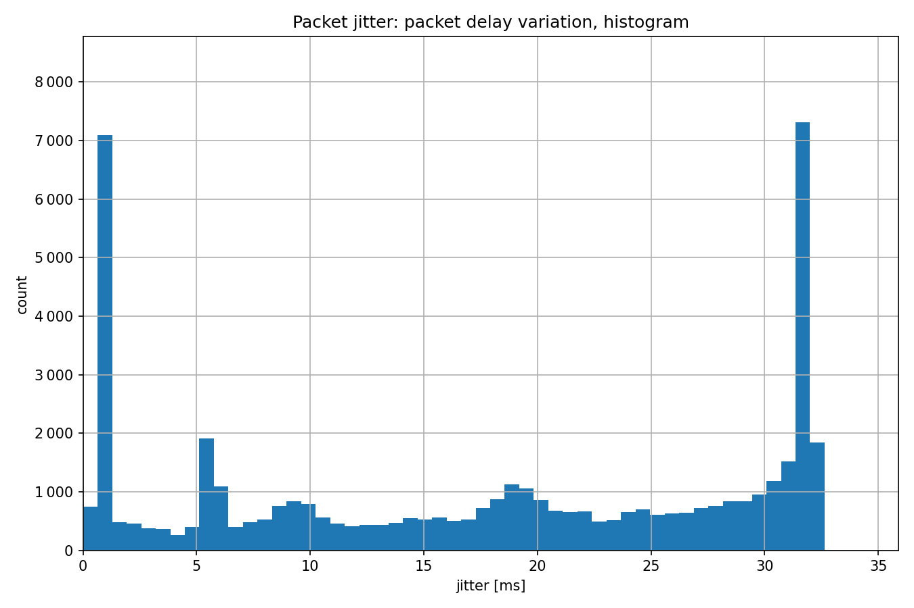

测量数据包延迟变化
===================

目标
~~~~~

在这个示例中，我们探索了应用程序模块的各种数据包延迟变化统计信息（也称为数据包抖动）。

INET 版本: ``4.4``

源文件位置:
`inet/showcases/measurement/jitter <https://github.com/inet-framework/inet/tree/master/showcases/measurement/jitter>`__

模型
~~~~~~~~~~

数据包延迟变化以几种不同的形式进行测量：

- 瞬时数据包延迟变化：连续数据包的延迟差（``packetJitter``）
- 数据包延迟的方差（``packetDelayVariation``）
- 与平均值相比的数据包延迟差（``packetDelayDifferenceToMean``）

以下是网络配置：

.. image:: Pic/Network4.png
   :alt: Network4.png
   :align: center

以下是配置：

.. code:: ini
   [General]
   network = JitterMeasurementShowcase
   sim-time-limit = 5s

   # 源应用程序 ~96Mbps 吞吐量
   *.source.numApps = 1
   *.source.app[0].typename = "UdpSourceApp"
   *.source.app[0].source.packetLength = 1200B
   *.source.app[0].source.productionInterval = exponential(100us)
   *.source.app[0].io.destAddress = "destination"
   *.source.app[0].io.destPort = 1000

   # 目标应用程序
   *.destination.numApps = 1
   *.destination.app[0].typename = "UdpSinkApp"
   *.destination.app[0].io.localPort = 1000

结果
~~~~~~~~~~

以下是结果：

源代码：
|  `omnetpp.ini <https://inet.omnetpp.org/docs/_downloads/e145e8c87ceb2085915c5f4d3cd4f166/omnetpp.ini>`__ 
|  `JitterMeasurementShowcase.ned <https://inet.omnetpp.org/docs/_downloads/c4c9f387de3596314e9690880861b6ec/JitterMeasurementShowcase.ned>`__

讨论
----------
如果您对这个示例有任何疑问或讨论，请在 `此页面 <https://github.com/inet-framework/inet/discussions/TODO>`__ 分享您的想法。
