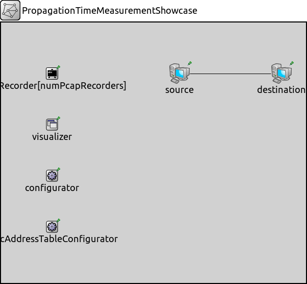
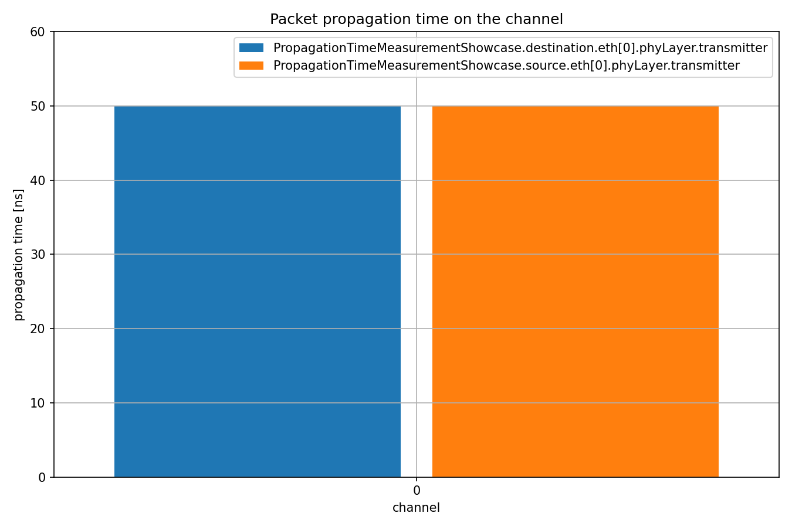

测量传播时间
====================

目标
~~~~~

在这个例子中，我们探讨了有线和无线传输介质的信道传播时间统计数据。

INET版本：``4.4``  
源文件位置：`inet/showcases/measurement/propagationtime <https://github.com/inet-framework/inet/tree/master/showcases/measurement/propagationtime>`__

模型
~~~~~~

包的传播时间是从物理信号开始编码包的时刻起，直到同一物理信号开始到达接收网络接口的时刻为止。这个时间通常等于物理信号末端到达接收端的时间差。例外情况是当接收方相对于发射方的速度较快，且与物理信号的传播速度相比非常高时，但在通信网络仿真中这种情况很少见。

以下是网络配置：

以下是配置：

.. code:: ini
   [General]  
   network = PropagationTimeMeasurementShowcase  
   description = "Measure packet propagation time on the channel"  
   sim-time-limit = 1s  

   # 源应用 ~96Mbps吞吐量  
   *.source.numApps = 1  
   *.source.app[0].typename = "UdpSourceApp"  
   *.source.app[0].source.packetLength = 1200B  
   *.source.app[0].source.productionInterval = exponential(100us)  
   *.source.app[0].io.destAddress = "destination"  
   *.source.app[0].io.destPort = 1000  

   # 目的地应用  
   *.destination.numApps = 1  
   *.destination.app[0].typename = "UdpSinkApp"  
   *.destination.app[0].io.localPort = 1000  

   # 启用模块化以太网模型  
   *.*.ethernet.typename = "EthernetLayer"  
   *.*.eth[*].typename = "LayeredEthernetInterface"  

   # 所有网络接口的数据速率  
   *.*.eth[*].bitrate = 100Mbps  
   
结果
~~~~~~

以下是结果：

源代码：
|  `omnetpp.ini <https://inet.omnetpp.org/docs/_downloads/6cb26105f517d2578d55ec1a747353f3/omnetpp.ini>`__ 
|  `PropagationTimeMeasurementShowcase.ned <https://inet.omnetpp.org/docs/_downloads/6b61c1a34e280fc9085c76bf368c9a2b/PropagationTimeMeasurementShowcase.ned>`__

讨论
----------
如果您对这个示例有任何疑问或讨论，请在 `此页面 <https://github.com/inet-framework/inet/discussions/TODO>`__ 分享您的想法。
