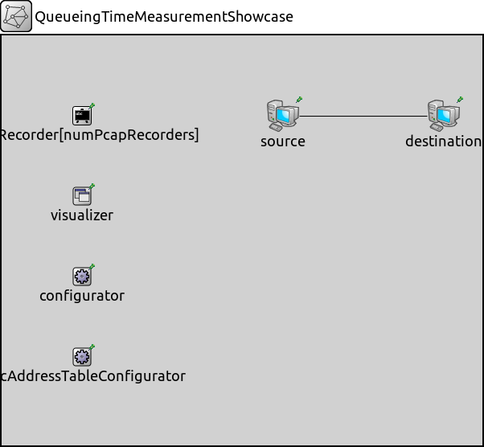
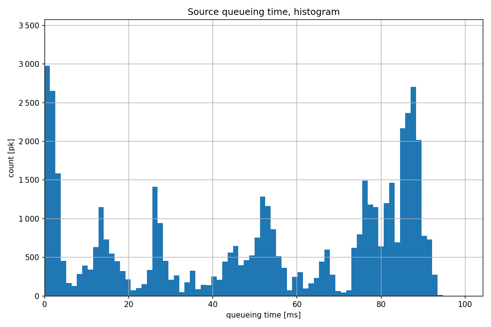
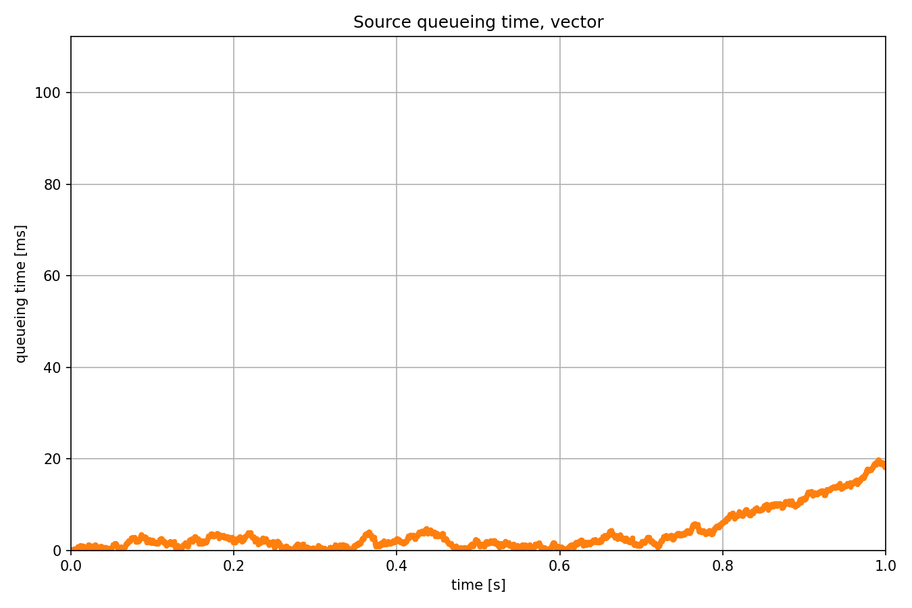

测量排队时间
====================

目标
~~~~~

在这个例子中，我们探讨了网络接口的队列模块的排队时间统计数据。

INET版本：``4.4``  
源文件位置：`inet/showcases/measurement/queueingtime <https://github.com/inet-framework/inet/tree/master/showcases/measurement/queueingtime>`__

模型
~~~~~~

排队时间是从数据包被加入队列的时刻开始，直到相同数据包从队列中被移除的时刻为止。简单的数据包队列模块通常也被用来构建更复杂的队列，如优先级队列，甚至流量整形器。对于这些情况，排队时间统计数据会自动收集。

以下是网络配置：

以下是配置：

.. code:: ini
   [General]  
   network = QueueingTimeMeasurementShowcase  
   description = "Measure queueing time in the switch"  
   sim-time-limit = 5s  

   # 源应用 ~96Mbps吞吐量  
   *.source.numApps = 1  
   *.source.app[0].typename = "UdpSourceApp"  
   *.source.app[0].source.packetLength = 1200B  
   *.source.app[0].source.productionInterval = exponential(100us)  
   *.source.app[0].io.destAddress = "destination"  
   *.source.app[0].io.destPort = 1000  

   # 目的地应用  
   *.destination.numApps = 1  
   *.destination.app[0].typename = "UdpSinkApp"  
   *.destination.app[0].io.localPort = 1000  

结果
~~~~~~

以下是结果：

源代码：
|  `omnetpp.ini <https://inet.omnetpp.org/docs/_downloads/d08c475323fd88afd8b0fc6c7215264a/omnetpp.ini>`__ 
|  `QueueingTimeMeasurementShowcase.ned <https://inet.omnetpp.org/docs/_downloads/28e274ff275444a89b51b73954cd1b8c/QueueingTimeMeasurementShowcase.ned>`__

讨论
----------
如果您对这个示例有任何疑问或讨论，请在 `此页面 <https://github.com/inet-framework/inet/discussions/TODO>`__ 分享您的想法。
