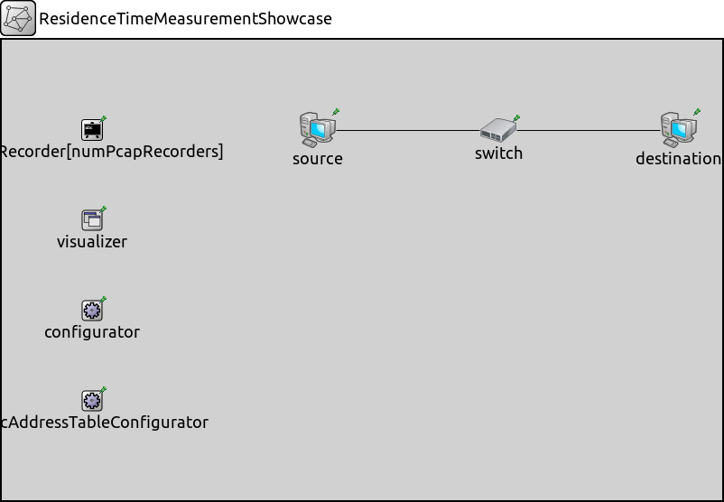
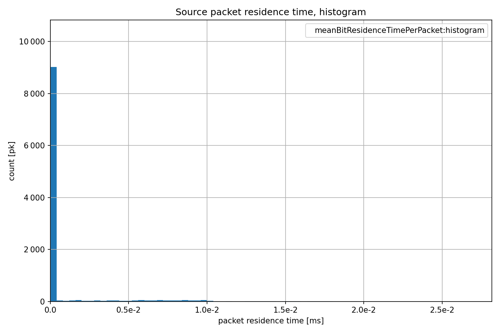
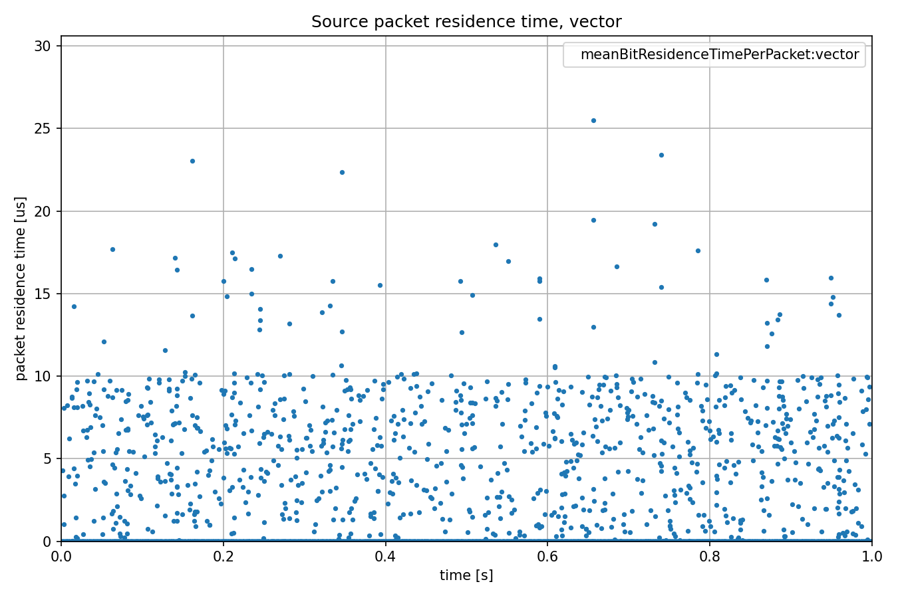
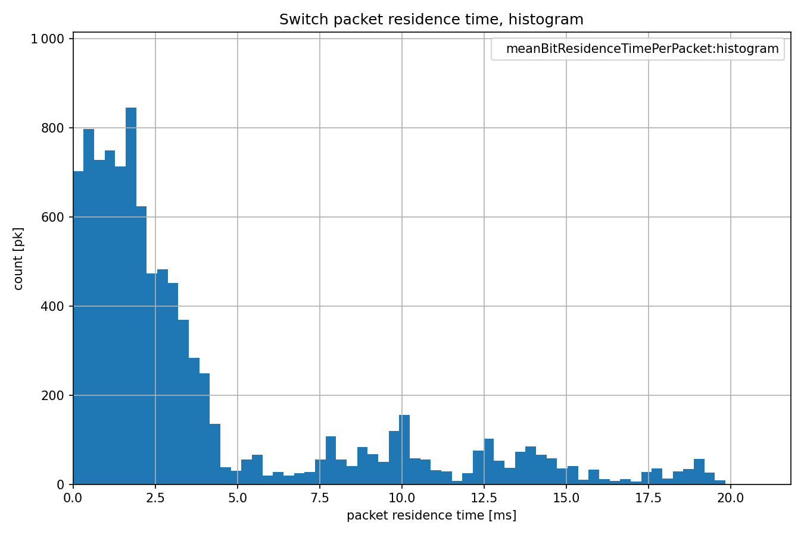
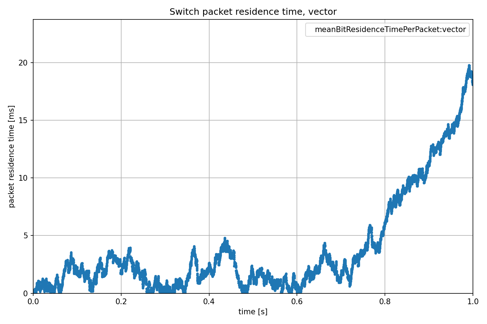
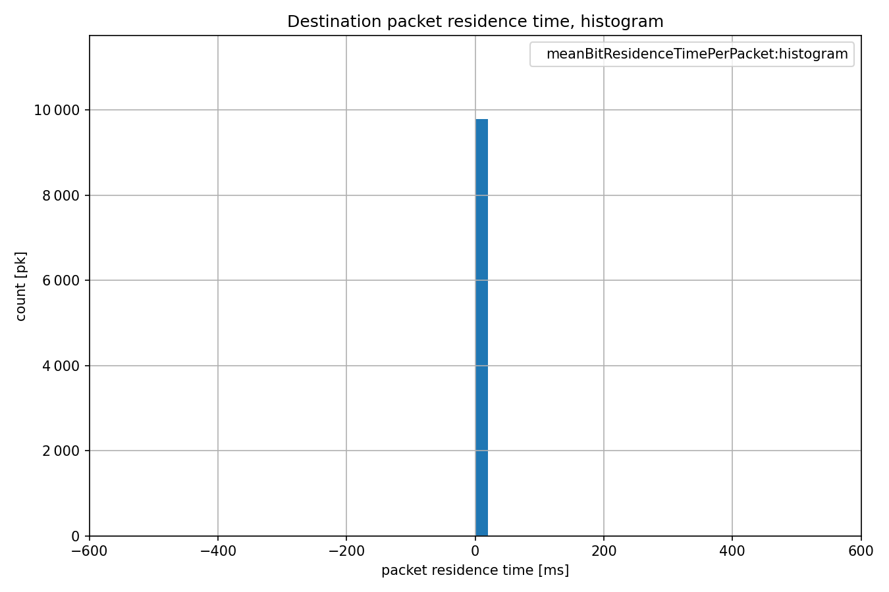
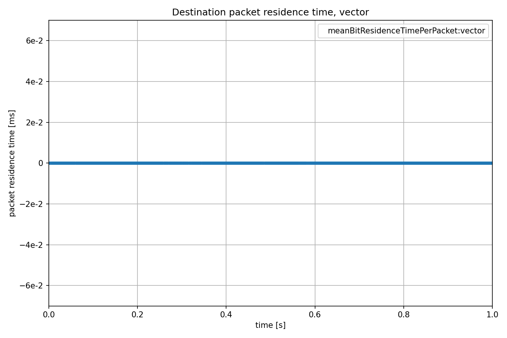

测量驻留时间
====================

目标
~~~~~

在这个例子中，我们探讨了网络节点的数据包驻留时间统计数据。

INET版本：``4.4``  
源文件位置：`inet/showcases/measurement/residencetime <https://github.com/inet-framework/inet/tree/master/showcases/measurement/residencetime>`__

模型
~~~~~~

数据包驻留时间是从数据包进入网络节点的时刻开始，直到相同数据包离开该网络节点的时刻为止。这个统计数据同样会收集在网络节点中创建和/或销毁的数据包。

以下是网络配置：

以下是配置：

.. code:: ini
   [General]  
   network = ResidenceTimeMeasurementShowcase  
   description = "Measure packet residence time in all network nodes"  
   sim-time-limit = 1s  

   # 源应用 ~96Mbps吞吐量  
   *.source.numApps = 1  
   *.source.app[0].typename = "UdpSourceApp"  
   *.source.app[0].source.packetLength = 1200B  
   *.source.app[0].source.productionInterval = exponential(100us)  
   *.source.app[0].io.destAddress = "destination"  
   *.source.app[0].io.destPort = 1000  

   # 目的地应用  
   *.destination.numApps = 1  
   *.destination.app[0].typename = "UdpSinkApp"  
   *.destination.app[0].io.localPort = 1000  

   # 启用所有网络节点的数据包驻留时间测量  
   *.*.measurer.typename = "ResidenceTimeMeasurer"  

结果
~~~~~~

以下是结果：

源代码：
|  `omnetpp.ini <https://inet.omnetpp.org/docs/_downloads/1bf3dda6ae73343dd2d397be29987519/omnetpp.ini>`__  
|  `ResidenceTimeMeasurementShowcase.ned <https://inet.omnetpp.org/docs/_downloads/e0688f1faeff532d4669e6b870139ee8/ResidenceTimeMeasurementShowcase.ned>`__

讨论
----------
如果您对这个示例有任何疑问或讨论，请在 `此页面 <https://github.com/inet-framework/inet/discussions/TODO>`__ 分享您的想法。
