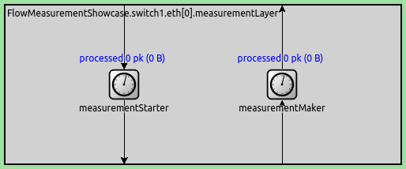
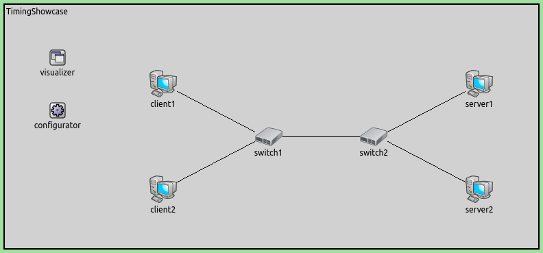
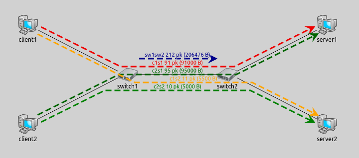
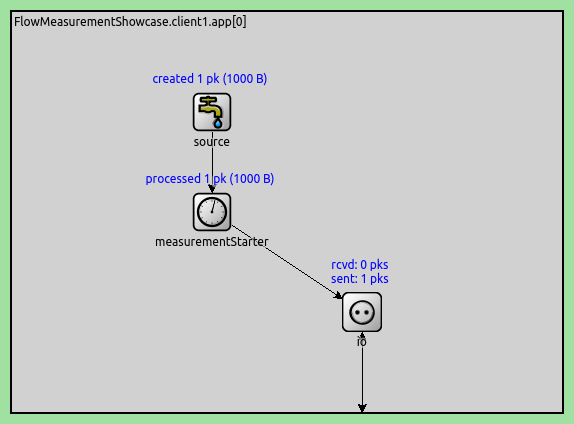
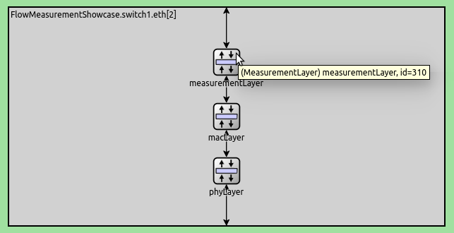
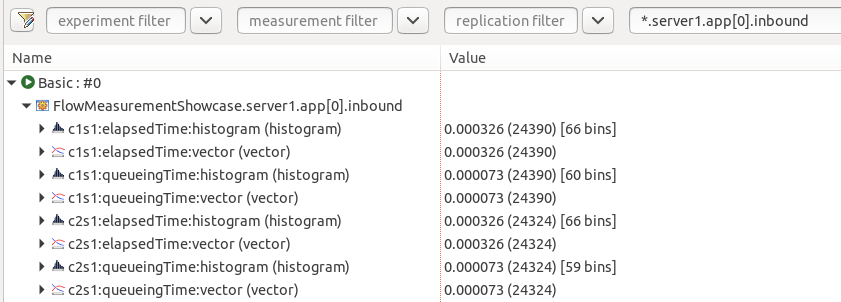
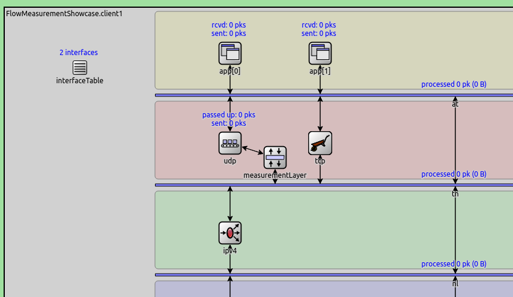
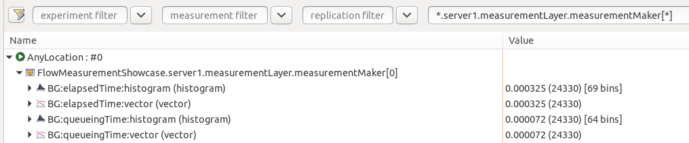

测量数据包流的时间
====================

目标
~~~~~

本展示案例演示了如何将数据包分组为流，以便对它们进行测量，如经过时间、在队列中花费的时间或传输时间。

INET版本：`4.4`  
源文件位置：inet/showcases/general/flowmeasurement <https://github.com/inet-framework/inet/tree/master/showcases/general/flowmeasurement>__

模型
~~~~~~

以下部分概述了与数据包相关的时间测量。有关更多信息，请参阅INET手册的"收集结果"部分。

数据包流概述
^^^^^^^^^^^^^^

默认情况下，INET中的统计数据是基于与特定模块相关的本地事件（例如模块接收的数据包）收集的。有时这些本地数据可能不够。例如，当我们想要分别测量到达同一目的地但在网络中采用不同路径的数据包所产生的排队时间时。

对于与发生在数据包上的事件相关的时间测量，可以定义数据包流。数据包流是在整个网络和整个仿真持续时间内对数据包的逻辑分类，由其名称标识。数据包流由添加到某些数据包的标签定义。该标签包含流名称（流的身份）和一些指定的测量请求。

沿数据包流进行时间测量在数据包关联的时间数据而非其通过、处理或到达的模块时非常有用。例如，我们可能想要测量数据包在所有通过的模块中的排队时间，而不是测量队列模块处理的所有数据包的排队时间。

数据包通过称为测量启动器的专用模块与流关联。这些模块将标签附加到数据包上，指示它属于哪个流以及请求的测量内容。当数据包在网络中传输时，某些模块将测量的时间（或其他数据）作为元信息添加到数据包中。其他专用模块（测量记录器）将附加的数据记录为与该特定流相关的统计信息。这些模块可以选择性地从数据包中移除标签（然后数据包可以继续沿其路径传输）。

例如，在测量启动器模块中向数据包添加标签，指定流名称`flow1`和排队时间测量。当数据包在网络中的各种队列模块中处理时，队列模块将在其中花费的时间附加到数据包作为元信息。标签在测量记录器模块中被移除，并记录数据包累积的排队时间。这些数据可以在分析工具的浏览数据选项卡中找到，作为测量记录器模块的`flowname:statisticname`结果名称（例如，`flow1:queueingTime:histogram`）。默认情况下，`FlowMeasurementRecorder`将指定的测量记录为向量和直方图。这些统计数据可以像任何其他统计数据一样被绘制、导出和分析。

任意数量的流标签可以添加到一个数据包（它可以是多个流的一部分）。同样，同一个流可以有多个起点和终点。

.. note::
   一个实际问题是，由于分片和重组等原因，数据包的不同部分可能有不同的历史。因此，我们需要跟踪数据包不同区域的测量。为此，数据包中的每个位都可以有自己的元信息，将其关联到一个流，称为区域标签。有关区域标签的更多信息，请查看INET开发者指南的"区域标记"部分。

测量模块
^^^^^^^^^^^^

负责添加流标签和指定对数据包进行测量的专用模块是`FlowMeasurementStarter`。其负责移除流标签和记录测量的对应模块是`FlowMeasurementRecorder`模块。

`FlowMeasurementStarter`和`FlowMeasurementRecorder`模块具有相同的参数集，用于指定流名称（`flowName`参数）、进入或退出流的数据包集（`packetFilter`参数）以及所需的测量（`measure`参数）。

默认情况下，过滤器匹配所有数据包（`packetFilter = 'true'`）。`measure`参数是一个包含以下集合中元素的列表，用空格分隔：

`delayingTime`, `queueingTime`, `processingTime`, `transmissionTime`, `propagationTime`: 不同情况下的时间，基于每比特

`elapsedTime`: 数据包在流中的总经过时间（见下面的第一个注释）

`packetEvent`: 记录发生在数据包上的所有事件（见下面的第二个注释）

`FlowMeasurementRecorder`模块默认从数据包中移除流标签。这由`endMeasurement`参数控制（默认为`true`）。

一些注意事项：

当网络中存在直通交换或节点内数据包流时，评估测量数据可能比没有时更复杂。这是因为测量是基于每比特进行的，如果网络中有数据包流，每个比特的传输时间可能不同。此外，在发射器中等待数据包的其他比特被传输和接收的比特只包含在经过时间测量中。因此，所有其他测量的总和可能不等于经过时间。

`packetEvent`测量是特殊的，因为它记录数据包在网络中传输时的历史，而不是进行特定的测量。例如，它记录数据包的延迟、排队、处理、传输等事件。没有内置模块利用数据包事件测量数据，这可由用户实现。这对基于数据包历史的更详细分析可能有用。

虽然测量启动器和记录器模块都有`measure`参数，但其含义略有不同。对于测量启动器模块，该参数指定要包含在附加流标签中的测量数据。对于测量记录器模块，它指定要记录为统计数据的测量。通常，记录器模块的参数值应该与启动器模块的参数相同或是其子集。如果记录器模块被配置为记录数据包上没有的测量（未在启动器模块中设置记录），则测量将静默失败。因此，用户有责任正确设置`measure`参数。

将测量模块添加到网络
^^^^^^^^^^^^^^^^^^^^

`FlowMeasurementStarter`和`FlowMeasurementRecorder`模块可以通过编辑模块的NED源或将其扩展为新类型，插入到网络中的任何位置（在网络节点或协议模块内等）。然而，一些模块，如`LayeredEthernetInterface`，已经有内置的`MeasurementLayer`子模块。该模块包含一个`FlowMeasurementStarter`和一个`FlowMeasurementRecorder`，但默认情况下它们是禁用的（类型设置为空字符串）。可以从.INI文件启用这些模块（例如`*.host.eth[0].measurementLayer.typename = "MeasurementLayer"`）。

图X. MeasurementLayer

基于多个条件将数据包关联到流
^^^^^^^^^^^^^^^^^^^^^^^^^^^^

测量模块可以使用数据包过滤器和数据包数据过滤器来过滤要与流关联的数据包。通过使用串联的多个测量模块，可以基于多个条件将数据包关联到多个流。`MultiMeasurementLayer`模块使这变得方便。它可以用来代替`MeasurementLayer`模块。它包含可变数量的`FlowMeasurementStarter`和`FlowMeasurementRecorder`模块；模块数量由其`numMeasurementModules`参数指定。例如，`numMeasurementModules = 2`：

示例仿真演示了将测量模块插入到特定位置（在`Udp`模块下方）和使用内置`MeasurementLayer`子模块的两种方法。

限制
^^^^^

计划在以后的版本中支持分片和帧聚合，目前不支持这些功能。

可视化数据包流
^^^^^^^^^^^^^^^

模块类型`PacketFlowVisualizer`（也包含在`IntegratedVisualizer`中）可以在网络中将数据包流显示为带有流名称注释的虚线箭头。箭头采用颜色编码，以便通过颜色区分流。可以通过`displayPacketFlows`参数启用可视化，例如在.INI文件中设置
.. code::
   *.visualizer.packetFlowVisualizer.displayPacketFlows = true

仿真示例
---------

本展示包含两个仿真。两个仿真都使用以下网络：

图X. 网络结构

该网络包含通过交换机(EthernetSwitch)以哑铃拓扑连接的主机。注意主机类型是参数化的(因此可以从ini文件中配置)：

.. code:: ini

        client1: <default("StandardHost")> like IEthernetNetworkNode {

示例1：启用测量模块
^^^^^^^^^^^^^^^^^

该仿真演示了将数据包分组成数据包流并使用内置于UDP应用程序和以太网接口的测量模块沿流测量时间。

配置
""""

主机类型是 ``StandardHost``。两个客户端中的两个UDP应用向服务器发送数据包( ``app[0]`` 发送到 ``server1`` ， ``app[1]`` 发送到 ``server2`` )；每个服务器有一个接收数据包的UDP应用。这种流量产生四个数据包流。让我们用s表示服务器，用c表示客户端。使用源-目标对表示的四个流是 ``c1s1`` 、 ``c1s2`` 、 ``c2s1`` 、 ``c2s2`` 。

我们想要测量以下内容：

1. 在源和目标UDP应用之间的流量的经过时间和排队时间，针对四个客户端-服务器数据包流分别测量。

2. 在连接交换机的两个以太网接口之间的所有流量的经过时间和排队时间。

为此，我们指定五个数据包流，并沿以下流测量经过时间和排队时间：

* 对应于数据包流 ``c1s1`` 、 ``c1s2`` 、 ``c2s1`` 和 ``c2s2``的四个数据包流(即每个流都在客户端和服务器UDP应用之间)

* 在连接switch1和switch2的以太网接口之间的数据包流。

为简单起见，让我们根据上述源-目标命名方案命名数据包流(将交换机缩写为sw)。因此，我们有以下数据包流： ``c1s1`` 、 ``c1s2`` 、 ``c2s1`` 、 ``c2s2``和 ``sw1sw2`` 

以下是显示五个定义的数据包流运行中的屏幕截图：

图X. 仿真截图显示了五个指定的数据包流运行情况

.. note::

   一个数据包可以是几个流的一部分，以启用不同的测量。例如，在上图中，来自客户端的四个流中的每一个也是两个交换机之间流的一部分。

让我们看看如何设置这些流。客户端和服务器中的UDP应用是 ``UdpSourceApp`` 和 ``UdpSinkApp`` 类型，这些是模块化 ``UdpApp`` 的版本，仅适合作为数据包源或接收器。这些模块有可选的 ``measurementStarter`` 和 ``measurementRecorder`` 子模块，我们可以在.INI文件中启用。我们在客户端中启用测量启动器(通过将其类型设置为 ``FlowMeasurementStarter`` )：

.. code:: ini

   *.client*.app[*].measurementStarter.typename = "FlowMeasurementStarter"

以下是客户端UDP应用中的 ``FlowMeasurementStarter`` ：

图X. 客户端UDP应用中的 ``FlowMeasurementStarter`` 

类似地，我们在服务器UDP应用中启用测量记录器模块(通过将其类型设置为 ``FlowMeasurementRecorder`` )：

.. code:: ini

   *.server*.app[*].measurementRecorder.typename = "FlowMeasurementRecorder"

对于两个交换机之间的数据包流，我们可以启用 ``EthernetInterface`` 的内置 ``measurementLayer`` 子模块：

.. code:: ini

   *.switch*.eth[2].measurementLayer.typename = "MeasurementLayer"

图X.  ``EthernetInterface`` 中的 ``measurementLayer`` 

以下是完整的流定义配置(包括已经提到的定义)：

.. code:: ini

   *.client*.app[*].measurementStarter.typename = "FlowMeasurementStarter"
   *.client1.app[0].measurementStarter.flowName = "c1s1"
   *.client1.app[1].measurementStarter.flowName = "c1s2"
   *.client1.app[*].measurementStarter.measure = "elapsedTime or queueingTime"
   *.client2.app[0].measurementStarter.flowName = "c2s1"
   *.client2.app[1].measurementStarter.flowName = "c2s2"
   *.client2.app[*].measurementStarter.measure = "elapsedTime or queueingTime"

   *.server*.app[*].measurementRecorder.typename = "FlowMeasurementRecorder"
   *.server1.app[0].measurementRecorder.flowName = "c1s1 or c1s2 or c2s1 or c2s2"
   *.server1.app[*].measurementRecorder.measure = "elapsedTime or queueingTime"
   *.server2.app[0].measurementRecorder.flowName = "c1s1 or c1s2 or c2s1 or c2s2"
   *.server2.app[*].measurementRecorder.measure = "elapsedTime or queueingTime"

   *.switch*.eth[2].measurementLayer.typename = "MeasurementLayer"
   *.switch1.eth[2].measurementLayer.measurementStarter.flowName = "sw1sw2"
   *.switch1.eth[2].measurementLayer.measurementStarter.measure = "elapsedTime or queueingTime"
   *.switch2.eth[2].measurementLayer.measurementRecorder.flowName = "sw1sw2"
   *.switch2.eth[2].measurementLayer.measurementRecorder.measure = "elapsedTime or queueingTime"

我们设置了客户端和服务器之间的四个流，以及两个交换机之间的流。我们根据源节点和目标节点命名流(例如， ``c1s1`` 表示 ``client1->server1`` )。我们设置测量模块来测量经过时间和排队时间。一些注意事项：

 ``sw1sw2`` 流是在相对的两个交换机接口之间(两个交换机中的 ``eth2`` )，因此其他交换机接口不需要测量模块。

可以在 ``FlowMeasurementRecorder`` 中记录多个流，例如：
``*.server1.app[*].inbound.flowName = "c1s1 or c1s2 or c2s1 or c2s2"``。

.. note::

   我们没有指定测量模块的任何数据包过滤器参数，默认情况下它们匹配所有数据包。我们在示例2中使用数据包过滤器。

结果
""""

测量的时间数据作为测量记录器模块的统计数据可用。例如，以下是在分析工具的浏览数据选项卡中显示的从 ``server1`` ( ``c1s1`` 和 ``c2s1`` 流)记录的统计数据：

图X. 在 ``server1`` 中记录的 ``c1s1`` 和 ``c2s1`` 流的测量结果

示例2：插入新的测量模块
^^^^^^^^^^^^^^^^^

该仿真演示演示了以下内容：
+ 将测量模块添加到任意模块
+ 将来自多个来源的数据包分配到同一流中
+  根据端口号将数据包分配给流
模拟在 ``omnetpp.ini`` 中的 ``AnyLocation`` 配置中定义。

配置
""""

在此配置中，我们想演示如何在不使用内置模块的情况下为网络添加测量模块。 为此，我们要将数据包分组到主机中 ``UDP`` 模块下面的数据包流中。 与之前的配置（每个 ``UDP`` 应用程序都有自己的数据流）相比，这里来自两个应用程序的数据包混合在数据流中。
在任何模块中插入测量模块（模块中尚未内置测量模块）的最简单方法是派生出一个使用测量模块扩展的新类型。 例如，我们在 ``FlowMeasurementShowcase.ned`` 中将 ``StandardHost`` 扩展为 ``MyStandardHost。`` 我们可以创建两个版本，一个是 ``FlowMeasurementStarter`` ，另一个是 ``FlowMeasurementRecorder`` ，但添加一个 ``MeasurementLayer`` 更方便（也更通用），因为它同时包含这两个模块：

.. code:: ned
   module MyStandardHost extends StandardHost
   {
      submodules:
         measurementLayer: <default("")> like IMeasurementLayer {
               @display("p=450,250");
         }
      connections:
         udp.ipOut --> { @reconnect; } --> measurementLayer.upperLayerIn if hasUdp;
         measurementLayer.lowerLayerOut --> { @reconnect; } --> tn.in[0] if hasUdp;
         udp.ipIn <-- { @reconnect; } <-- measurementLayer.upperLayerOut if hasUdp;
         measurementLayer.lowerLayerIn <-- { @reconnect; } <-- tn.out[0] if hasUdp;
   }

为了使 ``MyStandardHost`` 更加通用，我们默认禁用测量层模块。 我们可以通过 .INI 文件启用测量层模块。
我们在 ``Udp`` 模块和其下方的 ``MessageDispatcher`` 模块之间插入测量层模块。 门需要重新连接到新模块（如上述 NED 代码中的连接部分）。 结果如下

图 X. MyStandardHost 中的实例

现在，我们可以在 .INI 配置 ``MyStandardHost``  :

.. code:: ini
   *.client*.typename = "MyStandardHost"
   *.server*.typename = "MyStandardHost"

我们想演示根据源端口将数据包分组为多个数据包流。我们的目标是将源端口为 500 的 UDP 数据包分配给 flow ``VID`` ，将源端口为 1000 的 UDP 数据包分配给 flow ``BG`` 。为此，我们需要两个 ``FlowMeasurementStarter``，每个数据包都分配给其中一条流。 我们只需在主机中使用 ``MultiMeasurementLayer`` 模块即可：

.. code:: ini
   *.client*.measurementLayer.typename = "MultiMeasurementLayer"
   *.server*.measurementLayer.typename = "MultiMeasurementLayer"

   *.client*.measurementLayer.numMeasurementModules = 2

.. note::
   服务器只需一个测量记录模块就足够了，因为它可以记录两种流量。

以下是 omnetpp.ini 中的流定义：
.. code:: ini
   *.client*.measurementLayer.measurementStarter[0].flowName = "VID"
   *.client*.measurementLayer.measurementStarter[0].packetFilter = expr(has(udp) && udp.srcPort == 500)
   *.client*.measurementLayer.measurementStarter[1].flowName = "BG"
   *.client*.measurementLayer.measurementStarter[1].packetFilter = expr(has(udp) && udp.srcPort == 1000)
   *.client*.measurementLayer.measurementStarter[*].measure = "elapsedTime or queueingTime"
   *.client*.measurementLayer.measurementRecorder[*].typename = ""

   *.server*.measurementLayer.measurementRecorder[0].flowName = "VID or BG"
   *.server*.measurementLayer.measurementRecorder[*].measure = "elapsedTime or queueingTime"
   *.server*.measurementLayer.measurementStarter[*].typename = ""

流量定义根据数据包的源端口设置两个流量（ ``BG`` 和 ``VID`` ）。 流量有多个起点和终点（分别位于客户端和服务器）。 ``MultiMeasurementLayer`` 中的每个测量模块都会使用数据包数据过滤器将数据包分配给其中一个流。 与之前的配置一样，我们测量的是流逝时间和排队时间。

请注意

+ 记录器独立记录两个流
+ 属于同一流量的多个数据包会被记录在同一统计中
+ 我们不需要客户端的测量记录器和服务器的测量启动器，因此在多重测量模块中禁用它们。

结果
""""

| 源代码：
|  `omnetpp.ini <https://inet.omnetpp.org/docs/_downloads/83e12d34979eb4ed1d3d406d2f6f1d8d/omnetpp.ini>`__ 
|  `FlowMeasurementShowcase.ned <https://inet.omnetpp.org/docs/_downloads/2a8a5f7103dac6663561278e14d63e02/FlowMeasurementShowcase.ned>`__

讨论
----------
如果您对这个示例有任何疑问或讨论，请在 `此页面 <https://github.com/inet-framework/inet-showcases/discussions/TODO>`__ 分享您的想法。