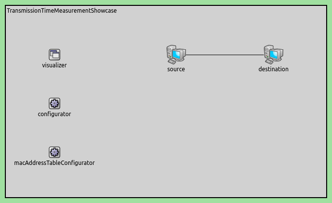
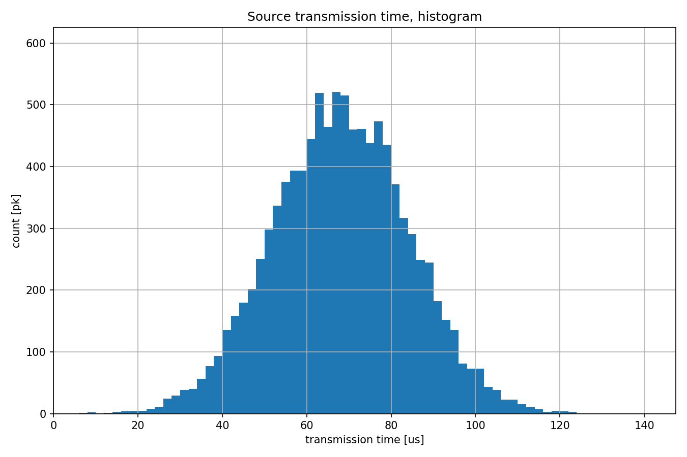
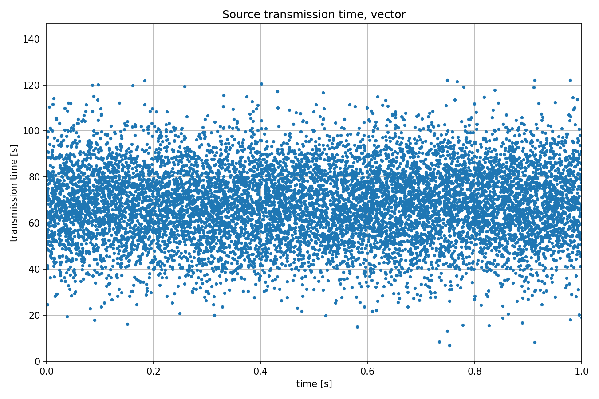

测量传输时间
===================

目标
~~~~~

在这个例子中，我们探讨了有线和无线传输介质的网络接口包传输时间统计数据。

INET版本：``4.4``  
源文件位置：`inet/showcases/measurement/transmissiontime <https://github.com/inet-framework/inet/tree/master/showcases/measurement/transmissiontime>`__

模型
~~~~~~~~~~

包的传输时间从物理信号开始编码包的时刻起，直到同一物理信号的末端离开同一网络接口为止。这个时间通常等于接收网络接口的包接收时间，从物理信号的开始到结束的时间。例外情况是，当接收方相对于发射方的速度较快，且与物理信号的传播速度相比很高时，但在通信网络仿真中这种情况很少见。

包的传输时间是从物理信号开始编码包的时刻起，直到同一物理信号的末端离开同一网络接口为止。

包的传输时间是出接口上物理信号传输的开始与结束时间之间的时间差。

以下是网络配置：

以下是配置：

.. code:: ini
   [General]  
   network = TransmissionTimeMeasurementShowcase  
   description = "Measure packet transmission time on the channel"  
   sim-time-limit = 1s  

   # 源应用 ~96Mbps吞吐量  
   *.source.numApps = 1  
   *.source.app[0].typename = "UdpSourceApp"  
   *.source.app[0].source.packetLength = int(truncnormal(800B, 200B))  
   *.source.app[0].source.productionInterval = exponential(100us)  
   *.source.app[0].io.destAddress = "destination"  
   *.source.app[0].io.destPort = 1000  

   # 目的地应用  
   *.destination.numApps = 1  
   *.destination.app[0].typename = "UdpSinkApp"  
   *.destination.app[0].io.localPort = 1000  

   # 启用模块化以太网模型  
   *.*.ethernet.typename = "EthernetLayer"  
   *.*.eth[*].typename = "LayeredEthernetInterface"  

   # 所有网络接口的数据速率  
   *.*.eth[*].bitrate = 100Mbps  
   
结果
~~~~~~~~~~

以下是结果：

源代码：
|  `omnetpp.ini <https://inet.omnetpp.org/docs/_downloads/cb66bafa304286f6c34c6400a8c9c2ef/omnetpp.ini>`__ 
|  `TransmissionTimeMeasurementShowcase.ned <https://inet.omnetpp.org/docs/_downloads/e2ba33a1965b801ff04e11afb503166a/TransmissionTimeMeasurementShowcase.ned>`__

讨论
----------
如果您对这个示例有任何疑问或讨论，请在 `此页面 <https://github.com/inet-framework/inet/discussions/TODO>`__ 分享您的想法。
