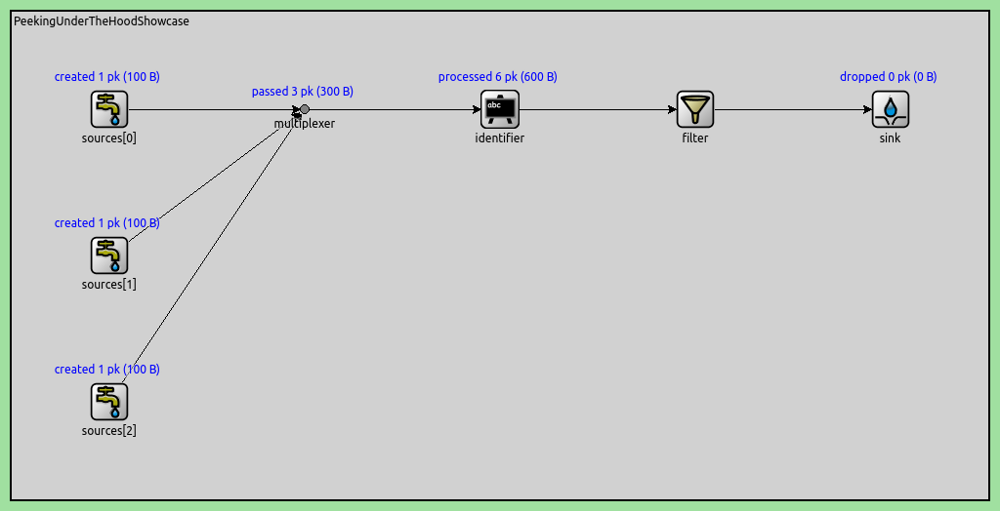
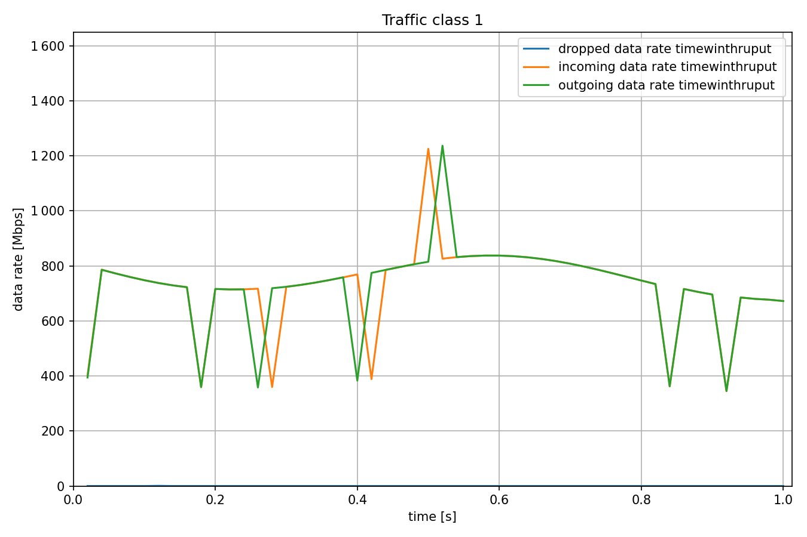
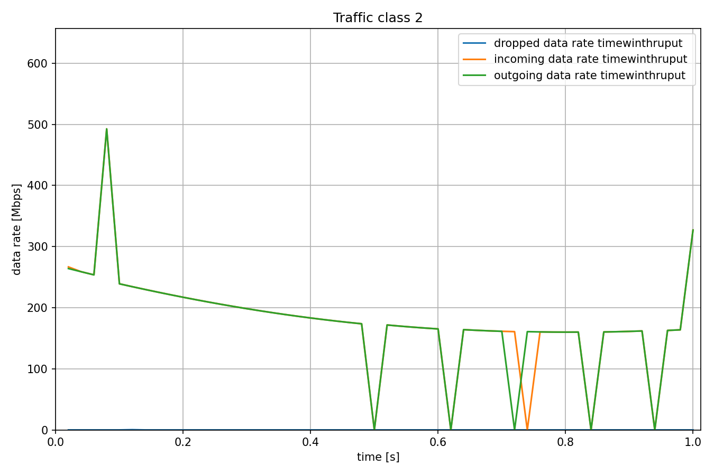
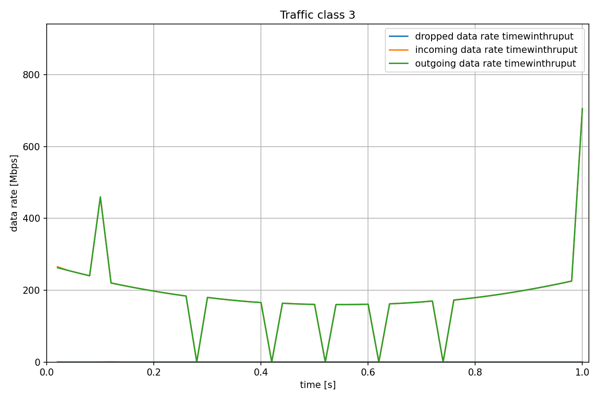

内部工作原理
===================

| `原文链接 <https://inet.omnetpp.org/docs/showcases/tsn/streamfiltering/tokenbucket/doc/index.html>`__ 
| `讲解视频 <https://space.bilibili.com/35942145>`__

目标
~~~~~

本示例演示了流过滤与监管模块可以在网络节点之外运行。这样做可能有助于测试验证特定的复杂流过滤和监管行为。

INET version: ``4.4``

源地址链接:
`inet/showcases/tsn/streamfiltering/underthehood <https://github.com/inet-framework/inet/tree/master/showcases/tsn/streamfiltering/underthehood>`__

模型
~~~~~~~~~

在此配置中，我们直接将流过滤模块连接到多个数据包发送源。

下面是网络

下面是配置

.. code:: ini

   [General]
   network = PeekingUnderTheHoodShowcase
   sim-time-limit = 1s
   description = "Per-stream filtering several packet sources with sinusoidally changing datarate"

   *.numSources = 3
   *.sources[*].packetLength = 100B
   *.sources[0].productionInterval = replaceUnit(sin(dropUnit(simTime() * 1)) + sin(dropUnit(simTime() * 8)) + 10, "ms") / 100
   *.sources[1].productionInterval = replaceUnit(sin(dropUnit(simTime() * 2)) + 1.5, "ms") / 10
   *.sources[2].productionInterval = replaceUnit(sin(dropUnit(simTime() * 3)) + 1.5, "ms") / 10

   *.identifier.mapping = [{packetFilter: "sources[0]*", stream: "s0"},
                        {packetFilter: "sources[1]*", stream: "s1"},
                        {packetFilter: "sources[2]*", stream: "s2"}]

   *.filter.typename = "SimpleIeee8021qFilter"
   *.filter.numStreams = 3
   *.filter.classifier.mapping = {s0: 0, s1: 1, s2: 2}

   **.initialNumTokens = 0
   *.filter.meter[*].typename = "SingleRateTwoColorMeter"
   *.filter.meter[*].committedInformationRate = 8Mbps
   *.filter.meter[*].committedBurstSize = 100kB

    
结果
~~~~~

下面是结果

| 源代码：
|  `omnetpp.ini <https://inet.omnetpp.org/docs/_downloads/65356755db975f6bb9efee6562c9d74a/omnetpp.ini>`__ 
|  `PeekingUnderTheHoodShowcase.ned <https://inet.omnetpp.org/docs/_downloads/95a5f7108069c83ee33d9fce6f6f74cd/PeekingUnderTheHoodShowcase.ned>`__

讨论
----------
如果您对这个示例有任何疑问或讨论，请在 `此页面 <https://github.com/inet-framework/inet/discussions/796>`__ 分享您的想法。
