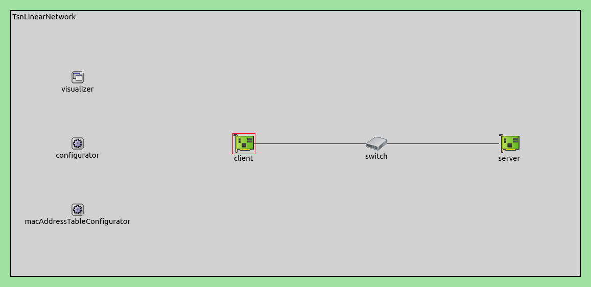
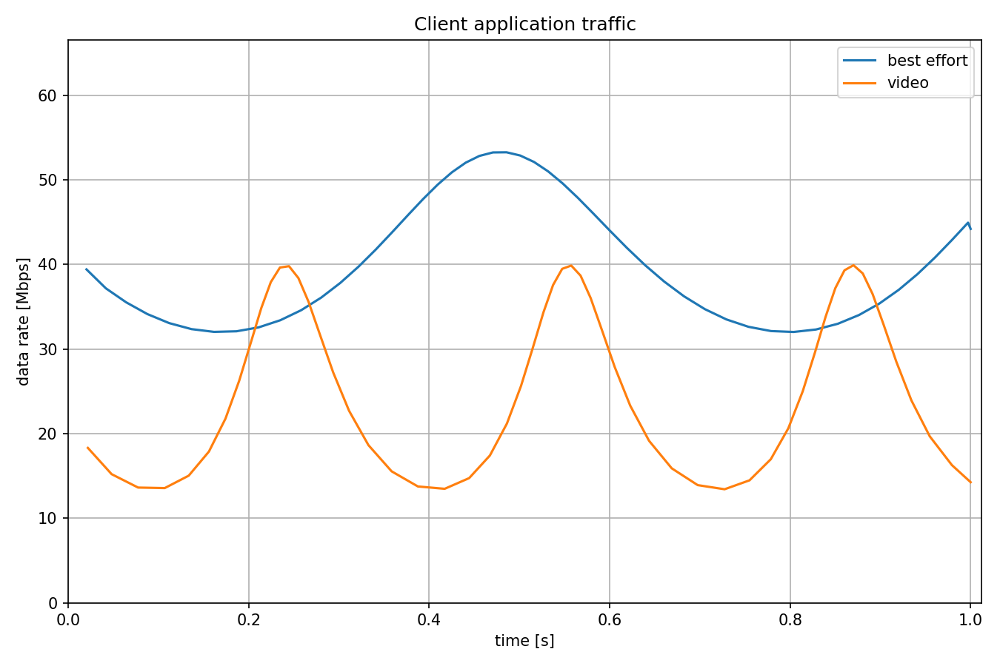
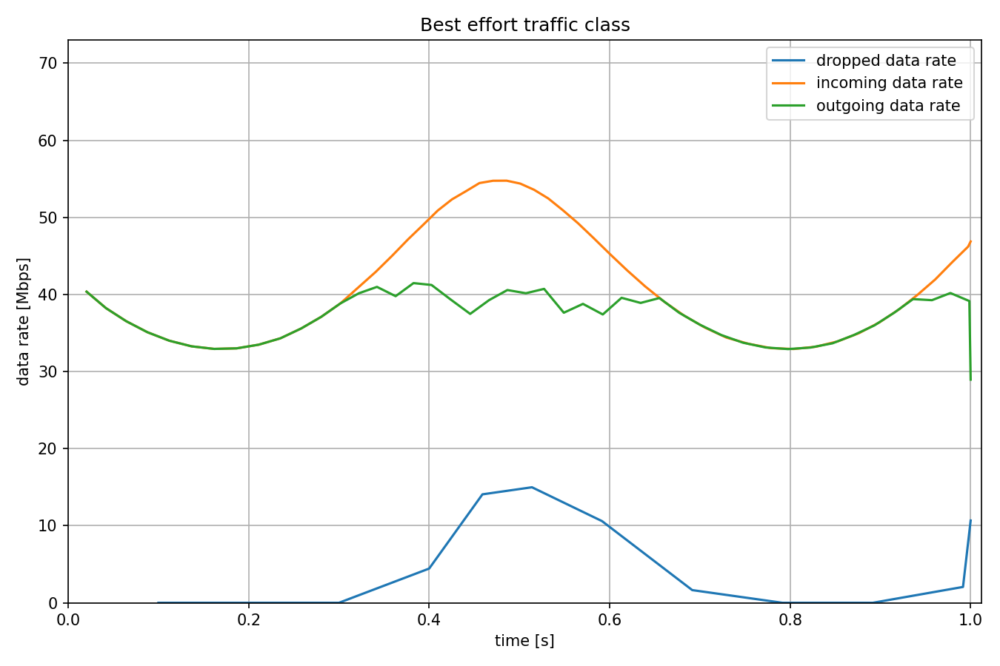
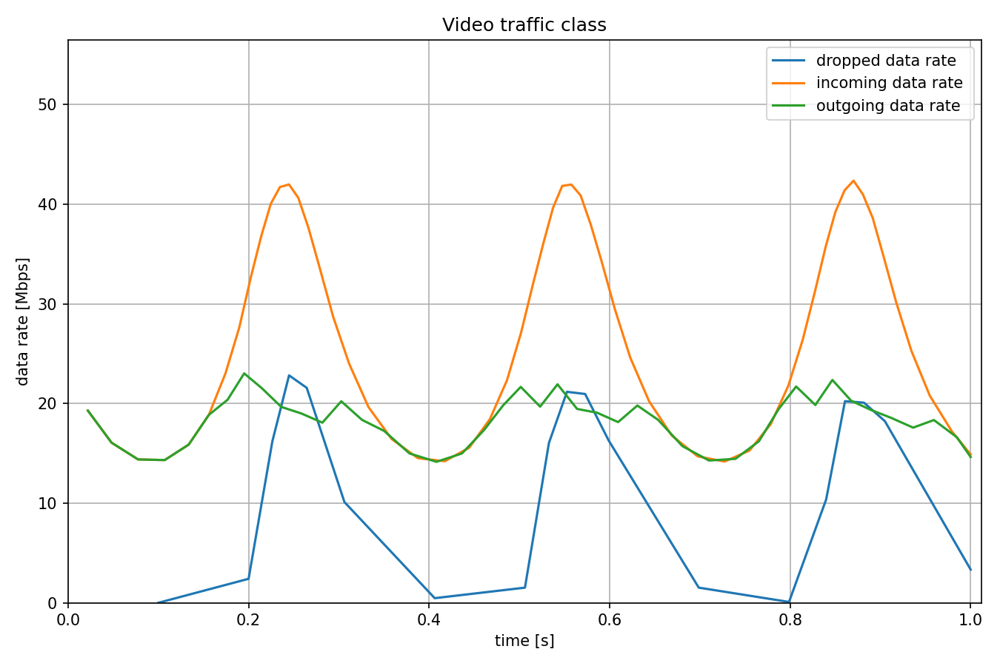
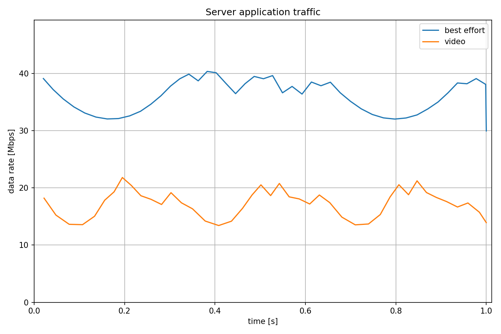

统计监管
=============================

| `原文链接 <https://inet.omnetpp.org/docs/showcases/tsn/streamfiltering/statistical/doc/index.html>`__ 

目标
~~~~~

在此示例中，我们将滑动窗口速率计与概率丢包器相结合，以实现简单的统计监管。

INET version: ``4.5``

源地址链接:
`inet/showcases/tsn/streamfiltering/statistical <https://github.com/inet-framework/inet/tree/master/showcases/tsn/streamfiltering/statistical>`__

模型
~~~~~~~~~

在此配置中，我们将滑动窗口速率计与统计速率限制器结合使用。 前者通过对时间窗口内的数据包字节进行求和来测量吞吐量，后者通过将测量的数据速率与最大允许数据速率进行比较来以概率方式丢弃数据包。

下面是网络：

下面是配置

.. code:: ini
   [General]
   network = inet.networks.tsn.TsnLinearNetwork
   sim-time-limit = 1s
   description = "Per-stream filtering using sliding window rate metering and statistical rate limiting"

   # client applications
   *.client.numApps = 2
   *.client.app[*].typename = "UdpSourceApp"
   *.client.app[0].display-name = "best effort"
   *.client.app[1].display-name = "video"
   *.client.app[*].io.destAddress = "server"
   *.client.app[0].io.destPort = 1000
   *.client.app[1].io.destPort = 1001

   # best-effort stream ~40Mbps
   *.client.app[0].source.packetLength = 1000B
   *.client.app[0].source.productionInterval = 200us + replaceUnit(sin(dropUnit(simTime() * 10)), "ms") / 20

   # video stream ~20Mbps
   *.client.app[1].source.packetLength = 500B
   *.client.app[1].source.productionInterval = 200us + replaceUnit(sin(dropUnit(simTime() * 20)), "ms") / 10

   # enable outgoing streams
   *.client.hasOutgoingStreams = true

   # client stream identification
   *.client.bridging.streamIdentifier.identifier.mapping = [{stream: "best effort", packetFilter: expr(udp.destPort == 1000)},
                                                         {stream: "video", packetFilter: expr(udp.destPort == 1001)}]

   # client stream encoding
   *.client.bridging.streamCoder.encoder.mapping = [{stream: "best effort", pcp: 0},
                                                 {stream: "video", pcp: 4}]

   # server applications
   *.server.numApps = 2
   *.server.app[*].typename = "UdpSinkApp"
   *.server.app[0].io.localPort = 1000
   *.server.app[1].io.localPort = 1001

   # enable per-stream filtering
   *.switch.hasIngressTrafficFiltering = true

   # disable forwarding IEEE 802.1Q C-Tag
   *.switch.bridging.directionReverser.reverser.excludeEncapsulationProtocols = ["ieee8021qctag"]

   # stream decoding
   *.switch.bridging.streamCoder.decoder.mapping = [{pcp: 0, stream: "best effort"},
                                                 {pcp: 4, stream: "video"}]

   # per-stream filtering
   *.switch.bridging.streamFilter.ingress.numStreams = 2
   *.switch.bridging.streamFilter.ingress.classifier.mapping = {"best effort": 0, "video": 1}
   *.switch.bridging.streamFilter.ingress.meter[0].display-name = "best effort"
   *.switch.bridging.streamFilter.ingress.meter[1].display-name = "video"

   # per-stream filtering
   *.switch*.bridging.streamFilter.ingress.meter[*].typename = "SlidingWindowRateMeter"
   *.switch*.bridging.streamFilter.ingress.meter[*].timeWindow = 10ms
   *.switch*.bridging.streamFilter.ingress.filter[*].typename = "StatisticalRateLimiter"
   *.switch*.bridging.streamFilter.ingress.filter[0].maxDatarate = 40Mbps
   *.switch*.bridging.streamFilter.ingress.filter[1].maxDatarate = 20Mbps
   

    
结果
~~~~~

下面是结果

| 源代码：
|  `omnetpp.ini <https://inet.omnetpp.org/docs/_downloads/d27ff5c389b1d484a167173acb298970/omnetpp.ini>`__ 

讨论
----------
如果您对这个示例有任何疑问或讨论，请在 `此页面 <https://github.com/inet-framework/inet/discussions/794>`__ 分享您的想法。
