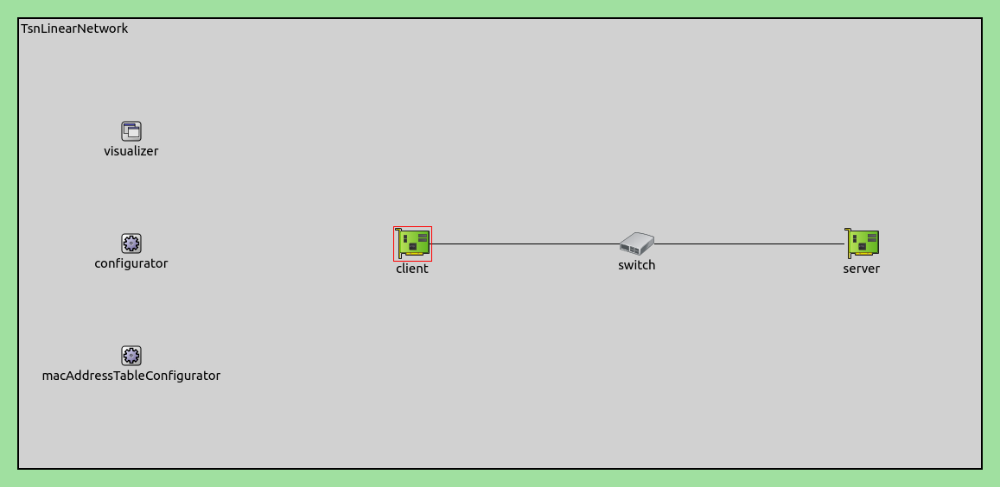
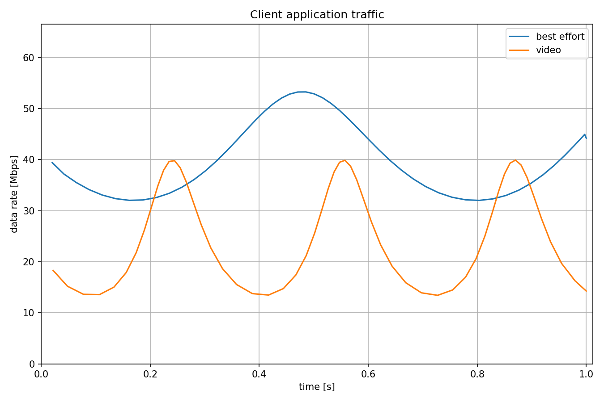
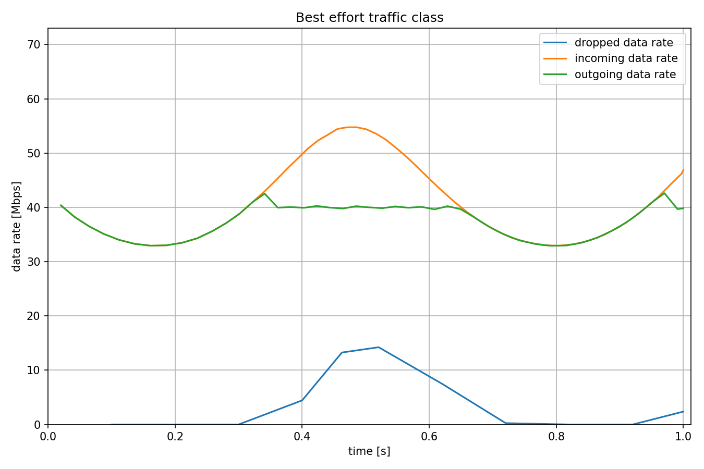
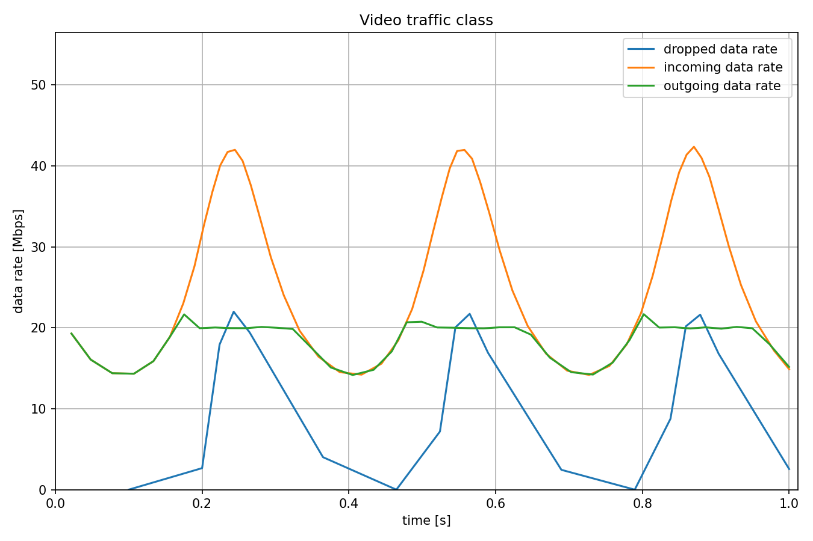
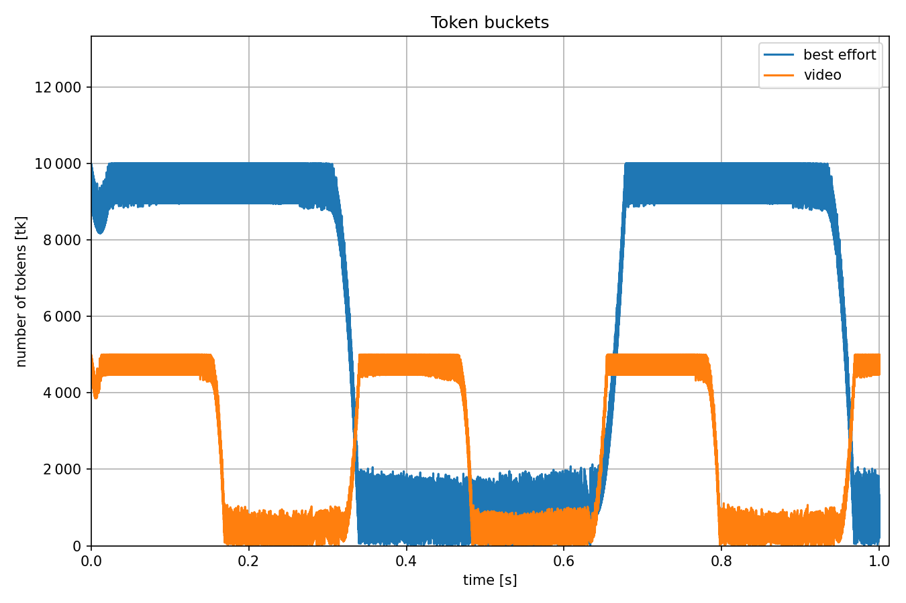
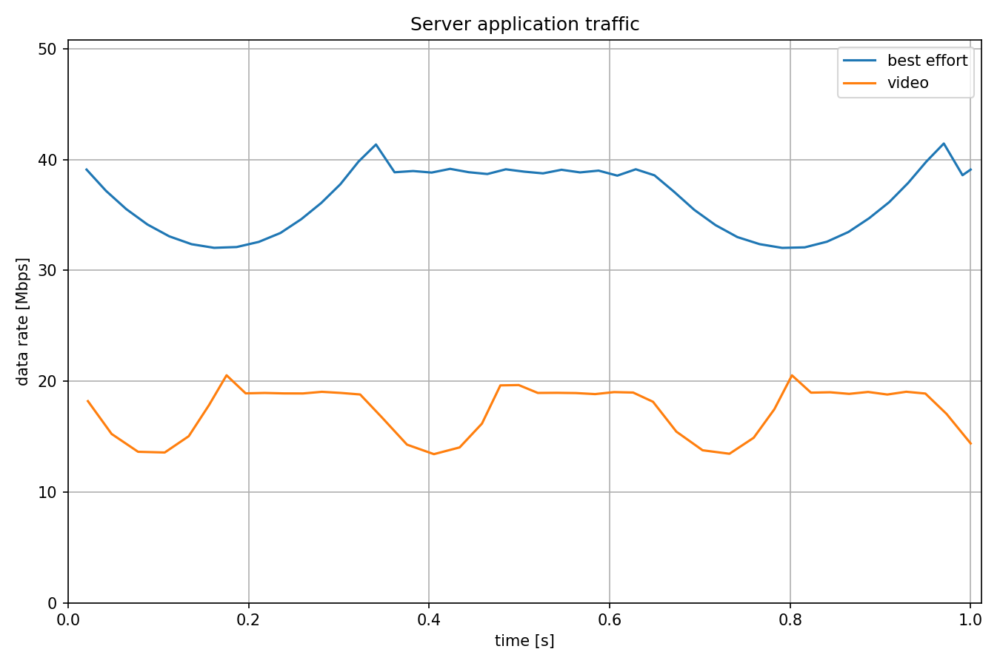

基于令牌桶的监管
===================

| `原文链接 <https://inet.omnetpp.org/docs/showcases/tsn/streamfiltering/tokenbucket/doc/index.html>`__ 
| `讲解视频 <https://space.bilibili.com/35942145>`__

目标
~~~~~

在此示例中，我们演示了使用令牌桶进行每个流的监管，其允许指定数据包的最大带宽以及突发大小。

INET version: ``4.5``

源地址链接:
`inet/showcases/tsn/streamfiltering/tokenbucket <https://github.com/inet-framework/inet/tree/master/showcases/tsn/streamfiltering/tokenbucket>`__

模型
~~~~~~~~~

在下面的网络中有三个网络节点，客户端和服务器为TsnDevice模块，交换机为TsnSwitch模块，它们之间的链路采用100Mbps以太网链路。

网络中有四个应用程序，在客户端和服务器之间创建两个独立的数据流。平均数据速率分别为 40 Mbps 和 20 Mbps，但数据包间隔时间采用正弦曲线。

.. code:: ini
   # client applications
   *.client.numApps = 2
   *.client.app[*].typename = "UdpSourceApp"
   *.client.app[0].display-name = "best effort"
   *.client.app[1].display-name = "video"
   *.client.app[*].io.destAddress = "server"
   *.client.app[0].io.destPort = 1000
   *.client.app[1].io.destPort = 1001

   # best-effort stream ~40Mbps
   *.client.app[0].source.packetLength = 1000B
   *.client.app[0].source.productionInterval = 200us + replaceUnit(sin(dropUnit(simTime() * 10)), "ms") / 20

   # video stream ~20Mbps
   *.client.app[1].source.packetLength = 500B
   *.client.app[1].source.productionInterval = 200us + replaceUnit(sin(dropUnit(simTime() * 20)), "ms") / 10

   # server applications
   *.server.numApps = 2
   *.server.app[*].typename = "UdpSinkApp"
   *.server.app[0].io.localPort = 1000
   *.server.app[1].io.localPort = 1001
   

这两个流具有两种不同的流量类别：尽力而为和视频流。传输层通过 UDP 目标端口识别传出的数据包。客户端使用 IEEE 802.1Q PCP 字段对流进行编码，交换机则对流进行解码。

.. code:: ini

   # enable outgoing streams
   *.client.hasOutgoingStreams = true

   # client stream identification
   *.client.bridging.streamIdentifier.identifier.mapping = [{stream: "best effort", packetFilter: expr(udp.destPort == 1000)},
                                                         {stream: "video", packetFilter: expr(udp.destPort == 1001)}]

   # client stream encoding
   *.client.bridging.streamCoder.encoder.mapping = [{stream: "best effort", pcp: 0},
                                                 {stream: "video", pcp: 4}]

   # disable forwarding IEEE 802.1Q C-Tag
   *.switch.bridging.directionReverser.reverser.excludeEncapsulationProtocols = ["ieee8021qctag"]

   # stream decoding
   *.switch.bridging.streamCoder.decoder.mapping = [{pcp: 0, stream: "best effort"},
                                                 {pcp: 4, stream: "video"}]

在交换机入口处，过滤器根据PCP信息的不同，将不同的流送至不同的路径传输。

.. code:: ini
   # enable ingress per-stream filtering
   *.switch.hasIngressTrafficFiltering = true

   # per-stream filtering
   *.switch.bridging.streamFilter.ingress.numStreams = 2
   *.switch.bridging.streamFilter.ingress.classifier.mapping = {"best effort": 0, "video": 1}
   *.switch.bridging.streamFilter.ingress.meter[0].display-name = "best effort"
   *.switch.bridging.streamFilter.ingress.meter[1].display-name = "video"

我们对两种流使用单速率双色过滤器。该过滤器包含一个令牌桶，有两个参数：允许最大流速率和允许流突发大小。该过滤器将数据包标记为绿色或红色，过滤器会丢弃红色数据包。

.. code:: ini
   *.switch.bridging.streamFilter.ingress.meter[*].typename = "SingleRateTwoColorMeter"
   *.switch.bridging.streamFilter.ingress.meter[0].committedInformationRate = 40Mbps
   *.switch.bridging.streamFilter.ingress.meter[1].committedInformationRate = 20Mbps
   *.switch.bridging.streamFilter.ingress.meter[0].committedBurstSize = 10kB
   *.switch.bridging.streamFilter.ingress.meter[1].committedBurstSize = 5kB

    
结果
~~~~~

第一个图显示了客户端中应用级输出流量的数据速率。两种传输类别的数据速率都随着正弦曲线变化。

下图显示了尽力而为流量类别的流过滤操作。 传出数据速率等于传入的数据速率减去丢弃的数据速率。

下图显示了视频流类别的流过滤的操作。 传出数据速率等于传入的数据速率减去丢弃的数据速率。

下图显示了两个流的令牌桶中的令牌数量。 填充区域意味着令牌数量随着数据包通过而快速变化。 当线路接近最小值时，数据速率达到最大值。

最后一张图显示了服务器中应用程序级输入流量的数据速率。 数据速率稍微低于相应流过滤的输出流量的数据速率。 原因是它们是在不同的协议层测量的。

| 源代码：
|  `omnetpp.ini <https://inet.omnetpp.org/docs/_downloads/db63db0c5b52a24ae2ca9fb309d23235/omnetpp.ini>`__ 

讨论
----------
如果您对这个示例有任何疑问或讨论，请在 `此页面 <https://github.com/inet-framework/inet/discussions/795>`__ 分享您的想法。
