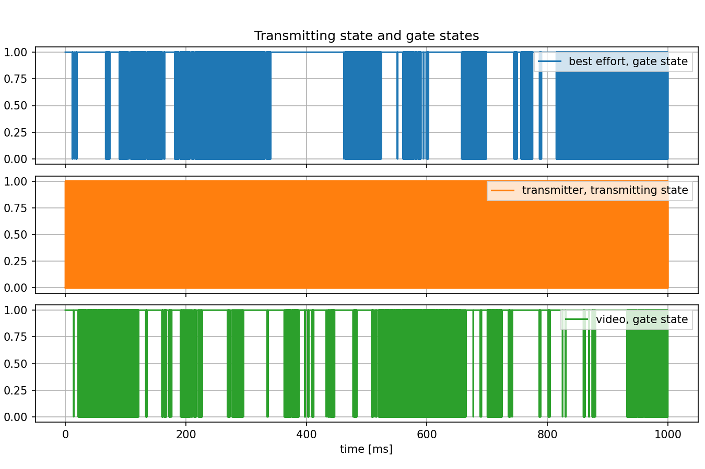

异步流量整形
=========================================

| `原文链接 <https://inet.omnetpp.org/docs/showcases/tsn/trafficshaping/asynchronousshaper/doc/index.html>`__ 
| `讲解视频 <https://space.bilibili.com/35942145>`__

目标
-----
在此示例中，我们演示如何使用异步流量整形器（ATS）。

INET version: ``4.4``

Source files location:
`inet/showcases/tsn/trafficshaping/asynchronousshaper <https://github.com/inet-framework/tree/master/showcases/tsn/trafficshaping/asynchronousshaper>`__

模型
--------
网络中有三个网络节点，客户端和服务器为 ``TsnDevice`` 模块，交换机为 ``TsnSwitch`` 模块，它们之间的链路采用100Mbps ``EthernetLink`` 通道。

.. image:: Pic/Network24.png
   :alt: Network24.png
   :align: center

网络中有四个应用程序，在客户端和服务器之间创建两个独立的数据流。BE流带宽为~48 Mbps，Video流带宽为 ~24 Mbps。

.. code:: ini
    # client applications
    *.client.numApps = 2
    *.client.app[*].typename = "UdpSourceApp"
    *.client.app[0].display-name = "best effort"
    *.client.app[1].display-name = "video"
    *.client.app[*].io.destAddress = "server"
    *.client.app[0].io.destPort = 1000
    *.client.app[1].io.destPort = 1001
    *.client.app[*].source.packetLength = 1000B
    *.client.app[0].source.productionInterval = exponential(200us)
    *.client.app[1].source.productionInterval = exponential(400us)

    # server applications
    *.server.numApps = 2
    *.server.app[*].typename = "UdpSinkApp"
    *.server.app[0].display-name = "best effort"
    *.server.app[1].display-name = "video"
    *.server.app[0].io.localPort = 1000
    *.server.app[1].io.localPort = 1001

这两个流具有两种不同的流量类别：尽力而为流和视频流。桥接层通过UDP目标端口识别传出的数据包。客户端使用IEEE 802.1Q PCP字段对流进行编码，交换机则对流进行解码。

.. code:: ini
    # enable outgoing streams
    *.client.hasOutgoingStreams = true

    # client stream identification
    *.client.bridging.streamIdentifier.identifier.mapping = [{stream: "best effort", packetFilter: expr(udp.destPort == 1000)},
                                                            {stream: "video", packetFilter: expr(udp.destPort == 1001)}]

    # client stream encoding
    *.client.bridging.streamCoder.encoder.mapping = [{stream: "best effort", pcp: 0},
                                                    {stream: "video", pcp: 4}]

    # disable forwarding IEEE 802.1Q C-Tag
    *.switch.bridging.directionReverser.reverser.excludeEncapsulationProtocols = ["ieee8021qctag"]

    # switch stream decoding
    *.switch.bridging.streamCoder.decoder.mapping = [{pcp: 0, stream: "best effort"},
                                                    {pcp: 4, stream: "video"}]

异步流量整形器要求每个数据包的传输合格时间在入端口的每流过滤器处计算出来。

.. code:: ini
    # enable ingress per-stream filtering
    *.switch.hasIngressTrafficFiltering = true
    # per-stream filtering
    *.switch.bridging.streamFilter.ingress.numStreams = 2
    *.switch.bridging.streamFilter.ingress.classifier.mapping = {"best effort": 0, "video": 1}
    *.switch.bridging.streamFilter.ingress.*[0].display-name = "best effort"
    *.switch.bridging.streamFilter.ingress.*[1].display-name = "video"
    *.switch.bridging.streamFilter.ingress.meter[*].typename = "EligibilityTimeMeter"
    *.switch.bridging.streamFilter.ingress.meter[*].maxResidenceTime = 10ms
    *.switch.bridging.streamFilter.ingress.meter[0].committedInformationRate = 41.68Mbps
    *.switch.bridging.streamFilter.ingress.meter[0].committedBurstSize = 10 * (1000B + 28B)
    *.switch.bridging.streamFilter.ingress.meter[1].committedInformationRate = 20.84Mbps
    *.switch.bridging.streamFilter.ingress.meter[1].committedBurstSize = 5 * (1000B + 28B)

    *.switch.bridging.streamFilter.ingress.filter[*].typename = "EligibilityTimeFilter"

流量整形发生在交换机的出端口中。流量整形器将BE流的数据速率限制为 40 Mbps，将Video流的数据速率限制为 20 Mbps。超出的流量存储在相应流量类别的 MAC 层子队列中。

.. code:: ini
    # enable egress traffic shaping
    *.switch.hasEgressTrafficShaping = true

    # asynchronous traffic shaping
    *.switch.eth[*].macLayer.queue.numTrafficClasses = 2
    *.switch.eth[*].macLayer.queue.*[0].display-name = "best effort"
    *.switch.eth[*].macLayer.queue.*[1].display-name = "video"
    *.switch.eth[*].macLayer.queue.queue[*].typename = "EligibilityTimeQueue"
    *.switch.eth[*].macLayer.queue.transmissionSelectionAlgorithm[*].typename = "Ieee8021qAsynchronousShaper"

结果
-------
第一个图表显示了客户端中应用层传出流量的数据速率。两种流量类别的数据速率随时间随机变化，但平均值相同。
.. TODO：图片错误，需要更新一下图片

下图显示了流量整形器的入口处流量的速率。此数据速率是在交换机的出端口内测量的。此图与上一个图略有不同，因为流量已经在交换机中，并且是在不同的协议级别进行测量的。（增加了IP,MAC,PHY层信息，数据包更大一点）
.. TODO：图片错误，需要更新一下图片

下图显示了经过流量整形器处理后的传出流量的速率。此速率仍在交换机的出端口内测量，但在不同的位置。很明显，传入流量的随机变化数据速率在这里已经转换为相当稳定的数据速率。

下图显示了交换机出端口处不同流量类别的队列长度。队列长度会随着时间的推移而增加，因为流量整形器的传入流量的数据速率大于传出流量的数据速率，并且不会丢弃数据包。

下图显示了交换机出端口处不同流量类别的队列令牌数量。可以看到，在队列长度增长时，表示传输停止，对应令牌数量增加。

下图显示了出端口不同队列门的开门状态。

下图显示了传输门的门状态与出端口的传输状态之间的关系（针对两种流量类别）。

最后一张图显示了服务器端应用层接收流量的速率。该数据速率略低于相应流量整形器传出流量的数据速率。原因是它们是在不同的协议层测量的

| 源代码：
|  `omnetpp.ini <https://inet.omnetpp.org/docs/_downloads/88713d9ecdfcc271d1ee9fd42df01c77/omnetpp.ini>`__ 

讨论
----------
如果您对这个示例有任何疑问或讨论，请在 `此页面 <https://github.com/inet-framework/inet/discussions/799>`__ 分享您的想法。