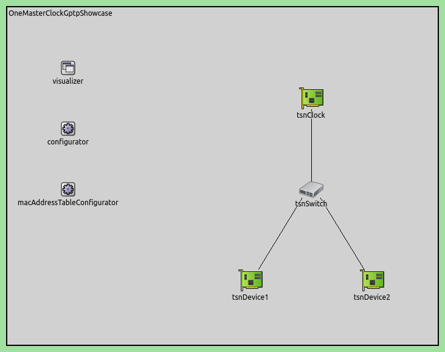

Using gPTP 使用gPTP
===================

Goals
~~~~~

通用精确时间协议（gPTP，如IEEE
802.1AS所规定）是一种可以高精度地同步时钟的网络协议。这对于诸如时间敏感网络（TSN）等应用非常有用。在此展示中，我们将演示如何配置gPTP主时钟、桥接器和终端站点，以在整个网络上建立可靠的时间同步。

INET version: ``4.5``

源地址链接:
`inet/showcases/tsn/timesynchronization/gptp <https://github.com/inet-framework/inet/tree/master/showcases/tsn/timesynchronization/gptp>`__

About gPTP
~~~~~~~~~~

Overview
^^^^^^^^

实际上，不同网络设备上的时钟时间可能会相互偏离。INET可以模拟这种时钟漂移（有关更多信息，请参见
`Clock
Drift <https://inet.omnetpp.org/docs/showcases/tsn/timesynchronization/clockdrift/doc/index.html>`__
展示）。在对时间敏感的应用中，通过使用时间同步来减轻这种漂移。

将任意两个时钟之间的时间同步意味着它们之间的时间差有一个上限。这可以通过定期同步时钟之间的时间（即在时间差变得太大之前）来实现。在gPTP中，一些从时钟的时间与gPTP时间域内的主时钟的时间同步。一个网络可以有多个gPTP时间域，即节点可以将多个时钟与多个主时钟同步以实现冗余（例如，如果一个主时钟故障或由于链路中断而离线，节点仍然可以拥有同步的时间）。每个时间域包含一个主时钟和任意数量的从时钟。该协议通过从主时钟节点向从时钟节点发送同步消息来将从时钟与主时钟同步。

根据IEEE 802.1
AS标准，主时钟可以通过最佳主时钟算法（BCMA）自动选择。BCMA还确定时钟生成树，即在网络中将同步消息传播到从时钟的路径。INET目前不支持BCMA；每个gPTP时间域的主时钟和生成树需要手动指定。

gPTP的操作如下概述:

-  所有节点计算驻留时间（即数据包在转发之前在节点中停留的时间）和向上链路的延迟。

-  gPTP同步消息向下传播。

-  点根据同步消息计算精确时间，以及接收同步消息的链路的驻留时间和延迟。

gPTP in INET
^^^^^^^^^^^^

应用模块实现。这是几个网络节点中的可选模块，例如TSN主机和交换机。可以通过ini文件中的
``hasTimeSynchronization`` 参数启用可选的
`Gptp <https://doc.omnetpp.org/inet/api-current/neddoc/inet.linklayer.ieee8021as.Gptp.html>`__
模块，例如：

.. code:: cpp
   *.tsnHost.hasTimeSynchronization = true

节点可以通过拥有多个
`Gptp <https://doc.omnetpp.org/inet/api-current/neddoc/inet.linklayer.ieee8021as.Gptp.html>`__
子模块，每个域一个，成为多个gPTP时间域的一部分。

模块根据其在生成树中的位置，扮演三种角色之一：主节点、桥节点或从节点。包含主节点gPTP模块的节点拥有时间域的主时钟，生成gPTP同步消息，并向下级的桥节点和从节点广播。桥节点也会将同步消息转发给桥节点和从节点。可以通过
`Gptp <https://doc.omnetpp.org/inet/api-current/neddoc/inet.linklayer.ieee8021as.Gptp.html>`__
模块的 ``gptpNodeType`` 参数（可以是 ``MASTER_NODE`` 、 ``BRIDGE_NODE``
或 ``SLAVE_NODE`` ）来选择模块类型。

**NOTE**

如果有多个时间域，网络节点可能在不同的时间域中扮演不同的gPTP角色。

生成生成树是通过将节点的接口（称为端口）标记为主端口或从端口来创建的，使用
``slavePort`` 和 ``masterPorts``
参数。同步消息在主端口上发送，并在从端口上接收。主节点只有主端口，从节点只有从端口（桥节点两者都有）。因此，由于这些端口定义了生成树，每个节点只能有一个从端口。

模块具有以下独特的机制：

-  对等延迟测量：从节点和桥节点定期通过发送上行的对等延迟请求消息（
   ``pDelayReq`` ）来测量链路延迟；它们接收对等延迟响应消息（
   ``pDelayResp`` ）。
-  时间同步：主节点定期广播带有本地时间的gPTP同步消息（ ``GptpSync``
   ），这些消息向下传播。从节点的时间被设置为主时钟的时间，根据链路和处理延迟进行修正。此外，通过设置振荡器补偿因子，从节点的漂移率与主时钟的漂移率对齐。补偿因子是根据当前和前一次同步事件中主时钟和从时钟的时间估计得出的。

NOTE 注意

接收这些消息的人需要知道消息发送的时间戳，以便能够计算出“正确”的时间。目前，只支持两步同步，即
``pDelayResp`` 和 ``GptpSync`` 消息紧接着会有后续消息，其中包含原始
``pDelayResp`` / ``GptpSync``
消息发送的精确时间。当接收到后续消息时，时钟会被设置为新的时间。

节点定期发送同步和对等延迟测量消息。同步和对等延迟测量消息的周期和偏移量可以由参数（
``syncInterval`` , ``pDelayInterval`` , ``syncInitialOffset`` ,
``pDelayInitialOffset`` ）指定。

当节点具有多个gPTP时间域时，每个时间域都有一个相应的
`Gptp <https://doc.omnetpp.org/inet/api-current/neddoc/inet.linklayer.ieee8021as.Gptp.html>`__
模块。\ `MultiDomainGptp <https://doc.omnetpp.org/inet/api-current/neddoc/inet.linklayer.ieee8021as.MultiDomainGptp.html>`__
模块使这变得方便，因为它包含多个模块。此外，每个域可以有一个相应的时钟模块。\ `MultiClock <https://doc.omnetpp.org/inet/api-current/neddoc/inet.clock.model.MultiClock.html>`__
模块可以用于此目的，因为它包含多个时钟子模块。

模块中的一个子时钟被指定为活动时钟。使用
`MultiClock <https://doc.omnetpp.org/inet/api-current/neddoc/inet.clock.model.MultiClock.html>`__
模块的用户（即从
`MultiClock <https://doc.omnetpp.org/inet/api-current/neddoc/inet.clock.model.MultiClock.html>`__
模块获取时间的其他模块）使用活动时钟的时间。例如，如果一个域中的时间同步失败，情景管理脚本可以将活动时钟更改为另一个子时钟。

**NOTE**

使用\ `MultiClock <https://doc.omnetpp.org/inet/api-current/neddoc/inet.clock.model.MultiClock.html>`__\ 和\ `MultiDomainGptp <https://doc.omnetpp.org/inet/api-current/neddoc/inet.linklayer.ieee8021as.MultiDomainGptp.html>`__\ 时，只需将\ `MultiClock <https://doc.omnetpp.org/inet/api-current/neddoc/inet.clock.model.MultiClock.html>`__\ 模块指定为
`MultiDomainGptp <https://doc.omnetpp.org/inet/api-current/neddoc/inet.linklayer.ieee8021as.MultiDomainGptp.html>`__\ 的时钟模块即可。每个域的相应子时钟将自动选择（即，基于索引，\ `Gptp <https://doc.omnetpp.org/inet/api-current/neddoc/inet.linklayer.ieee8021as.Gptp.html>`__\ 子模块与\ `MultiClock <https://doc.omnetpp.org/inet/api-current/neddoc/inet.clock.model.MultiClock.html>`__\ 中的时钟子模块配对）。

有关\ `Gptp <https://doc.omnetpp.org/inet/api-current/neddoc/inet.linklayer.ieee8021as.Gptp.html>`__\ 、\ `MultiDomainGptp <https://doc.omnetpp.org/inet/api-current/neddoc/inet.linklayer.ieee8021as.MultiDomainGptp.html>`__\ 和\ `MultiClock <https://doc.omnetpp.org/inet/api-current/neddoc/inet.clock.model.MultiClock.html>`__\ 参数的更多信息，请查阅NED文档。

The Model
~~~~~~~~~

在这个展示中，我们展示了在三个模拟中设置和操作gPTP的过程

-  **一个主时钟**：通过一个时间域和一个主时钟进行简单设置。
-  **主时钟和热备份主时钟**：更复杂的设置，使用两个时间域来分别设置主时钟和热备份主时钟。如果主时钟节点离线，备份时钟可以接管并成为新的主时钟。
-  **T两个利用网络冗余的主时钟**：一个包含主节点和热备份主节点的较大网络，每个节点有两个时间域。时间同步在主节点和网络中的任何链接故障时都能得到保护。

在 ``General`` 配置中，我们在所有网络节点中启用
`Gptp <https://doc.omnetpp.org/inet/api-current/neddoc/inet.linklayer.ieee8021as.Gptp.html>`__
模块，并为主时钟配置一个随机的时钟漂移率，为从节点和桥节点的时钟配置一个恒定的时钟漂移率（每个节点都指定一个随机分布）

.. code:: cpp

   # enable time synchronization in all network nodes
   *.*.hasTimeSynchronization = true

   # all oscillators have a constant drift rate (specified with a random distribution for each one) 
   # except for the master clocks, which have a random drift rate
   **.tsnClock*.clock.oscillator.typename = "RandomDriftOscillator"
   **.oscillator.changeInterval = 12.5ms
   **.oscillator.driftRate = uniform(-100ppm, 100ppm)

我们在下面的部分详细说明每个模拟。

One Master Clock
~~~~~~~~~~~~~~~~

在这种配置中，网络拓扑是一个简单的树形结构。网络包含一个主时钟节点
(`TsnClock <https://doc.omnetpp.org/inet/api-current/neddoc/inet.node.tsn.TsnClock.html>`__)，一个桥接器和两个终端设备
(`TsnDevice <https://doc.omnetpp.org/inet/api-current/neddoc/inet.node.tsn.TsnDevice.html>`__)，通过一个
`TsnSwitch <https://doc.omnetpp.org/inet/api-current/neddoc/inet.node.tsn.TsnSwitch.html>`__\ 连接。



我们通过在 ``tsnClock`` 和 ``tsnSwitch``
中设置主端口来配置生成树

.. code:: cpp

   # TSN clock gPTP master ports
   *.tsnClock.gptp.masterPorts = ["eth0"]

   # TSN switch gPTP bridge master ports
   *.tsnSwitch.gptp.masterPorts = ["eth1", "eth2"]

**NOTE**

TsnDevice和TsnSwitch中的从端口默认设置为 ``eth0`` ，因此不需要显式设置。

这是一个同步机制的视频（显示了主时钟的时间以及其他节点与此时间的差异）

.. raw:: html
<iframe src="https://inet.omnetpp.org/docs/showcases/tsn/timesynchronization/gptp/doc/media/onemasterclock.mp4" scrolling="no" border="0" frameborder="no" framespacing="0" allowfullscreen="true"> </iframe>


请注意，在接收到后续消息之后设置时钟。

这是由gPTP同步消息的方向指示的生成树

.. image:: Pic/OneMasterClock_tree.png
   :alt: OneMasterClock_tree.png
   :align: center

我们通过将时钟时间差与模拟时间绘制成图来检查所有时钟的时钟漂移

.. image:: Pic/OneMasterClock.png
   :alt: OneMasterClock.png
   :align: center

主时钟按照随机游走过程漂移。从属时钟的时间周期性地与主时钟同步。在第二次时间同步事件发生时，即在0.25秒时，从属时钟的漂移率被补偿，以更加与主时钟的漂移率对齐。

所有这些图表在开始时都有两个大的锯齿状图案，在漂移率被补偿之前。从现在开始，我们通常会省略这些，集中关注时钟漂移在时间同步后稳定的细节。

**NOTE**

可以通过绘制 ``timeChanged:vector``
统计数据，并应用线性趋势操作（参数为-1），轻松制作出一个时钟时间差与模拟时间的图表。

Primary and Hot-standby Master Clocks
~~~~~~~~~~~~~~~~~~~~~~~~~~~~~~~~~~~~~

在这个配置中，树形网络拓扑进一步扩展。网络包含一个主主时钟节点和一个热备主时钟节点。两个主时钟节点都有自己的时间同步域。交换机和设备节点有两个时钟，每个时钟分别与一个主时钟同步。两个时间域之间唯一的连接是热备主时钟，它也与主主时钟同步。这种连接有效地使两个时间域完全同步，并可以在主时钟故障的情况下无缝切换。

NOTE 注意

此设置只包含故障转移的可能性，但本文没有实际演示。主时钟故障在
`Effects of Time Synchronization on Time-Aware
Shaping <https://inet.omnetpp.org/docs/showcases/tsn/combiningfeatures/gptpandtas/doc/index.html>`__
中得到了演示。

网络包含两个时钟节点
(`TsnClock <https://doc.omnetpp.org/inet/api-current/neddoc/inet.node.tsn.TsnClock.html>`__)
和四个TSN设备节点
(`TsnDevice <https://doc.omnetpp.org/inet/api-current/neddoc/inet.node.tsn.TsnDevice.html>`__),由两个TSN交换机(`TsnSwitch <https://doc.omnetpp.org/inet/api-current/neddoc/inet.node.tsn.TsnSwitch.html>`__)连接：

.. image:: Pic/PrimaryAndHotStandbyNetwork.png
   :alt: PrimaryAndHotStandbyNetwork.png
   :align: center

我们的目标是为两个时间域配置两个gPTP生成树。在这个设置中，时钟节点有一个时钟，其他节点有两个（每个域一个）。

-  ``tsnClock1`` （主要主节点）有一个时钟和一个gPTP域，并将时间信息传播给所有其他节点的0域。
-  ``tsnClock2`` （热备用主节点）有一个时钟和两个gPTP域，将其域1的时间信息传播给除
   ``tsnClock1`` 之外的所有其他节点的域1。
-  ``tsnClock2`` 中的时钟与域0中的主要主节点同步。

让我们看一下omnetpp.ini中的配置，从时钟节点的设置开始：

.. code:: cpp

   *.tsnClock2.clock.typename = "SettableClock"

   *.tsnClock1.gptp.typename = "Gptp"
   *.tsnClock1.gptp.clockModule = "tsnClock1.clock"
   *.tsnClock1.gptp.masterPorts = ["eth0"]

   *.tsnClock2.gptp.typename = "MultiDomainGptp"
   *.tsnClock2.gptp.numDomains = 2
   *.tsnClock2.gptp.domain[*].clockModule = "tsnClock2.clock"
   *.tsnClock2.gptp.domain[0].gptpNodeType = "SLAVE_NODE"
   *.tsnClock2.gptp.domain[0].slavePort = "eth0"
   *.tsnClock2.gptp.domain[1].gptpNodeType = "MASTER_NODE"
   *.tsnClock2.gptp.domain[1].masterPorts = ["eth0"]

我们配置
``tsnClock2``
为可设置时间的\ `SettableClock <https://doc.omnetpp.org/inet/api-current/neddoc/inet.clock.model.SettableClock.html>`__,
我们配置 ``tsnClock1`` 为具有
`Gptp <https://doc.omnetpp.org/inet/api-current/neddoc/inet.linklayer.ieee8021as.Gptp.html>`__
模块，并将其设置为主节点。此外，我们指定它应该使用自己的时钟，并将唯一的接口
``eth0`` 设置为主端口（节点将在该端口上发送gPTP同步消息）。

在 ``tsnClock2`` 中，我们需要两个
`Gptp <https://doc.omnetpp.org/inet/api-current/neddoc/inet.linklayer.ieee8021as.Gptp.html>`__
模块（一个是树中的叶子，另一个是根），因此我们将 ``gptp``
模块的类型设置为具有两个域的
`MultiDomainGptp <https://doc.omnetpp.org/inet/api-current/neddoc/inet.linklayer.ieee8021as.MultiDomainGptp.html>`__
。两个域都使用节点中唯一的时钟，但其中一个充当gPTP主节点，另一个充当gPTP从节点（使用相同的端口，
``eth0`` ）。

Here is the configuration for the switches: 这是交换机的配置

.. code:: cpp

   *.tsnSwitch*.clock.typename = "MultiClock"
   *.tsnSwitch*.clock.numClocks = 2

   # TSN switches have multiple gPTP time synchronization domains
   *.tsnSwitch*.gptp.typename = "MultiDomainGptp"
   *.tsnSwitch*.gptp.numDomains = 2
   *.tsnSwitch1.gptp.domain[0].slavePort = "eth0"
   *.tsnSwitch1.gptp.domain[0].masterPorts = ["eth1", "eth2", "eth3"]
   *.tsnSwitch1.gptp.domain[1].slavePort = "eth1"
   *.tsnSwitch1.gptp.domain[1].masterPorts = ["eth2", "eth3"]  # eth1 is omitted because no sync needed towards primary master
   *.tsnSwitch2.gptp.domain[0].slavePort = "eth1"
   *.tsnSwitch2.gptp.domain[0].masterPorts = ["eth0", "eth2", "eth3"]
   *.tsnSwitch2.gptp.domain[1].slavePort = "eth0"
   *.tsnSwitch2.gptp.domain[1].masterPorts = ["eth1", "eth2", "eth3"]

我们配置交换机具有两个时钟和两个
`Gptp <https://doc.omnetpp.org/inet/api-current/neddoc/inet.linklayer.ieee8021as.Gptp.html>`__
模块（每个域一个）。然后，我们通过设置端口来指定生成树（在
`TsnSwitch <https://doc.omnetpp.org/inet/api-current/neddoc/inet.node.tsn.TsnSwitch.html>`__\ 中，默认情况下
``gptpModuleType`` 是 ``BRIDGE_NODE``
，所以我们不需要指定）。在两个域中，连接到时钟节点的接口是从属端口，其他接口是主端口。唯一的例外是
``tsnSwitch1`` 不应该向 ``tsnClock1``
发送同步消息（因为我们不希望它与任何东西同步），所以 ``eth1``
接口不被设置为主端口。

最后，这是设备的配置

.. code:: cpp

   *.tsnDevice*.clock.typename = "MultiClock"
   *.tsnDevice*.clock.numClocks = 2

   # TSN devices have multiple gPTP time synchronization domains
   *.tsnDevice*.gptp.typename = "MultiDomainGptp"
   *.tsnDevice*.gptp.numDomains = 2
   *.tsnDevice1.gptp.clockModule = "tsnDevice1.clock"
   *.tsnDevice2.gptp.clockModule = "tsnDevice2.clock"
   *.tsnDevice3.gptp.clockModule = "tsnDevice3.clock"
   *.tsnDevice4.gptp.clockModule = "tsnDevice4.clock"
   *.tsnDevice*.gptp.domain[*].slavePort = "eth0"

就像在交换机中一样，设备中也需要两个时钟和两个
`Gptp <https://doc.omnetpp.org/inet/api-current/neddoc/inet.linklayer.ieee8021as.Gptp.html>`__
模块，因此我们使用
`MultiClock <https://doc.omnetpp.org/inet/api-current/neddoc/inet.clock.model.MultiClock.html>`__
和
`MultiDomainGptp <https://doc.omnetpp.org/inet/api-current/neddoc/inet.linklayer.ieee8021as.MultiDomainGptp.html>`__\ 与两个子模块。我们将每个设备的
``gptp`` 模块配置为使用设备中的
`MultiClock <https://doc.omnetpp.org/inet/api-current/neddoc/inet.clock.model.MultiClock.html>`__\ 模块；自动选择适当的子时钟用于该域。我们将所有
``gptp``
模块设置为将唯一接口用作从端口（在\ `TsnDevice <https://doc.omnetpp.org/inet/api-current/neddoc/inet.node.tsn.TsnDevice.html>`__\ 中，默认情况下Gptp模块类型为
``SLAVE_NODE`` ，因此我们不需要进行配置）。

我们还为不同域中的pDelay测量和gPTP同步消息配置了一些偏移量，以避免它们同时传输并遭受排队延迟。

.. code:: cpp

   **.pdelayInitialOffset = 100us
   *.*.gptp.domain[0].syncInitialOffset = syncInterval * 1 / 2
   *.*.gptp.domain[1].syncInitialOffset = syncInterval * 2 / 2

以下是模拟开始时的时间同步过程的视频。显示了主节点的时钟时间以及其他节点与该时钟时间的时间差。
gPTP的消息以箭头形式可视化。可视化根据域进行了颜色编码。


.. raw:: html

<iframe src="https://inet.omnetpp.org/docs/showcases/tsn/timesynchronization/gptp/doc/media/PrimaryAndHotStandbyMasterClocks.mp4" scrolling="no" border="0" frameborder="no" framespacing="0" allowfullscreen="true"> </iframe>

首先，桥接节点和从节点通过交换pDelay消息来测量链路延迟。然后，主时钟发送gPTP同步消息。请注意，在接收到gPTP跟随消息后，时钟设置为新时间时，时间差会发生跳变。

此设置受到主时钟故障的保护。在这种情况下，场景管理脚本可以将网络中的节点切换到gPTP域1，即将MultiClock中的活动时钟切换到
``clock[1]`` 子模块，而不会影响时间同步。

生成树以数据链路层的gPTP消息传输形式进行可视化。这描绘了网络中来自主时钟的时间信息流动。

.. image:: Pic/PrimaryAndHotStandbyMasterClocks_tree-1708860651544-41.png
   :alt: PrimaryAndHotStandbyMasterClocks_tree-1708860651544-41.png
   :align: center


让我们来看一些时钟漂移图表。不要在一个图表中绘制所有时钟的时钟漂移，我们使用三个图表，这样它们就不会那么杂乱。这是两个主时钟的时钟漂移（时钟时间与模拟时间的差异）：

.. image:: Pic/PrimaryAndHotStandBy_masterclocks.png
   :alt: PrimaryAndHotStandBy_masterclocks.png
   :align: center

两个主时钟都有随机漂移率，但热备份主时钟的时间和时钟漂移率会定期与主时钟同步。

这是时间域0（主要主机）中所有时钟的时钟漂移


每个从属时钟都有一个独特但恒定的漂移速率，而主时钟的漂移速率则随机波动。从属时钟定期与主时钟同步。在最初的两次同步事件之后（未在图表上显示），从属时钟的漂移速率将被调整以与主时钟对齐。然而，每个从属时钟中的振荡器补偿因子是由当前和前一个同步点的漂移速率确定的，随着主时钟的漂移速率继续变化，从属时钟可能会偏离主时钟。值得注意的是，在第一次速率补偿之后，所有从属时钟具有相同的漂移速率。

让我们看看时间域1（热备份主机）中所有时钟的时钟漂移


时钟具有不同的漂移速率，并定期与热备份主时钟进行同步（用粗蓝线显示）。热备份主时钟本身与主时钟存在漂移，并定期进行同步。时间差的上限在图表上显而易见。

请注意，在域1中的从属时钟在域0中的热备份主时钟的时间更新之前进行同步。与之前的情况一样，从属时钟的漂移率被补偿，以更加与主时钟的速率对齐。

**NOTE**

从主时钟偏离的角度来看，从这些图表上看，从时钟的差异可能看起来很大，但实际上只有微秒级别（y轴的刻度是x轴的百万分之一）。

**WARNING**

从主时钟偏离的角度来看，从这些图表上看，从时钟的差异可能看起来很大，但实际上只有微秒级别（y轴的刻度是x轴的百万分之一）。

在下一节中，我们使网络更加冗余，以便主要主时钟和网络中的任何链接都可以失败而不会破坏时间同步。

Two Master Clocks Exploiting Network Redundancy
~~~~~~~~~~~~~~~~~~~~~~~~~~~~~~~~~~~~~~~~~~~~~~~

在这种配置中，网络拓扑是一个环形结构。主时钟和热备份主时钟各自具有两个独立的时间域。一个时间域使用顺时针方向，另一个时间域使用逆时针方向在环形拓扑中传播时钟时间。这种方法可以保护主时钟节点的故障以及环中单个链路的故障，因为所有桥接器都可以通过两个主时钟的时间同步域之一在两个方向上到达。

这是网络（它使用与之前相同的节点类型，
`TsnClock <https://doc.omnetpp.org/inet/api-current/neddoc/inet.node.tsn.TsnClock.html>`__\ 、\ `TsnSwitch <https://doc.omnetpp.org/inet/api-current/neddoc/inet.node.tsn.TsnSwitch.html>`__
(和
`TsnDevice <https://doc.omnetpp.org/inet/api-current/neddoc/inet.node.tsn.TsnDevice.html>`__\ ）


.. image:: Pic/TwoMasterClocksNetwork.png
   :alt: TwoMasterClocksNetwork.png
   :align: center

时间同步冗余是通过以下方式实现的：

-  主主节点有一个时钟和两个主gPTP时间域。这些域在时钟里以顺时针和逆时针的方向发送时间信息。
-  热备份主节点有两个从节点和两个主节点的gPTP域，以及两个子时钟。域0和1将两个时钟与主主节点的两个域同步，域2和3在环中双向发送两个时钟的定时信息。
-  交换机和设备节点有四个域（和四个子时钟），域0和1与主要主节点同步，域2和3与热备份主节点同步。
-  Consequently, gPTP modules in the switches are gPTP bridges, in the
   devices, gPTP slaves.
   因此，交换机中的gPTP模块是gPTP桥，设备中的gPTP模块是gPTP从属。

在主要主节点故障和环中的一个链接故障的情况下，交换机和设备将至少有一个同步的时钟可以切换到。

我们如何配置这个方案？我们添加所需的gPTP域和时钟，并配置上述的生成树。在设置端口和时钟时，有一些重要的方面：

-  我们不想将任何时间信息转发给主要的主节点，因此我们相应地设置了
   ``tsnSwitch1`` 中的主端口。
-  我们注意不将定时消息转发给最初发送它的交换机（以避免同步消息无限循环）。例如，tsnSwitch6不应将同步消息发送到域0中的
   ``tsnSwitch1`` 。
-  热备份的主节点只有两个时钟，被四个领域使用。从领域0和1传递给领域2和3的时序信息在这里进行。所以我们设置领域0和2使用
   ``clock[0]`` ，领域1和3使用 ``clock[1]`` 。

这是时钟节点的配置

.. code:: cpp

   [Config TwoMasterClocksExploitingNetworkRedundancy]
   network = TwoMasterClocksRingGptpShowcase
   description = "Ring topology with redundant time synchronization domains"
   # clock visualization note: bridge and slave nodes display difference from corresponding master clock

   # TSN clock2 has multiple clocks
   *.tsnClock2.clock.typename = "MultiClock"
   *.tsnClock2.clock.numClocks = 2

   # TSN clocks have multiple gPTP time synchronization domains
   *.tsnClock*.gptp.typename = "MultiDomainGptp"
   *.tsnClock1.gptp.numDomains = 2
   *.tsnClock1.gptp.domain[0..1].clockModule = "tsnClock1.clock"
   *.tsnClock1.gptp.domain[0].masterPorts = ["eth0"]
   *.tsnClock1.gptp.domain[1].masterPorts = ["eth0"]
   *.tsnClock2.gptp.numDomains = 4
   *.tsnClock2.gptp.domain[2..3].clockModule = "tsnClock2.clock"
   *.tsnClock2.gptp.domain[0].gptpNodeType = "SLAVE_NODE"
   *.tsnClock2.gptp.domain[0].slavePort = "eth0"
   *.tsnClock2.gptp.domain[1].gptpNodeType = "SLAVE_NODE"
   *.tsnClock2.gptp.domain[1].slavePort = "eth0"
   *.tsnClock2.gptp.domain[2].gptpNodeType = "MASTER_NODE"
   *.tsnClock2.gptp.domain[2].masterPorts = ["eth0"]
   *.tsnClock2.gptp.domain[3].gptpNodeType = "MASTER_NODE"
   *.tsnClock2.gptp.domain[3].masterPorts = ["eth0"]

我们设置 ``tsnClock1`` 有两个
`Gptp <https://doc.omnetpp.org/inet/api-current/neddoc/inet.linklayer.ieee8021as.Gptp.html>`__
模块，每个模块使用主机中唯一的时钟。时钟网络节点的类型是
`TsnClock <https://doc.omnetpp.org/inet/api-current/neddoc/inet.node.tsn.TsnClock.html>`__\ ；在这些节点中，默认情况下，
`Gptp <https://doc.omnetpp.org/inet/api-current/neddoc/inet.linklayer.ieee8021as.Gptp.html>`__
模块被设置为主节点。我们在两个模块中设置了主端口，因此它们通过它们唯一的以太网接口传播时间信息。

``tsnClock2`` 被设置为具有四个gPTP域。由于 ``tsnClock2``
只有两个子时钟，我们需要在
`MultiClock <https://doc.omnetpp.org/inet/api-current/neddoc/inet.clock.model.MultiClock.html>`__
模块中指定域2和域3使用 ``clock[0]`` 和 ``clock[1]`` （只需设置
`MultiClock <https://doc.omnetpp.org/inet/api-current/neddoc/inet.clock.model.MultiClock.html>`__
模块的 ``clockModule`` 参数即可，因为它会自动将子时钟分配给域）。

因此，在 ``tsnClock2``
中，域0和1是gPTP从站，同步到主要主站的两个域。域2和3是gPTP主站，并传播由前两个域设置的时钟时间。

交换机的配置如下：

.. code:: cpp

   # TSN switches have multiple clocks
   *.tsnSwitch*.clock.typename = "MultiClock"
   *.tsnSwitch*.clock.numClocks = 4

   # TSN switches have multiple gPTP time synchronization domains
   *.tsnSwitch*.gptp.typename = "MultiDomainGptp"
   *.tsnSwitch*.gptp.numDomains = 4

   # TSN switch 1
   *.tsnSwitch1.gptp.domain[0].masterPorts = ["eth1"]
   *.tsnSwitch1.gptp.domain[0].slavePort = "eth0"
   *.tsnSwitch1.gptp.domain[1].masterPorts = ["eth2"]
   *.tsnSwitch1.gptp.domain[1].slavePort = "eth0"
   *.tsnSwitch1.gptp.domain[2].masterPorts = ["eth1"]
   *.tsnSwitch1.gptp.domain[2].slavePort = "eth2"
   *.tsnSwitch1.gptp.domain[3].masterPorts = ["eth2"]
   *.tsnSwitch1.gptp.domain[3].slavePort = "eth1"

   # TSN switch 2
   *.tsnSwitch2.gptp.domain[0].masterPorts = ["eth1", "eth2"]
   *.tsnSwitch2.gptp.domain[0].slavePort = "eth0"
   *.tsnSwitch2.gptp.domain[1].masterPorts = ["eth2"]
   *.tsnSwitch2.gptp.domain[1].slavePort = "eth1"
   *.tsnSwitch2.gptp.domain[2].masterPorts = ["eth1", "eth2"]
   *.tsnSwitch2.gptp.domain[2].slavePort = "eth0"
   *.tsnSwitch2.gptp.domain[3].masterPorts = ["eth0", "eth2"]
   *.tsnSwitch2.gptp.domain[3].slavePort = "eth1"

   # TSN switch 3
   *.tsnSwitch3.gptp.domain[0].masterPorts = ["eth1", "eth2"]
   *.tsnSwitch3.gptp.domain[0].slavePort = "eth0"
   *.tsnSwitch3.gptp.domain[1].masterPorts = ["eth0", "eth2"]
   *.tsnSwitch3.gptp.domain[1].slavePort = "eth1"
   *.tsnSwitch3.gptp.domain[2].masterPorts = ["eth2"]
   *.tsnSwitch3.gptp.domain[2].slavePort = "eth0"
   *.tsnSwitch3.gptp.domain[3].masterPorts = ["eth0", "eth2"]
   *.tsnSwitch3.gptp.domain[3].slavePort = "eth1"

   # TSN switch 4
   *.tsnSwitch4.gptp.domain[0].masterPorts = ["eth0", "eth2"]
   *.tsnSwitch4.gptp.domain[0].slavePort = "eth1"
   *.tsnSwitch4.gptp.domain[1].masterPorts = ["eth0", "eth1"]
   *.tsnSwitch4.gptp.domain[1].slavePort = "eth2"
   *.tsnSwitch4.gptp.domain[2].masterPorts = ["eth2"]
   *.tsnSwitch4.gptp.domain[2].slavePort = "eth0"
   *.tsnSwitch4.gptp.domain[3].masterPorts = ["eth1"]
   *.tsnSwitch4.gptp.domain[3].slavePort = "eth0"

   # TSN switch 5
   *.tsnSwitch5.gptp.domain[0].masterPorts = ["eth1", "eth2"]
   *.tsnSwitch5.gptp.domain[0].slavePort = "eth0"
   *.tsnSwitch5.gptp.domain[1].masterPorts = ["eth0", "eth2"]
   *.tsnSwitch5.gptp.domain[1].slavePort = "eth1"
   *.tsnSwitch5.gptp.domain[2].masterPorts = ["eth1", "eth2"]
   *.tsnSwitch5.gptp.domain[2].slavePort = "eth0"
   *.tsnSwitch5.gptp.domain[3].masterPorts = ["eth2"]
   *.tsnSwitch5.gptp.domain[3].slavePort = "eth1"

   # TSN switch 6
   *.tsnSwitch6.gptp.domain[0].masterPorts = ["eth2"]
   *.tsnSwitch6.gptp.domain[0].slavePort = "eth0"
   *.tsnSwitch6.gptp.domain[1].masterPorts = ["eth0", "eth2"]
   *.tsnSwitch6.gptp.domain[1].slavePort = "eth1"
   *.tsnSwitch6.gptp.domain[2].masterPorts = ["eth1", "eth2"]
   *.tsnSwitch6.gptp.domain[2].slavePort = "eth0"
   *.tsnSwitch6.gptp.domain[3].masterPorts = ["eth0", "eth2"]
   *.tsnSwitch6.gptp.domain[3].slavePort = "eth1"

这是设备的配置

.. code:: cpp

   *.tsnDevice*.clock.typename = "MultiClock"
   *.tsnDevice*.clock.numClocks = 2

   # TSN devices have multiple gPTP time synchronization domains
   *.tsnDevice*.gptp.typename = "MultiDomainGptp"
   *.tsnDevice*.gptp.numDomains = 2
   *.tsnDevice1.gptp.clockModule = "tsnDevice1.clock"
   *.tsnDevice2.gptp.clockModule = "tsnDevice2.clock"
   *.tsnDevice3.gptp.clockModule = "tsnDevice3.clock"
   *.tsnDevice4.gptp.clockModule = "tsnDevice4.clock"
   *.tsnDevice*.gptp.domain[*].slavePort = "eth0"

最后，我们为这四个领域配置偏移量，以便它们不会同时发送同步消息

.. code:: cpp

   **.pdelayInitialOffset = 0.1ms
   *.*.gptp.domain[0].syncInitialOffset = syncInterval * 1 / 4
   *.*.gptp.domain[1].syncInitialOffset = syncInterval * 2 / 4
   *.*.gptp.domain[2].syncInitialOffset = syncInterval * 3 / 4
   *.*.gptp.domain[3].syncInitialOffset = syncInterval * 4 / 4

这是由gPTP消息可视化的生成树

.. image:: Pic/ExploitingNetworkRedundancy_tree.png
   :alt: ExploitingNetworkRedundancy_tree.png
   :align: center

就像之前的部分一样，让我们来检查网络中不同时钟的时钟漂移。这是主时钟的时钟漂移：


热备份主节点的时钟定期与主要主节点的时间同步。请注意，同步时间具有我们配置的偏移量。让我们看一下域0中的时钟漂移（主要主节点的时钟用较粗的线绘制）：


在域0中，所有时钟都与主要主时钟同步。它们同时同步，因为偏移量是在域之间的。域1中的时钟漂移类似，所以我们不在这里包括它。让我们看看域2（主要主时钟以虚线显示作为参考，因为它不是该域的一部分；该域中的热备份主时钟以粗线显示）：


所有交换机和设备都与热备份主时钟同步（该时钟本身定期与主要主时钟同步）。

NOTE 注意

所有领域的图表都可以在展示文件夹中的.anf文件中找到。

Sources:
```omnetpp.ini`` <https://inet.omnetpp.org/docs/_downloads/a815f04b0a163b99601acef0b3c16a6b/omnetpp.ini>`__,
```GptpShowcase.ned`` <https://inet.omnetpp.org/docs/_downloads/21dd82f588a87047c3dd9a635944b654/GptpShowcase.ned>`__

.. _discussion-1:

Discussion
~~~~~~~~~~

Use `this <https://github.com/inet-framework/inet/discussions/798>`__
page in the GitHub issue tracker for commenting on this showcase.
请在GitHub问题跟踪器上使用
`此页面 <https://github.com/inet-framework/inet/discussions/798>`__
对此展示进行评论。
