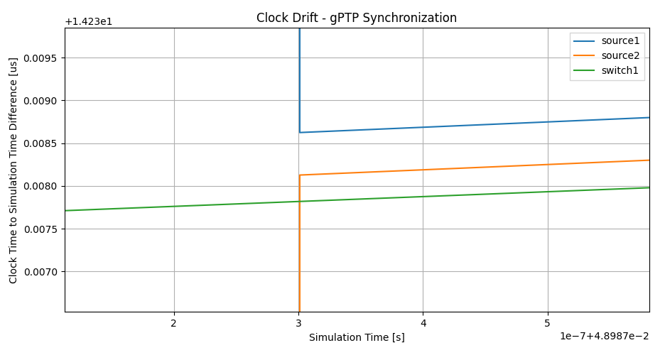

Clock Drift 时钟漂移
=====================

Goals
-----

在现实世界中，没有全局统一的时间，而是每个节点使用自己的物理时钟来跟踪时间。由于时钟的有限精度，网络中各个节点的时钟时间可能会随着时间的推移而发生偏差。时钟漂移指的是这种逐渐偏离的情况。为了解决时钟漂移问题，可以使用时间同步机制定期调整网络设备的时钟，以确保它们之间保持足够的同步。

应用程序和协议在网络上的运行对本地时间的准确性非常敏感。时间同步在TSN中非常重要，因为在这些网络中，准确的时间保持至关重要。

在这个展示中，我们将演示如何在网络节点中引入本地时钟，以及如何配置这些时钟的时钟漂移。我们还将展示如何使用时间同步机制来减少不同设备之间的时钟差异。

INET version: ``4.5``

Source files location:
`inet/showcases/tsn/timesynchronization/clockdrift <https://github.com/inet-framework/inet/tree/master/showcases/tsn/timesynchronization/clockdrift>`__

Simulating Clock Drift and Time Synchronization
-----------------------------------------------

默认情况下，INET中的网络节点和接口等模块没有本地时间，而是使用仿真时间作为全局时间。为了模拟具有本地时间的网络节点以及时钟漂移和其补偿（时间同步）等效果，网络节点需要具有*时钟子模块*。为了保持时间，大多数时钟模块使用*振荡器子模块*。振荡器定期产生脉冲，时钟模块计数脉冲。时钟漂移是由不准确的振荡器引起的。INET提供了各种振荡器模型，因此通过组合时钟和振荡器模型，我们可以模拟恒定和随机的时钟漂移速率。为了模拟时间同步，时钟的时间可以由同步器模块设置。

有几种钟模型可供选择：

-  `OscillatorBasedClock <https://doc.omnetpp.org/inet/api-current/neddoc/inet.clock.model.OscillatorBasedClock.html>`__:
   
   振荡器时钟：具有振荡器子模块；通过计算振荡器的脉冲来保持时间。根据振荡器子模块的不同，可以模拟恒定和随机的时钟漂移速率。

-  `SettableClock <https://doc.omnetpp.org/inet/api-current/neddoc/inet.clock.model.SettableClock.html>`__:
   
   可设置时钟：与基于振荡器的时钟相同，但时间可以从C++或场景管理脚本中设置

-  `IdealClock <https://doc.omnetpp.org/inet/api-current/neddoc/inet.clock.model.IdealClock.html>`__:
   
   理想时钟：时钟的时间与模拟时间相同；用于测试目的

以下振荡器模型可用：

-  `IdealOscillator <https://doc.omnetpp.org/inet/api-current/neddoc/inet.clock.oscillator.IdealOscillator.html>`__:
   
   理想振荡器：以恒定的节拍长度定期生成脉冲

-  `ConstantDriftOscillator <https://doc.omnetpp.org/inet/api-current/neddoc/inet.clock.oscillator.ConstantDriftOscillator.html>`__:
   
   以恒定的漂移速率周期性地生成脉冲，用于模拟恒定速率的时钟漂移

-  `RandomDriftOscillator <https://doc.omnetpp.org/inet/api-current/neddoc/inet.clock.oscillator.RandomDriftOscillator.html>`__:
   
   随机漂移振荡器：振荡器随时间改变漂移速率；用于模拟随机时钟漂移

同步器是作为应用层模块实现的。对于时钟同步，同步器模块需要设置时钟的时间，因此只有可设置时钟支持同步。以下同步器模块可用：

-  `SimpleClockSynchronizer <https://doc.omnetpp.org/inet/api-current/neddoc/inet.applications.clock.SimpleClockSynchronizer.html>`__:

   
   使用带外机制来同步时钟，而不是使用真正的时钟同步协议。适用于时间同步的细节不重要的模拟场景。

-  `Gptp <https://doc.omnetpp.org/inet/api-current/neddoc/inet.linklayer.ieee8021as.Gptp.html>`__:

   使用通用精确时间协议来同步时钟。

`SimpleClockSynchronizer <https://doc.omnetpp.org/inet/api-current/neddoc/inet.applications.clock.SimpleClockSynchronizer.html>`__
模块定期将从时钟与主时钟同步。同步间隔可以通过参数进行配置。此外，为了模拟现实生活中的同步协议，其本质上有一定的不准确性，精度可以被指定（详见模块的NED文档）。

通用精确时间协议（gPTP，或IEEE 802.1
AS）可以在以太网网络中以TSN协议所需的高时钟精确度来同步时钟。它在INET中由\ `Gptp <https://doc.omnetpp.org/inet/api-current/neddoc/inet.linklayer.ieee8021as.Gptp.html>`__
模块实现。几种网络节点类型，如\ `EthernetSwitch <https://doc.omnetpp.org/inet/api-current/neddoc/inet.node.ethernet.EthernetSwitch.html>`__
，具有可选的gPTP模块，通过 ``hasGptp``
布尔参数激活。它也可以作为应用程序插入到主机中。
Gptp在这个展示中的最后一个示例中展示。有关\ `Gptp <https://doc.omnetpp.org/inet/api-current/neddoc/inet.linklayer.ieee8021as.Gptp.html>`__
的更多详细信息，请查看\ `Using
gPTP <https://inet.omnetpp.org/docs/showcases/tsn/timesynchronization/gptp/doc/index.html>`__
展示或模块的NED文档。

当发生同步时，两个同步器都会更新时钟的当前时间。此外，它们还通过设置振荡器补偿来更新时钟的漂移率。SimpleClockSynchronizer使用一种带外机制读取实际的时钟漂移率，并相应地设置振荡器补偿。使用Gptp时，振荡器补偿是基于最后两个时间同步事件来设置的。

The Model and Results
---------------------

展示柜中包含了几个示例模拟。所有模拟都使用以下网络：

.. image:: Pic/Network23.png
   :alt: Network23.png
   :align: center

示例配置如下：

-  ``NoClockDrift``:网络节点没有时钟，它们通过模拟时间进行同步
-  ``ConstantClockDrift``:网络节点具有恒定的时钟漂移率，随着时间的推移，时钟会发散
-  ``ConstantClockDriftOutOfBandSync``:
   时钟具有恒定的漂移速率，并且它们通过一种非带内同步方法（无需真正的协议）进行同步
-  ``RandomClockDrift``:
   时钟具有定期变化的随机时钟漂移速率
-  ``RandomClockDriftOutOfBandSync``:
   时钟具有周期性变化的随机时钟漂移率，并通过一种带外同步方法（无实际协议）进行同步
-  ``RandomClockDriftGptpSync``:
   时钟具有随机的、周期性变化的随机时钟漂移率，并通过gPTP进行同步

在 ``General``
配置中， ``source1`` 被配置为向 ``sink1`` 发送UDP数据包，而 ``source2``
则发送到 ``sink2`` 。

**NOTE**

为了展示时钟漂移对网络流量的影响，我们在 ``switch1``
中配置以太网MAC层，使用 ``switch1`` 中的TSN门控机制，使其每10微秒在
``source1`` 和 ``source2``
之间切换转发帧。这不会影响接下来几个部分的模拟结果，但在时钟漂移对端到端延迟的影响部分变得重要。有关此配置部分的更多详细信息，请参阅该部分。

在接下来的几个部分中，我们展示了上述的例子。在具有恒定时钟漂移的模拟中，
``switch1``
始终具有相同的时钟漂移率。在随机漂移配置中，漂移率使用相同的分布进行指定，但实际的漂移率在不同的配置之间可能会有所不同。在具有时钟同步的配置中，主机被同步到
``switch1``
的时间。我们绘制时钟之间的时间差和模拟时间，以观察时钟如何与模拟时间和彼此分离。

Example: No Clock Drift
~~~~~~~~~~~~~~~~~~~~~~~

在这种配置中，网络节点没有时钟。应用程序和门调度通过模拟时间进行同步。（将与其他三种情况下的端到端延迟进行对比。）

没有时钟，所以配置为空

.. code:: cpp

   [Config NoClockDrift]
   description = "Without clocks, network nodes are synchronized by simulation time"

Example: Constant Clock Drift
~~~~~~~~~~~~~~~~~~~~~~~~~~~~~

在这种配置中，所有网络节点都有一个具有恒定漂移速率的时钟。时钟随着时间的推移逐渐偏离彼此。

这是配置：

.. code:: c++

   [Config ConstantClockDrift]
   description = "Clocks with constant drift rate diverge over time"

   *.source*.clock.typename = "OscillatorBasedClock"
   *.source*.clock.oscillator.typename = "ConstantDriftOscillator"
   *.source1.clock.oscillator.driftRate = 500ppm
   *.source2.clock.oscillator.driftRate = -400ppm
   *.source*.app[0].source.clockModule = "^.^.clock"

   *.switch1.clock.typename = "OscillatorBasedClock"
   *.switch1.clock.oscillator.typename = "ConstantDriftOscillator"
   *.switch1.clock.oscillator.driftRate = 300ppm
   *.switch1.eth[0].macLayer.queue.gate[*].clockModule = "^.^.^.^.clock"

我们配置网络节点以具有基于振荡器的时钟模块，使用恒定漂移振荡器。我们还设置振荡器的漂移速率。通过为不同的时钟设置不同的漂移速率，我们可以控制它们随时间的发散。请，漂移速率是相对于模拟时间定义的。此外，我们需要明确告知相关模块（在这里是UDP应用程序和
``switch1``
的队列）使用主机中的时钟模块，否则它们将默认使用全局模拟时间。

这是随时间变化的漂移（时间差）：

.. image:: Pic/ConstantClockDrift.png
   :alt: ConstantClockDrift.png
   :align: center

三个时钟的漂移速率不同。与 ``switch1`` 相比， ``source1`` 和 ``source2``
的漂移大小和方向也不同，即 ``source1`` 的时钟比 ``switch1`` 的时钟快，而
``source2`` 的时钟比 ``switch1`` 的时钟慢。

**NOTE**

可以通过绘制 ``timeChanged:vector``
统计数据，并应用线性趋势操作（参数为-1），轻松制作出一个时钟时间差与模拟时间的图表。

Example: Out-of-Band Synchronization of Clocks, Constant Drift
~~~~~~~~~~~~~~~~~~~~~~~~~~~~~~~~~~~~~~~~~~~~~~~~~~~~~~~~~~~~~~

在这种配置中，网络节点时钟的漂移速率与之前的配置相同，但它们会通过一个带外机制（C++函数调用）定期进行同步。

带外同步设置在基本配置 ``OutOfBandSyncBase``
中定义，我们可以进行扩展Example: Random Clock Drift Rate

.. code:: cpp

   [Config OutOfBandSyncBase]
   description = "Base config for out-of-band synchronization"
   #abstract-config = true (requires omnet 7)

   *.source*.clock.typename = "SettableClock"
   *.source*.clock.defaultOverdueClockEventHandlingMode = "execute"

   *.source*.numApps = 2
   *.source*.app[1].typename = "SimpleClockSynchronizer"
   *.source*.app[1].masterClockModule = "^.^.switch1.clock"
   *.source*.app[1].slaveClockModule = "^.clock"
   *.source*.app[1].synchronizationInterval = 500us
   *.source*.app[1].synchronizationClockTimeError = uniform(-10ns, 10ns)

由于我们想要使用时钟同步，所以我们需要能够设置时钟，因此网络节点具有\ `SettableClock <https://doc.omnetpp.org/inet/api-current/neddoc/inet.clock.model.SettableClock.html>`__
模块。设置 ``defaultOverdueClockEventHandlingMode = "execute"``
表示在向前设置时钟时，过期的事件会立即执行。我们使用\ `SimpleClockSynchronizer <https://doc.omnetpp.org/inet/api-current/neddoc/inet.applications.clock.SimpleClockSynchronizer.html>`__
进行带外同步。同步器模块被实现为应用程序，因此我们在每个源主机的应用程序槽中添加一个同步器模块。我们将同步器模块设置为与
``switch1``
的时钟同步。我们为同步设置了一个小的随机时钟误差，因此时钟时间不会完全同步。

对于恒定的时钟漂移率，此配置扩展 ``ConstantClockDrift``
。对于同步，它也扩展 ``OutOfBandSyncBase`` 。否则，配置为空：

.. code:: cpp

   [Config ConstantClockDriftOutOfBandSync]
   description = "Clocks are periodically synchronized out-of-band, without a real protocol. Clocks use constant drift oscillators."
   extends = OutOfBandSyncBase, ConstantClockDrift

让我们看看时间差异：


与模拟时间相比， ``switch1``
的时钟存在一个恒定的漂移速率。由于所有时钟的漂移速率都是恒定的，第一次同步事件之后，通过设置同步时钟的振荡器补偿，可以弥补漂移速率的差异。之后，所有时钟与
``switch1`` 的时钟具有相同的漂移速率。让我们放大上图的开始部分：

.. image:: Pic/OutOfBandSyncConstantZoomed.png
   :alt: OutOfBandSyncConstantZoomed.png
   :align: center

在模拟开始时，时钟的漂移速率不同，直到第一次同步事件中的漂移速率得到补偿。漂移速率被完全补偿，但时间与我们配置的小随机误差同步（注意同步后行之间的小距离，每次同步事件时会随机变化）。

Example: Random Clock Drift Rate
~~~~~~~~~~~~~~~~~~~~~~~~~~~~~~~~

在这个配置中，时钟使用RandomDriftOscillator模块，通过随机漫步的过程周期性地改变漂移率。漂移率变化的幅度为每个振荡器指定一个不同的分布。此外，漂移率变化的间隔被设置为恒定值。以下是配置信息：

.. code:: cpp

   [Config RandomClockDrift]
   description = "Clocks with random drift rate"

   *.source*.clock.typename = "OscillatorBasedClock"
   *.source*.clock.oscillator.typename = "RandomDriftOscillator"
   *.source1.clock.oscillator.driftRateChange = uniform(-125ppm, 125ppm)
   *.source2.clock.oscillator.driftRateChange = uniform(-100ppm, 100ppm)
   *.source1.clock.oscillator.changeInterval = 0.1ms
   *.source2.clock.oscillator.changeInterval = 0.1ms
   *.source*.app[0].source.clockModule = "^.^.clock"

   *.switch1.clock.typename = "OscillatorBasedClock"
   *.switch1.clock.oscillator.typename = "RandomDriftOscillator"
   *.switch1.clock.oscillator.driftRateChange = uniform(-75ppm, 75ppm)
   *.switch1.clock.oscillator.changeInterval = 0.1ms
   *.switch1.eth[0].macLayer.queue.gate[*].clockModule = "^.^.^.^.clock"

The following chart displays how the clocks diverge over time:
以下图表显示了随着时间的推移，时钟的差异

.. image:: Pic/RandomClockDrift.png
   :alt: RandomClockDrift.png
   :align: center

Example:Out-of-Band Synchronization of Clocks, Random Drift
~~~~~~~~~~~~~~~~~~~~~~~~~~~~~~~~~~~~~~~~~~~~~~~~~~~~~~~~~~~

该配置通过一个周期性的带外同步机制（使用跨网络节点的C++函数调用）扩展了之前的配置，该机制在
``OutOfBandSyncBase`` 配置中定义

.. code:: cpp

   [Config RandomClockDriftOutOfBandSync]
   description = "Clocks are periodically synchronized out-of-band, without a real protocol. Clocks use random drift oscillators."
   extends = OutOfBandSyncBase, RandomClockDrift

与不断漂移速率+带外同步情况相同，我们指定一个小的随机时钟时间同步错误，但没有漂移速率同步错误。


switch1的时钟一直在漂移，但源的时钟与其同步。这是同样的图表，但放大了：

.. image:: Pic/OutOfBandSyncRandomZoomed.png
   :alt: OutOfBandSyncRandomZoomed.png
   :align: center

时钟漂移的速率是完全同步的，因此源的线与 ``switch1``
在同步点处相切。然而，在同步事件之间，时钟会漂移，因此分歧会增加，直到再次同步。

Example:Synchronizing Clocks Using gPTP
~~~~~~~~~~~~~~~~~~~~~~~~~~~~~~~~~~~~~~~

在这种配置中，网络节点的时钟漂移率与前两种配置相同，但它们会定期使用通用精确时间协议（gPTP）与主时钟进行同步。该协议测量各个链路的延迟，并通过生成树在网络上传播主时钟的时间。

这是配置

.. code:: cpp

   [Config RandomClockDriftGptpSync]
   description = "Clocks are periodically synchronized using gPTP"
   extends = RandomClockDrift

   *.switch*.hasGptp = true

   *.switch*.gptp.syncInterval = 500us
   *.switch*.gptp.pdelayInterval = 1ms
   *.switch*.gptp.pdelayInitialOffset = 0ms

   *.switch*.clock.typename = "SettableClock"

   *.switch1.gptp.gptpNodeType = "MASTER_NODE"
   *.switch1.gptp.masterPorts = ["eth0", "eth1", "eth2"]  # eth*

   *.switch2.gptp.gptpNodeType = "SLAVE_NODE"
   *.switch2.gptp.slavePort = "eth0"

   *.source*.clock.typename = "SettableClock"

   *.source*.numApps = 2
   *.source*.app[1].typename = "Gptp"
   *.source*.app[1].gptpNodeType = "SLAVE_NODE"
   *.source*.app[1].slavePort = "eth0"
   *.source*.app[1].syncInterval = 500us
   *.source*.app[1].pdelayInterval = 1ms

这里是时间差异：

.. image:: Pic/GptpSync.png
   :alt: GptpSync.png
   :align: center

``switch1`` 的时钟具有周期性变化的随机漂移率，而其他时钟则周期性地与
``switch1`` 同步。

这是上面的图表放大后的部分：


根据前两次同步事件计算得出的漂移率差异，用于设置振荡器补偿。

Accuracy of Synchronization
~~~~~~~~~~~~~~~~~~~~~~~~~~~

时间同步的精度可以通过放大上述时钟时间图来可视化。我们可以检查源主机时间发生变化的时刻。新时间与参考时间的距离显示了时间同步的精度。



当时钟同步时，通过在时钟中设置振荡器补偿来补偿漂移率差异。我们可以在下面的放大图像上观察到这一点。

.. image:: Pic/GptpSync_RateAccuracy.png
   :alt: GptpSync_RateAccuracy.png
   :align: center

同步使得线条更加平行，即漂移速率更加接近。此外，请注意，由于随机游走过程，漂移速率有时会在同步事件之间发生变化。

我们为SimpleClockSynchronizer配置了一个随机分布的时间同步错误，但没有漂移率补偿错误。在gPTP的情况下，准确性是不可设置的，而是协议操作的一种紧急属性。此外，gPTP同步本质上存在一些漂移率补偿错误。

**NOTE**

同步使得线条更加平行，即漂移速率更加接近。此外，请注意，由于随机游走过程，漂移速率有时会在同步事件之间发生变化。

我们为SimpleClockSynchronizer配置了一个随机分布的时间同步错误，但没有漂移率补偿错误。在gPTP的情况下，准确性是不可设置的，而是协议操作的一种紧急属性。此外，gPTP同步本质上存在一些漂移率补偿错误。

**NOTE**

-  当将
   `SimpleClockSynchronizer <https://doc.omnetpp.org/inet/api-current/neddoc/inet.applications.clock.SimpleClockSynchronizer.html>`__
   配置为 ``synchronizationClockTimeError``
   为0时，同步时间与参考时间完全匹配。

-  当配置
   `SimpleClockSynchronizer <https://doc.omnetpp.org/inet/api-current/neddoc/inet.applications.clock.SimpleClockSynchronizer.html>`__
   时，使用 ``synchronizationOscillatorCompensationError``
   为0时，补偿的时钟漂移率与参考时间完全匹配。否则，误差可以用PPM指定。

-  使用任何同步方法时，时钟之间的时钟时间差非常小，大约为微秒级别。

-  当将SimpleClockSynchronizer配置为
   ``synchronizationClockTimeError`` 为0时，同步时间与参考时间完全匹配。

-  当配置SimpleClockSynchronizer时，使用
   ``synchronizationOscillatorCompensationError``
   为0时，补偿的时钟漂移率与参考时间完全匹配。否则，误差可以用PPM指定。

-  使用任何同步方法时，时钟之间的时钟时间差非常小，大约为微秒级别。

Effects of Clock Drift on End-to-end Delay
~~~~~~~~~~~~~~~~~~~~~~~~~~~~~~~~~~~~~~~~~~

本节旨在展示时钟漂移对网络操作的深远影响。我们通过四个示例来观察端到端延迟，以展示这种影响。

为了达到这个目的，在所有的模拟中， ``switch1``
中的以太网MAC层被配置为每10微秒交替转发来自 ``source1`` 和 ``source2``
的数据包；请注意，UDP应用程序每20微秒发送一个数据包，其中 ``source2``
的数据包与 ``source1`` 相比偏移了10微秒。因此，来自两个源的数据包在
``switch1`` 中有一个发送窗口，并且源会根据该发送窗口生成和发送数据包到
``switch1`` （只有当节点中的时钟同步时，它们才会同步，我们稍后会看到）。

这是我们的配置方式。我们在 ``switch1``
中配置EthernetMacLayer，包含一个GatingPriorityQueue，其中有两个内部队列：

.. code:: cpp

   *.switch1.eth[0].macLayer.queue.typename = "GatingPriorityQueue"
   *.switch1.eth[0].macLayer.queue.numQueues = 2

GatingPriorityQueue中的内部队列都有自己的门。这些门连接到一个PriorityScheduler，因此门控优先队列会优先处理来自第一个内部队列的数据包。这是一个具有两个内部队列的门控优先队列。

.. image:: Pic/GatingPriorityQueue.png
   :alt: GatingPriorityQueue.png
   :align: center

在我们的情况下，我们配置分类器（设置为ContentBasedClassifier）将来自
``source1``
的数据包发送到第一个队列，将来自source2的数据包发送到第二个队列，因此，门控优先队列优先处理
``source1``
的数据包。门的配置是每10微秒打开和关闭一次，第二个门的偏移量为10微秒周期（它们交替打开）。此外，我们通过将两个门的计划与流量生成对齐，将两个门的计划与3.118微秒的偏移量进行偏移，这是一个数据包从源到
``switch1`` 传输所需的时间。以下是其余的门控优先队列配置：

::

   *.switch1.eth[0].macLayer.queue.classifier.typename = "ContentBasedClassifier"
   *.switch1.eth[0].macLayer.queue.classifier.packetFilters = ["source1*", "source2*"]
   *.switch1.eth[0].macLayer.queue.queue[*].typename = "DropTailQueue"
   *.switch1.eth[0].macLayer.queue.gate[*].initiallyOpen = false
   *.switch1.eth[0].macLayer.queue.gate[*].durations = [10us, 10us]
   *.switch1.eth[0].macLayer.queue.gate[0].offset = 3.118us
   *.switch1.eth[0].macLayer.queue.gate[1].offset = 13.118us

如前所述，源中的流量应用程序每20微秒生成一个数据包，与 ``source2``
相比，偏移量为10微秒：

.. code:: cpp

   # source applications
   *.source*.numApps = 1
   *.source*.app[*].typename = "UdpSourceApp"
   *.source*.app[0].source.packetLength = 800B
   *.source*.app[0].source.productionInterval = 20us
   *.source*.app[0].io.destPort = 1000

   *.source1.app[0].io.destAddress = "sink1"
   *.source1.app[0].source.packetNameFormat = "source1-%c"

   *.source2.app[0].io.destAddress = "sink2"
   *.source2.app[0].source.initialProductionOffset = 10us
   *.source2.app[0].source.packetNameFormat = "source2-%c"

   # sink applications
   *.sink*.numApps = 1
   *.sink*.app[*].typename = "UdpSinkApp"
   *.sink*.app[0].io.localPort = 1000

请注意，只有一个数据包适合发送窗口。然而，gPTP数据包很小，并且在与数据包相同的发送窗口中发送。

我们测量从源应用程序到相应的接收应用程序的端到端延迟。让我们来看一下下面的结果。

首先，我们来看一下带外同步的情况。在没有时钟漂移的情况下，数据包的生成与门控时间完全对齐，因此数据包总是能够找到开放的门。端到端延迟是恒定的，因为它仅取决于传输时间（没有由于关闭的门而产生的排队延迟）。这个延迟值在图表上显示为基准线：

.. image:: Pic/delay_outofbandsync.png
   :alt: delay_outofbandsync.png
   :align: center

在模拟开始时，由于时钟之间的漂移率差异尚未同步，常量漂移/下沉1的延迟较大。然而，在此之后，其延迟较低且有界。随机情况下的延迟波动比常量情况更大。然而，常量和随机情况下都存在延迟处于基准水平的时期。

**NOTE**

流量生成和门的开闭时间不需要完全同步，数据点才能达到基线，因为门开放时间为10微秒，数据包传输需要约6.4微秒。

以下图表显示了相同的数据放大后的情况：

.. image:: Pic/delay_outofbandsync_zoomed.png
   :alt: delay_outofbandsync_zoomed.png
   :align: center

在时钟漂移恒定的情况下，漂移速率差在第一次同步事件中得到完美补偿，因此线段完全水平。然而，我们为时间差同步指定了一个随机误差，因此这些值在每次同步事件中都会变化，每0.5毫秒一次。

对于随机时钟漂移的情况，每次同步事件都可以无误地补偿漂移率，但是时钟的漂移率在同步事件之间仍然随机变化。这导致延迟出现波动。

让我们看看使用随机时钟漂移率振荡器的情况下，使用gPTP的案例


延迟分布类似于带外同步情况，但存在异常值。gPTP需要通过网络发送数据包进行时间同步，而不是使用带外机制。这些gPTP消息有时会导致
``source1`` 的数据包延迟，使其在队列中等待。

**NOTE**

通过优先处理gPTP数据包而不是源应用程序数据包，可以消除异常值。理想情况下，它们也可以在门控时间表中分配时间。

以下图表显示了带外同步和gPTP，以便进行比较

.. image:: Pic/delay_outofbandsync_gptp.png
   :alt: delay_outofbandsync_gptp.png
   :align: center

在所有这些情况下，应用程序与队列中的门的打开同步发送数据包。在没有时钟漂移的情况下，延迟仅取决于比特率和数据包长度。在
``OutOfBandSynchronization`` 和 ``GptpSynchronization``
的情况下，时钟会漂移，但漂移会周期性地通过同步消除，因此延迟保持有界。

让我们看看在没有同步的情况下延迟会发生什么：

.. image:: Pic/delay_constant.png
   :alt: delay_constant.png
   :align: center

延迟与其他情况相比，变化很大。

这些图表背后的原因是什么？当没有时钟漂移（或通过同步消除时），端到端延迟是有界的，因为数据包在源端与
``switch1``
（发送窗口）中相应门的打开同步生成。在时钟漂移恒定的情况下，延迟的特性取决于时钟之间漂移的大小和方向。

可能有助于将恒定漂移速率视为时间膨胀。在理想条件下（没有时钟漂移或消除时钟漂移），所有三个模块中的时钟保持相同的时间，因此没有时间膨胀。两个源中的数据包与发送窗口（对应门打开时）同步生成，并立即由
``switch1`` 转发。在恒定时钟漂移的情况下，从 ``switch1`` 的角度来看，
``source1`` 的时钟比自己慢， ``source2``
的时钟比自己快。因此，由于时间膨胀，来自 ``source1``
的数据流比理想情况下稀疏，来自 ``source2`` 的数据流比理想情况下密集。

如果数据包流较稀疏（橙色图表），在一定时间内发送窗口的数量平均少于要发送的数据包数量，因此数据包不会在队列中积累。然而，由于时钟漂移，数据包生成和发送窗口不再同步，而是不断变化。有时，当相应的门关闭时，数据包到达队列，因此必须等待下一次开放。对于后续数据包，下一次开放时间越来越早（由于两个时钟漂移的相对方向），因此数据包在队列中等待的时间越来越短，因此曲线逐渐下降。然后曲线变平，表示数据包在门打开时到达，可以立即发送。一段时间后，与数据包生成相比，门的开放时间再次发生变化，因此数据包在门关闭后才到达，并且必须在队列中等待一个完整的周期才能发送。

如果数据包流更密集（蓝色图表），平均而言，在一定时间内要发送的数据包数量多于发送窗口的数量，因此数据包最终会在队列中积累。这会导致延迟无限增加。

**NOTE**

-  如果传输在门关闭之前无法完成，数据包将不会被 ``switch1``
   转发（一个数据包需要6.4微秒传输，门开放时间为10微秒）。
-  橙色图表的水平部分的长度等于两个时钟在 ``txWindow - txDuration``
   期间漂移的量。在橙色图表的情况下，它是
   ``(10us - 6.4us) / 700ppm ~= 5ms`` 。

因此，如果不消除恒定的时钟漂移，网络将无法保证数据包的有界延迟。恒定的时钟漂移具有可预测的重复模式，但它仍然对延迟产生巨大影响。

让我们来考虑随机时钟漂移的情况：


不可预测的随机时钟漂移可能对延迟产生更大的影响。

以下图表比较了恒定和随机时钟漂移率的情况：

.. image:: Pic/delay_constant_random.png
   :alt: delay_constant_randompng
   :align: center

相似情节中的时钟（如恒定漂移/下沉1和随机漂移/下沉2）以相同的方向漂移。

Sources:
```omnetpp.ini`` <https://inet.omnetpp.org/docs/_downloads/f6a3b3e3373e0ae31ff113560db75a12/omnetpp.ini>`__,
```ClockDriftShowcase.ned`` <https://inet.omnetpp.org/docs/_downloads/9e1530aa23323cc6487c22f18b12760e/ClockDriftShowcase.ned>`__

Discussion
----------

Use `this <https://github.com/inet-framework/inet/discussions/797>`__
page in the GitHub issue tracker for commenting on this showcase.
请在GitHub问题跟踪器上使用此页面对此展示进行评论。