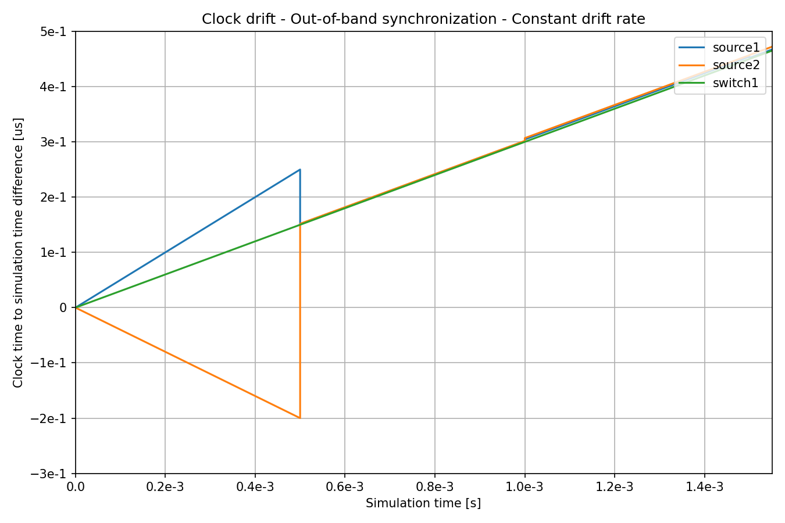
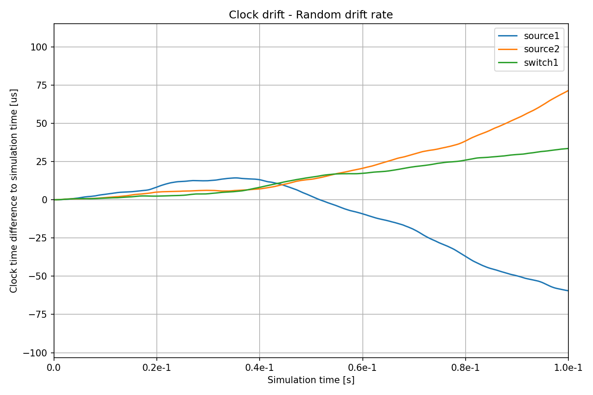
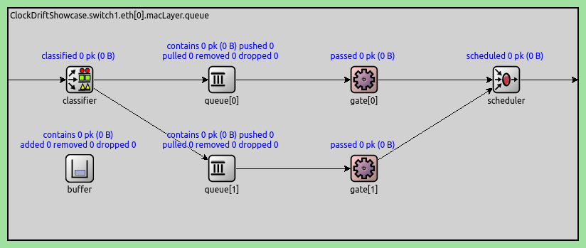

时钟漂移
=====================

| `原文链接 <https://inet.omnetpp.org/docs/showcases/tsn/timesynchronization/clockdrift/doc/index.html>`__ 
| `讲解视频 <https://space.bilibili.com/35942145>`__

目标
-----

在现实世界中，没有全局统一的时间，而是每个节点使用自己的本地时钟来记录时间。由于时钟的精度不同，\
网络中各个节点的时钟时间可能会随着时间的推移而发生偏差。为了解决时钟漂移问题，可以使用时间同步机制定期调整网络设备的时钟，以确保它们之间保持时间同步。

应用程序和协议在网络上的运行对本地时间的准确性非常敏感。时间同步在TSN中非常重要，因为在这些网络中，保持准确的时间至关重要。

在本示例中，我们将演示如何在网络节点中引入本地时钟，以及如何配置这些时钟的时钟漂移。我们还将展示如何使用不同的时间同步机制来减少不同设备之间的时钟差异。

INET version: ``4.5``

Source files location:
`inet/showcases/tsn/timesynchronization/clockdrift <https://github.com/inet-framework/inet/tree/master/showcases/tsn/timesynchronization/clockdrift>`__

仿真时钟偏移与时钟同步
-----------------------------------------------

默认情况下，INET中的网络节点和接口等模块没有本地时钟，而是使用仿真时间作为全局时间。为了模拟具有本地时间的网络节点以及时钟漂移和其时间同步等效果，网络节点需要具有*时钟子模块*。\
为了记录时间，大多数时钟模块使用*振荡器子模块*。振荡器定期产生脉冲，时钟模块通过计数脉冲计时。时钟漂移是由不准确的振荡器引起的。INET提供了各种振荡器模型，因此通过组合时钟和振荡器\
模型来模拟恒定或随机的时钟漂移速率。为了模拟时间同步，时钟的时间可以由同步器模块设置。

有以下几种钟模型可供选择：

+  `OscillatorBasedClock <https://doc.omnetpp.org/inet/api-current/neddoc/inet.clock.model.OscillatorBasedClock.html>`__: 振荡器时钟。具有振荡器子模块；通过计算振荡器的脉冲来保持时间。根据振荡器子模块的不同，可以模拟恒定和随机的时钟漂移速率
+  `SettableClock <https://doc.omnetpp.org/inet/api-current/neddoc/inet.clock.model.SettableClock.html>`__: 可设置时钟。与基于振荡器的时钟相同，但时间可以从C++或场景管理脚本中设置
+  `IdealClock <https://doc.omnetpp.org/inet/api-current/neddoc/inet.clock.model.IdealClock.html>`__: 理想时钟。时钟的时间与模拟时间相同；用于测试目的

有以下几种振荡器模型可供选择：

+  `IdealOscillator <https://doc.omnetpp.org/inet/api-current/neddoc/inet.clock.oscillator.IdealOscillator.html>`__: 理想振荡器。以恒定的节拍长度定期生成脉冲
+  `ConstantDriftOscillator <https://doc.omnetpp.org/inet/api-current/neddoc/inet.clock.oscillator.ConstantDriftOscillator.html>`__: 以恒定的漂移速率周期性地生成脉冲，用于模拟恒定速率的时钟漂移
+  `RandomDriftOscillator <https://doc.omnetpp.org/inet/api-current/neddoc/inet.clock.oscillator.RandomDriftOscillator.html>`__: 随机漂移振荡器：振荡器随时间改变漂移速率；用于模拟随机时钟漂移

同步器是作为应用层模块实现的。对于时钟同步，同步器模块需要设置时钟的时间，因此只有可设置时钟 `SettableClock`支持同步。以下同步器模块可用：

+  `SimpleClockSynchronizer <https://doc.omnetpp.org/inet/api-current/neddoc/inet.applications.clock.SimpleClockSynchronizer.html>`__: 使用带外机制来同步时钟，而不是使用真正的时钟同步协议。适用于不关注时钟同步细节的场景。
+  `Gptp <https://doc.omnetpp.org/inet/api-current/neddoc/inet.linklayer.ieee8021as.Gptp.html>`__: 使用通用精确时间协议来同步时钟。

`SimpleClockSynchronizer <https://doc.omnetpp.org/inet/api-current/neddoc/inet.applications.clock.SimpleClockSynchronizer.html>`__ 模块定期将从时钟与主时钟同步。同\
步间隔可以通过参数进行配置。此外，为了模拟现实生活中的同步协议，其本质上有一定的不准确性，精度可以被指定（详见模块的NED文档）。

通用精确时间协议（gPTP，或 IEEE 802.1AS）可以在以太网中以TSN协议所需的高精确度来同步时钟。它在INET中由 `Gptp <https://doc.omnetpp.org/inet/api-current/neddoc/inet.linklayer.ieee8021as.Gptp.html>`__ 模块实现。\
多种网络节点类型，如 `EthernetSwitch <https://doc.omnetpp.org/inet/api-current/neddoc/inet.node.ethernet.EthernetSwitch.html>`__，具有可选的gPTP模块。可以通过 ``hasGptp`` 参数激活。该模块可以作为应用程序插入到主机中。\
有关 `Gptp <https://doc.omnetpp.org/inet/api-current/neddoc/inet.linklayer.ieee8021as.Gptp.html>`__ 的更多详细信息，请查看 `Using gPTP <https://inet-showcases-cn.readthedocs.io/zh-cn/latest/Time_Synchronization/Using_gPTP.html>`__ \
示例或模块的NED文档。

在进行时钟同步时，同步器会更新本地时钟的当前时间。此外，它们还通过设置振荡器补偿来更新本地时钟的漂移率。SimpleClockSynchronizer使用一种带外机制读取实际的时钟漂移率，并相应地设置振荡器补偿。使用Gptp时，振荡器补偿是基于最后两个时间同步事件来设置的。

仿真与结果
---------------------

示例中包含了几个不同的情况。所有仿真都采用以下网络：

.. image:: Pic/Network23.png
   :alt: Network23.png
   :align: center

示例配置如下：

-  ``NoClockDrift``: 网络节点没有时钟，它们通过模拟时间进行同步
-  ``ConstantClockDrift``: 网络节点具有恒定的时钟漂移率，随着时间的推移，时钟会发散
-  ``ConstantClockDriftOutOfBandSync``: 时钟具有恒定的漂移速率，并且它们通过一种非带内同步方法（无实际协议）进行同步
-  ``RandomClockDrift``: 时钟具有定期变化的随机时钟漂移速率
-  ``RandomClockDriftOutOfBandSync``: 时钟具有周期性变化的随机时钟漂移率，并通过一种带外同步方法（无实际协议）进行同步
-  ``RandomClockDriftGptpSync``: 时钟具有随机的、周期性变化的随机时钟漂移率，并通过gPTP进行同步

在 ``General`` 配置中， ``source1`` 被配置为向 ``sink1`` 发送UDP数据包，而 ``source2`` 则向 ``sink2`` 发送。

.. note::
   为了展示时钟漂移对网络流量的影响，我们在 ``switch1`` 中配置TAS机制，使其每10μs交替转发来自source1和source1的帧。这不会影响后文中的仿真结果，但是时钟漂移会影响报文的端到端延迟。有关此配置部分的更多详细信息，请参阅 `该部分 <https://inet-showcases-cn.readthedocs.io/zh-cn/latest/Time_Synchronization/Clock_Drift.html#id13>`__ 。

在接下来的几个部分中，我们展示了上述的示例。在具有恒定时钟漂移的仿真中， ``switch1`` 始终具有相同的时钟漂移率。在随机漂移的仿真中，\
使用相同的漂移率，但实际的漂移率在不同的配置之间可能会有所不同。在具有时钟同步的配置中，主机被同步到 ``switch1`` 的时间。\
我们绘制各节点本地时钟和全局模拟时间的时间差，以观察本地时钟与全局模拟时间之间的差异。

示例：无时钟漂移
~~~~~~~~~~~~~~~~~~~~~~~

在此配置中，网络节点没有时钟。应用程序和门控调度机制通过模拟时间进行同步。（用于与其他三种情况下的端到端延迟对比）

由于没有配置本地时钟，所以相关配置为空

.. code:: ini

   [Config NoClockDrift]
   description = "Without clocks, network nodes are synchronized by simulation time"

示例: 固定时钟漂移
~~~~~~~~~~~~~~~~~~~~~~~~~~~~~

在此配置中，网络中所有节点都有一个具有恒定漂移速率的本地时钟。时钟随着时间的推移逐渐漂移。

.. code:: ini

   [Config ConstantClockDrift]
   description = "Clocks with constant drift rate diverge over time"

   *.source*.clock.typename = "OscillatorBasedClock"
   *.source*.clock.oscillator.typename = "ConstantDriftOscillator"
   *.source1.clock.oscillator.driftRate = 500ppm
   *.source2.clock.oscillator.driftRate = -400ppm
   *.source*.app[0].source.clockModule = "^.^.clock"

   *.switch1.clock.typename = "OscillatorBasedClock"
   *.switch1.clock.oscillator.typename = "ConstantDriftOscillator"
   *.switch1.clock.oscillator.driftRate = 300ppm
   *.switch1.eth[0].macLayer.queue.gate[*].clockModule = "^.^.^.^.clock"

我们为网络中所有节点配置基于振荡器的时钟模块 `OscillatorBasedClock <https://doc.omnetpp.org/inet/api-current/neddoc/inet.clock.model.OscillatorBasedClock.html>`__ , \
并采用固定时钟漂移速率的振荡器模块 `ConstantDriftOscillator <https://doc.omnetpp.org/inet/api-current/neddoc/inet.clock.oscillator.ConstantDriftOscillator.html>`__ 。 \
通过为不同的时钟设置不同的漂移速率，我们可以控制它们随时间的发散。漂移速率是相对于全局仿真时间定义的。此外，我们需要明确指定相关模块所依赖的本地时钟（在本示例中为UDP应用程序和Switch1的队列）， \
否则他们默认依赖全局仿真时间。

此图展示了随时间变化的本地时钟漂移情况（即本地时钟与全局仿真时间的差值）：

.. image:: Pic/ConstantClockDrift.png
   :alt: ConstantClockDrift.png
   :align: center

三个时钟的漂移速率不同，与 ``switch1`` 相比， ``source1`` 和 ``source2`` 的漂移大小和方向也不同，即 ``source1`` 的时钟比 ``switch1`` 的时钟快，而 ``source2`` 的时钟比 ``switch1`` 的时钟慢。

.. note::
   可以利用统计出的 ``timeChanged:vector`` 数据，并以 ``-1`` 作为参数进行线性趋势运算，可以绘制出本地时钟与全局仿真时间的差值的图表。

示例: 固定时钟偏移与带外时钟同步
~~~~~~~~~~~~~~~~~~~~~~~~~~~~~~~~~~~~~~~~~~~~~~~~~~~~~~~~~~~~~~

在此配置中，网络中节点的本地时钟漂移速率与之前的配置相同，但它们会通过一个带外机制（C++函数调用）定期进行同步。

带外同步设置在基本配置 ``OutOfBandSyncBase`` 中定义，我们可以扩展它

.. code:: ini

   [Config OutOfBandSyncBase]
   description = "Base config for out-of-band synchronization"
   #abstract-config = true (requires omnet 7)

   *.source*.clock.typename = "SettableClock"
   *.source*.clock.defaultOverdueClockEventHandlingMode = "execute"

   *.source*.numApps = 2
   *.source*.app[1].typename = "SimpleClockSynchronizer"
   *.source*.app[1].masterClockModule = "^.^.switch1.clock"
   *.source*.app[1].slaveClockModule = "^.clock"
   *.source*.app[1].synchronizationInterval = 500us
   *.source*.app[1].synchronizationClockTimeError = uniform(-10ns, 10ns)

由于我们想要进行时钟同步，所以我们需要设置本地时钟，因此网络中节点需要具有 `SettableClock <https://doc.omnetpp.org/inet/api-current/neddoc/inet.clock.model.SettableClock.html>`__ \
模块。设置 ``defaultOverdueClockEventHandlingMode = "execute"`` 表示在设置本地时钟时间前，过期的事件会被立即执行。我们使用 \ 
`SimpleClockSynchronizer <https://doc.omnetpp.org/inet/api-current/neddoc/inet.applications.clock.SimpleClockSynchronizer.html>`__ 进行带外同步。 \
该同步器作为应用层程序，我们需要为每个主机中的同步器指定同步的主时钟。在此示例中，我们指定同步器与 ``switch1`` 的时钟进行同步。同时，我们为同步器设置了一个小的随机 \
同步误差，使时钟时间不会被完全同步。

对于 ``ConstantClockDriftOutOfBandSync`` 示例，此示例集成了 ``ConstantClockDrift`` 示例和 ``OutOfBandSyncBase`` 示例，不需要额外的配置。

.. code:: ini

   [Config ConstantClockDriftOutOfBandSync]
   description = "Clocks are periodically synchronized out-of-band, without a real protocol. Clocks use constant drift oscillators."
   extends = OutOfBandSyncBase, ConstantClockDrift

此图为时间同步后的效果：

.. image:: Pic/OutOfBandSyncConstant.png
   :alt: OutOfBandSyncConstant.png
   :align: center

与全局仿真时间相比， ``switch1`` 的时钟存在一个恒定的漂移速率。由于所有时钟的漂移速率都是恒定的，\
在第一次同步之后，通过设置本地时钟的振荡器补偿，可以弥补漂移速率的差异。之后，所有时钟与 ``switch1`` 的时钟具有相同的漂移速率。让我们放大上图的起始部分：

在仿真开始时，时钟的漂移速率不同，在第一次同步后，本地时钟的振荡器得到补偿。但由于我们设置了小的随机误差，在每次同步后时间会发生微小变化。

示例：随机时钟漂移
~~~~~~~~~~~~~~~~~~~~~~~~~~~~~~~~

在此配置中，本地时钟使用随机时钟漂移振荡器 `RandomDriftOscillator <https://doc.omnetpp.org/inet/api-current/neddoc/inet.clock.oscillator.RandomDriftOscillator.html>`__ 模块。 \
指定随机时钟漂移振荡器的漂移范围和漂移间隔，使本地时钟时间随机偏移。以下是配置信息：

.. code:: ini

   [Config RandomClockDrift]
   description = "Clocks with random drift rate"

   *.source*.clock.typename = "OscillatorBasedClock"
   *.source*.clock.oscillator.typename = "RandomDriftOscillator"
   *.source1.clock.oscillator.driftRateChange = uniform(-125ppm, 125ppm)
   *.source2.clock.oscillator.driftRateChange = uniform(-100ppm, 100ppm)
   *.source1.clock.oscillator.changeInterval = 0.1ms
   *.source2.clock.oscillator.changeInterval = 0.1ms
   *.source*.app[0].source.clockModule = "^.^.clock"

   *.switch1.clock.typename = "OscillatorBasedClock"
   *.switch1.clock.oscillator.typename = "RandomDriftOscillator"
   *.switch1.clock.oscillator.driftRateChange = uniform(-75ppm, 75ppm)
   *.switch1.clock.oscillator.changeInterval = 0.1ms
   *.switch1.eth[0].macLayer.queue.gate[*].clockModule = "^.^.^.^.clock"

下图显示了随着时间的推移，本地时钟与全局仿真时间的差异

示例：随机时钟偏移与带外时钟同步
~~~~~~~~~~~~~~~~~~~~~~~~~~~~~~~~~~~~~~~~~~~~~~~~~~~~~~~~~~~

对于 ``RandomClockDriftOutOfBandSync`` 示例，此示例集成了 ``RandomClockDrift`` 示例和 ``OutOfBandSyncBase`` 示例，不需要额外的配置。

.. code:: ini

   [Config RandomClockDriftOutOfBandSync]
   description = "Clocks are periodically synchronized out-of-band, without a real protocol. Clocks use random drift oscillators."
   extends = OutOfBandSyncBase, RandomClockDrift

和固定时钟偏移与带外时钟同步情况相同，我们指定了一个小的随机时钟同步误差，但没有漂移速率同步错误。

.. image:: Pic/OutOfBandSyncRandom.png
   :alt: OutOfBandSyncRandom.png
   :align: center

switch1的时钟一直在漂移，但 ``source1`` 和 ``source2`` 的本地时钟与其同步。将上图放大后：

由于时钟漂移的速率是相同的，因此 ``source1`` 、 ``source2`` 和 ``switch1`` 的时间线在同步点处相切。然而，在同步后，时钟会重新漂移。

示例：使用gPTP进行同步
~~~~~~~~~~~~~~~~~~~~~~~~~~~~~~~~~~~~~~~

在此配置中，网络节点的时钟漂移率与前两种配置相同，但它们会定期使用通用精确时间协议（gPTP）与主时钟进行同步。该协议测量各个链路的延迟，并通过生成树在网络上传播主时钟的时间。

.. code:: ini

   [Config RandomClockDriftGptpSync]
   description = "Clocks are periodically synchronized using gPTP"
   extends = RandomClockDrift

   *.switch*.hasGptp = true

   *.switch*.gptp.syncInterval = 500us
   *.switch*.gptp.pdelayInterval = 1ms
   *.switch*.gptp.pdelayInitialOffset = 0ms

   *.switch*.clock.typename = "SettableClock"

   *.switch1.gptp.gptpNodeType = "MASTER_NODE"
   *.switch1.gptp.masterPorts = ["eth0", "eth1", "eth2"]  # eth*

   *.switch2.gptp.gptpNodeType = "SLAVE_NODE"
   *.switch2.gptp.slavePort = "eth0"

   *.source*.clock.typename = "SettableClock"

   *.source*.numApps = 2
   *.source*.app[1].typename = "Gptp"
   *.source*.app[1].gptpNodeType = "SLAVE_NODE"
   *.source*.app[1].slavePort = "eth0"
   *.source*.app[1].syncInterval = 500us
   *.source*.app[1].pdelayInterval = 1ms

此图为本地时间与全局仿真时间的差异：

.. image:: Pic/GptpSync.png
   :alt: GptpSync.png
   :align: center

 ``switch1`` 的时钟具有周期性变化的随机漂移率，其他时钟周期性地与 ``switch1`` 进行同步。

这是上面的图表放大后的部分：

.. image:: Pic/GptpSyncZoomed.png
   :alt: GptpSyncZoomed.png
   :align: center

根据前两次同步事件可以计算出时钟漂移率的差异，用于设置振荡器补偿。

同步精度
~~~~~~~~~~~~~~~~~~~~~~~~~~~

时间同步的精度可以通过放大上述时钟时间图来可视化。我们可以观察源主机中发生时间同步的时刻，新时间与参考时间（即主时钟时间）的距离表示时间同步的精度。

.. image:: Pic/gptp_time_accuracy.png
   :alt: gptp_time_accuracy.png
   :align: center

当时钟同步时，通过在时钟中设置振荡器补偿来补偿漂移率差异。我们可以在下面的放大图像上观察到这一点。

.. image:: Pic/GptpSync_RateAccuracy.png
   :alt: GptpSync_RateAccuracy.png
   :align: center

同步使得线条更加平行，即漂移速率更加接近。此外，由于设置了时钟的随机漂移速率，漂移速率会在同步事件之间发生变化。

我们为SimpleClockSynchronizer配置了一个随机分布的时间同步误差，但没有漂移率补偿错误。在gPTP的情况下，准确性是不可设置的，而是协议所包含的属性。此外，gPTP同步本质上存在一些漂移率补偿错误。

.. note::
   -  当将 `SimpleClockSynchronizer <https://doc.omnetpp.org/inet/api-current/neddoc/inet.applications.clock.SimpleClockSynchronizer.html>`__ 模块的 ``synchronizationClockTimeError`` 参数配置为0时，同步时间与参考时间完全一致。
   -  当将 `SimpleClockSynchronizer <https://doc.omnetpp.org/inet/api-current/neddoc/inet.applications.clock.SimpleClockSynchronizer.html>`__ 模块的 ``synchronizationOscillatorCompensationError`` 参数配置为0时，补偿的时钟漂移率与参考时间完全匹配。否则，误差可以用PPM指定。
   -  在进行时钟同步时，时钟之间的时间差异非常小，大约为微秒级别。

时钟漂移对端到端延迟的影响
~~~~~~~~~~~~~~~~~~~~~~~~~~~~~~~~~~~~~~~~~~

本节旨在展示时钟漂移对流量传输的影响。我们通过四个示例来观察端到端延迟，以观测这种影响。

为了达到这个目的，在所有的模拟中， ``switch1`` 中的以太网MAC层被配置为每10微秒交替转发来自 ``source1`` 和 ``source2`` 的数据包；UDP应用程序每20微秒发送一个数据包，其中 ``source2`` \
的数据包与 ``source1`` 相比偏移了10微秒。因此，当 ``source1`` 和 ``source2`` 的时间与 ``switch1`` 的时间完全同步时，刚好可以在指定的时隙窗口中完成传输。

在此配置中，我们在 ``switch1``的EthernetMacLayer模块中配置了一个GatingPriorityQueue模块，其内部包含两个队列：

.. code:: ini

   *.switch1.eth[0].macLayer.queue.typename = "GatingPriorityQueue"
   *.switch1.eth[0].macLayer.queue.numQueues = 2

GatingPriorityQueue中的内部队列都有自己的门，这些门连接到一个PriorityScheduler。在同一时刻，该模块会选择可以传输的队列（即开门的队列）中优先级最高的队列进行传输。

在此配置中，我们配置分类器（使用ContentBasedClassifier）将来自 ``source1`` 的数据包发送到第一个队列，将来自 ``source2`` 的数据包发送到第二个队列。因此，门控优先队列优先处理 ``source1`` 的数据包。 \
配置每个门每10μs交替开关。此外，为了将两个门的开关时间与流量到达时间对齐，两个门开关时间需要有3.118μs的偏移。这是一个数据包从源节点到 ``switch1`` 传输所需的时间。以下是TAS相关配置：

.. code:: ini

   *.switch1.eth[0].macLayer.queue.classifier.typename = "ContentBasedClassifier"
   *.switch1.eth[0].macLayer.queue.classifier.packetFilters = ["source1*", "source2*"]
   *.switch1.eth[0].macLayer.queue.queue[*].typename = "DropTailQueue"
   *.switch1.eth[0].macLayer.queue.gate[*].initiallyOpen = false
   *.switch1.eth[0].macLayer.queue.gate[*].durations = [10us, 10us]
   *.switch1.eth[0].macLayer.queue.gate[0].offset = 3.118us
   *.switch1.eth[0].macLayer.queue.gate[1].offset = 13.118us

以下是源节点相关配置，源节点中应用程序每20μs生成一个UDP数据包，并且 ``source2``相比 ``source1`` ，偏移10μs：

.. code:: ini

   # source applications
   *.source*.numApps = 1
   *.source*.app[*].typename = "UdpSourceApp"
   *.source*.app[0].source.packetLength = 800B
   *.source*.app[0].source.productionInterval = 20us
   *.source*.app[0].io.destPort = 1000

   *.source1.app[0].io.destAddress = "sink1"
   *.source1.app[0].source.packetNameFormat = "source1-%c"

   *.source2.app[0].io.destAddress = "sink2"
   *.source2.app[0].source.initialProductionOffset = 10us
   *.source2.app[0].source.packetNameFormat = "source2-%c"

   # sink applications
   *.sink*.numApps = 1
   *.sink*.app[*].typename = "UdpSinkApp"
   *.sink*.app[0].io.localPort = 1000

注意，在一个时隙窗口中只适合一个UDP数据包传输，然而gPTP数据包很小，可以与UDP数据包在相同的时隙窗口中传输。

我们在接收端记录报文的端到端延迟。首先，在带外同步的情况，在没有时钟偏移的情况下，数据包的传输时间与门控时隙窗口完全对齐，因此数据包总是可以在开门的时间完成传输，端到端延迟是恒定的，只取决于传输时间。这个延迟在图表中显示为基准线（Baseline)。

在仿真开始时，由于时钟之间的漂移率差异且尚未进行时间同步，因此 ``constant drift,sink1 `` 的延迟较大。在运行一段时间后，由于进行时间同步，其延迟降低且受到限制。其中，随机漂移情况下的延迟波动大于恒定漂移情况下的延迟波动，但这两种情况都有延迟 \
处于基线水平的情况。

.. note::
   
   UDP数据包到达时间与门的开关时间不需要完全同步，因为UDP数据包的传输时间约为6.4μs，而设置的时隙窗口时间为10μs。

以下图表显示了相同的数据放大后的情况：

.. image:: Pic/delay_outofbandsync_zoomed.png
   :alt: delay_outofbandsync_zoomed.png
   :align: center

对于时钟漂移恒定的情况，漂移速率差在第一次同步事件中得到完美补偿，因此线段完全水平。然而，我们为时间差同步指定了一个随机误差，因此这些值在每次同步事件中都会变化，每0.5毫秒一次。

对于随机时钟漂移的情况，每次同步事件都可以无误地补偿漂移率，但是时钟的漂移率在同步事件之间仍然随机变化。这导致延迟出现波动。

 下图为在随机时钟漂移情况下，使用gPTP的结果

.. image:: Pic/delay_gptp.png
   :alt: delay_gptp.png
   :align: center

延迟分布类似于带外同步情况，但存在异常值。gPTP需要通过网络发送数据包进行时间同步，而不是使用带外机制。这些gPTP消息有时会导致 ``source1`` 的数据包延迟，使其在队列中排队等待。

.. note::
   
   通过优先处理gPTP数据包而不是UDP数据包，可以消除异常值。理想情况下，它们也可以在门控列表中分配时间。

以下图表显示了带外同步和gPTP，以便进行比较

在所有这些情况下，应用程序与队列中的门的打开同步发送数据包。在没有时钟漂移的情况下，延迟仅取决于比特率和数据包长度。在 ``OutOfBandSynchronization`` 和 ``GptpSynchronization`` 的情况下，时钟会漂移， \
但漂移会周期性地通过同步消除，因此延迟保持有界。

让我们看看在没有同步的情况下延迟会发生什么：

延迟与其他情况相比，变化很大。这些图表背后的原因是什么？当没有时钟漂移（或通过同步机制同步）时，端到端延迟是有界的。因为由源节点发出的数据包可以在交换机中对应的时隙窗口传输。 \
在时钟漂移率恒定的情况下，数据包的延迟取决于时钟之间的漂移大小与方向。

将恒定漂移率视为时间膨胀可能会有所帮助。 在理想条件下（无时钟漂移或消除时钟漂移），所有三个模块中的时钟保持相同时间，因此不存在时间差异。两个源中的数据包都是与时隙窗口同步 \
的，即他们到底交换机后立即转发。在时钟漂移恒定的情况下，从switch1的角度来看，source1的时钟比自己慢，而source2的时钟比自己快。因此，由于时间偏差，来自source1 \
的数据包流比理想情况更稀疏，而来自source2的数据包流更密集。

如果数据包流较稀疏（橙色图），则在给定时间内发送的数据包平均少于发送窗口的数量，因此数据包不会在队列中累积。然而，由于时钟漂移，数据包生成和发送窗口不再同步，而是不断变化。 \
有时，当相应的门关闭时，数据包到达switch1中的队列，因此必须等待下一次开门。对于后续数据包来说，下一次开门发生得越来越早（由于两个时钟中漂移的相对方向），因此数据包在队列中 \
等待的时间越来越少，因此曲线的下降部分。 然后曲线变成水平的，这意味着数据包在门打开时到达并且可以立即发送。 一段时间后，与数据包生成时间相比，门打开再次发生变化，因此数据包 \
在门关闭后才到达，并且它们必须在队列中等待下个周期才能发送。

如果数据包流较密集（蓝色图），则平均要发送的数据包数量多于给定时间内的发送窗口数量，因此数据包最终会在队列中累积。这会导致延迟无限期地增加。

.. note::
   -  如果数据包的传输在门关闭之前无法完成，数据包将不会被 ``switch1`` 转发（一个数据包需要6.4微秒传输，门开放时间为10微秒）。【隐式保护带】
   -  橙色图表的水平部分的长度等于两个时钟在 ``txWindow - txDuration`` 期间漂移的量。在橙色图表的情况下，它是 ``(10μs - 6.4μs) / 700ppm ~= 5ms`` 。

因此，如果不消除恒定的时钟漂移，网络将无法保证数据包的有界延迟。虽然恒定的时钟漂移具有可预测的重复模式，但它仍然对延迟产生巨大影响。

让我们来考虑随机时钟漂移的情况：

.. image:: Pic/delay_random-1708854847415-27.png
   :alt: delay_random-1708854847415-27.png
   :align: center

不可预测的随机时钟漂移可能对延迟产生更大的影响。以下图表比较了恒定和随机时钟漂移率的情况：

类似图中的时钟（例如 ``constant drift/sink1`` 和 ``random drift/sink2`` ）沿相同方向漂移。

| 源代码：
|  `omnetpp.ini <https://inet.omnetpp.org/docs/_downloads/f6a3b3e3373e0ae31ff113560db75a12/omnetpp.ini>`__ 
|  `ClockDriftShowcase.ned <https://inet.omnetpp.org/docs/_downloads/9e1530aa23323cc6487c22f18b12760e/ClockDriftShowcase.ned>`__

讨论
----------
如果您对这个示例有任何疑问或讨论，请在 `此页面 <https://github.com/inet-framework/inet/discussions/797>`__ 分享您的想法。